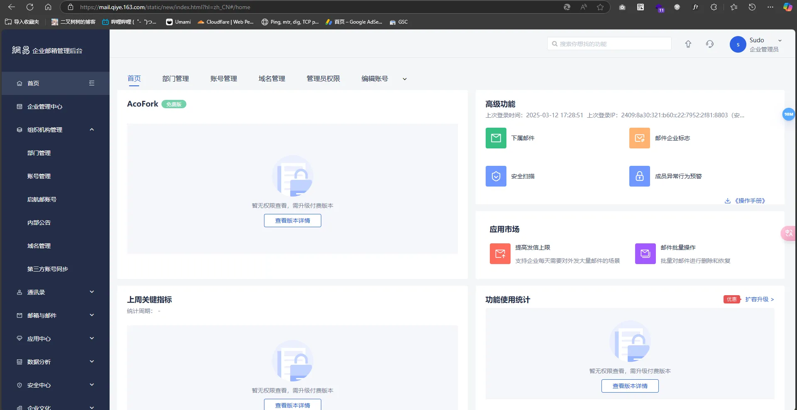
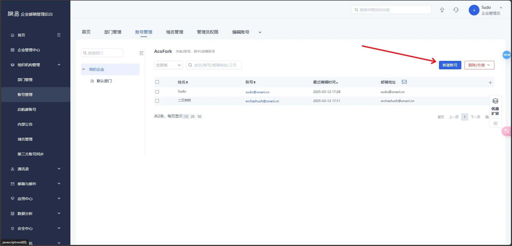
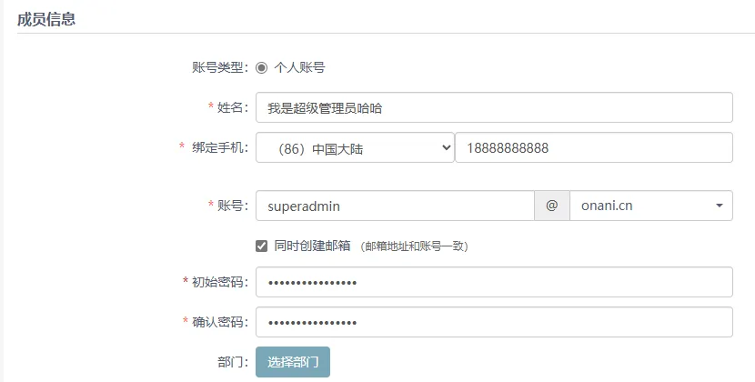
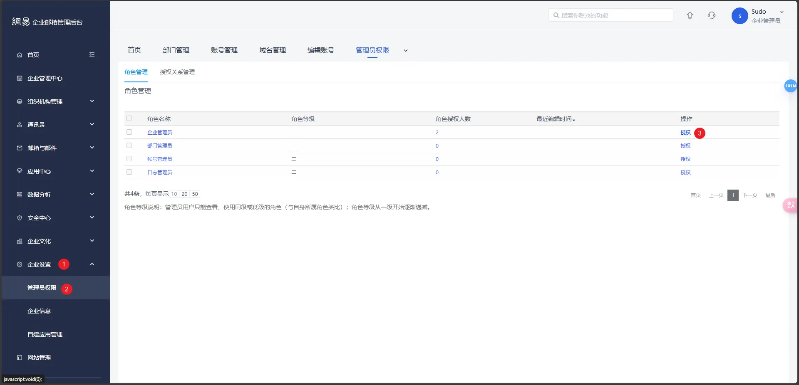
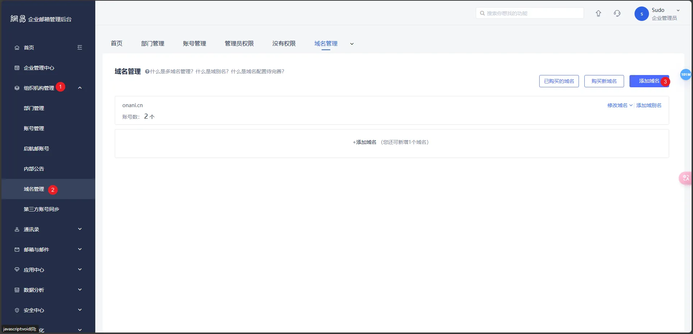
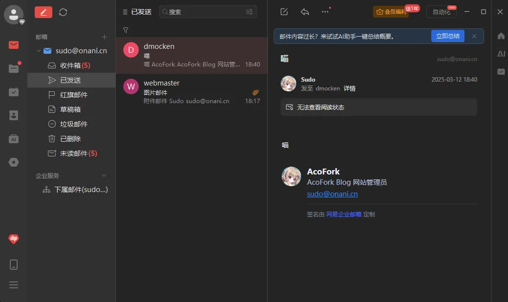
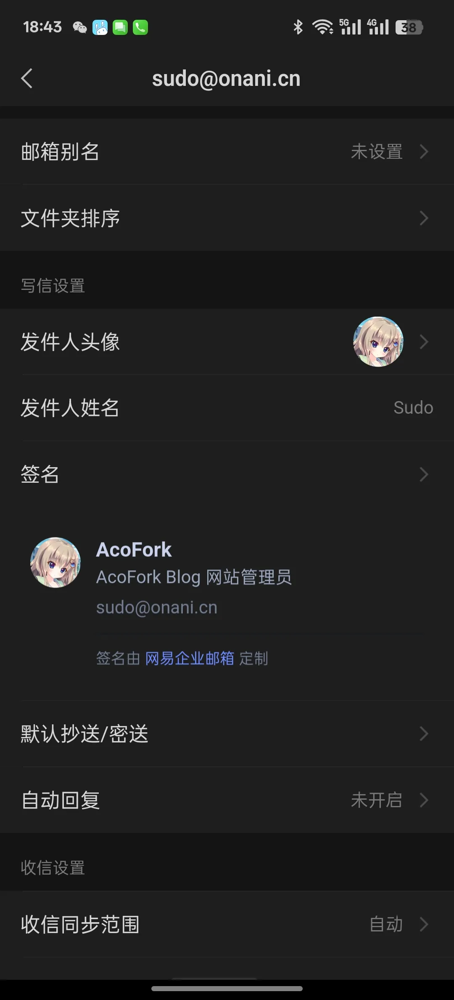

# 引言

最早我开始知道域名邮箱是因为偶然在一位我朋友的开发群内看到他的微软账户绑定的邮箱是admin@他网站的域名.com。

我当时就很好奇，就去问他你这个邮箱是自建的吗？

因为我当时也知道可以通过购买VPS然后配上一些开源邮局框架来自建邮箱，但是这需要金钱和时间成本，而且我认为不大稳定，所以一直就没有试过，而且我觉得我当时的acofork@foxmail.com这个邮箱虽然是托管在QQ的，但是也够用了。

然后他说他用的是Cloudflare的邮件转发服务，我就心想这cf还能干这个，一番操作以下发现还真能。

在cf的域名配置中有一个电子邮件转发，可以将发给你域名的邮件转发到你自己用的邮箱，比如发给sikosiko@onani.cn的邮件会被cf转发给我的私用邮箱acofork@foxmail.com。

但是因为是转发，那么如果你想要以sikosiko@onani.cn这个身份发邮件就需要费一番周折了。我用的foxmail.com被腾讯收购了，现在作为QQ邮箱的服务提供，而QQ邮箱要绑定域名需要购买万恶的VIP，于是就只能通过Outlook、Gmail等支持免费绑定域名作为别名的邮箱来发邮件

但这也太割裂了吧，我在QQ邮箱上收到，然后还要去Outlook或者Gmail上面回复？于是我后面也还是继续使用我的私用邮箱，不去折腾什么域名邮箱了，毕竟方便比什么都重要

---

但是话又说回来，最近发现了这个网易免费企业邮，可以免费绑定你的域名用作域名邮箱，并且直接将MX解析解析到网易，既能收，也能发。而且这个项目也不是刚出的，貌似在2015就已经有了，所以也不用担心灵车，至少比你自建的稳定😋

# 正式开始

## 创建账号并配置管理员

首先前往 [网易免费企业邮箱](https://ym.163.com/) 创建一个账号。直接用手机号注册

注意，注册完毕后登录账户名和登录密码会通过**短信**发给你，然后前往 https://mail.qiye.163.com/ 进行登录

如果你不喜欢系统随机生成的密码，可以先点击忘记密码，然后填写账户名，验证绑定的手机号后即可重置密码

登陆进去后大概是这样

如果你不喜欢你的账户名，比如我的就是 **erchashush** @acofork.freeqiye.com，这个erchashush其实是可以更改的

在组织机构管理中点击账号管理，选择新建账号

然后写一个你想要的别名。绑定手机填你的，因为第一次登录需要验证码验证，如果填错了直接删除即可

然后我们需要给这个新账号提权，如果你想用superadmin登录后台的话

接着右上角退出登录，然后使用新创建的管理员账户登录

## 绑定你的域名

前往组织机构管理 - 域名管理 - 添加域名

根据提示在你的域名提供商（比如Cloudflare）配置TXT记录和MX记录即可

## 登录你的邮箱

前往 [网易邮箱大师-高效强大的全平台邮箱客户端](https://dashi.163.com/) 下载对应的版本

使用你的邮箱 + 密码进行登录即可。如果需要手机验证验证即可。最好下载一个手机端的网易邮箱大师，在手机端登录后任何其他平台登录都会需要手机端授权，更安全

## 效果展示

签名和发件人头像可以通过手机的网易邮箱大师设置

