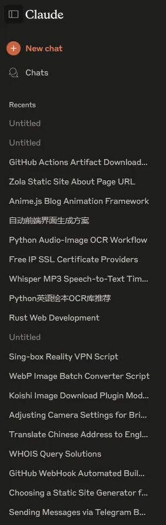
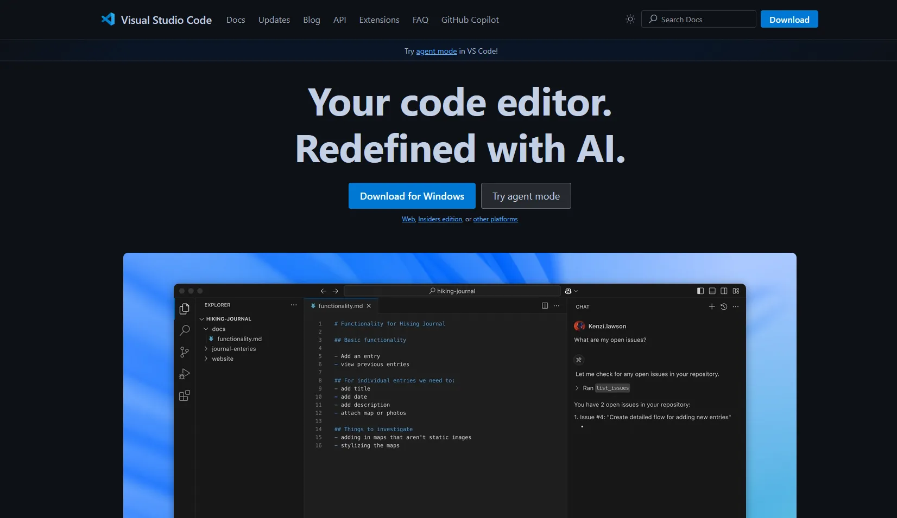

# 正确的引导方法

先搞清楚你自己具体的需求。比如代码用什么语言编写？用什么技术栈？要具体实现什么功能？应用的场景是什么？是前端、后端还是全栈等等

逻辑清晰，简洁干练地表述你的需求。

比如： `编写一个Python脚本，在代码中硬编码S3_Endpoint、S3_Area、S3_key、S3_Secret、S3_Url（暂时全部留空）。运行后监听Ctrl+Alt+A，一旦被按下，立即检查剪贴板内是否有图片（支持文件格式和纯图格式），将其转换为Webp格式并上传到S3 API的S3_Url路径下，最后模拟键入`

如果不确定AI是否理解了你的需求，可以CallBack一下，避免AI假装理解了你的需求然后一通乱写，比如上面的表述可以改为：

 `编写一个Python脚本，在代码中硬编码S3_Endpoint、S3_Area、S3_key、S3_Secret、S3_Url（暂时全部留空）。运行后监听Ctrl+Alt+A，一旦被按下，立即检查剪贴板内是否有图片（支持文件格式和纯图格式），将其转换为Webp格式并上传到S3 API的S3_Url路径下，最后模拟键入。你明白了吗，请告诉我你将要如何完成这个任务，在我批准前请不要编写代码` 

有时候表达模糊实际上是好事。

因为你一旦开始描述创建一个什么什么变量，赋值为多少多少的时候，实际上你不是在用AI写代码，而是让AI将你的自然语言代码转换为编程语言代码，这就不是一个创造式的需求，而是一个翻译类的需求，最终代码生成质量的好坏完全取决于你的技术知识储备和逻辑思维是否强大。

所以，在面对大部分的需求，我们可以先大致描述一个框架，确认AI的方向正确后慢慢编写项目

AI也会犯错，并且极其容易瞎猜。不要尽信AI给出的内容，在涉及到你不懂的知识时，我们可以翻阅[维基百科](https://wikipedia.org)等权威知识网来验证

不要让AI一直自我检查。现代的AI IDE中，大部分已经实现了Agent模式，也就是： `用户提出需求 -> AI分析并实现需求 -> AI自动Debug -> 最终交付用户项目`。

但是在我半年的AI IDE使用经验中，如果代码出现Bug，请不要说类似： `这个代码跑不了，帮我看看` 这样的话，我仍然建议你将完整的报错信息复制粘贴给AI并且要求他分析并解决，例如： 

`[报错信息]它报错了，请根据报错信息深度分析一下问题导致的原因，并给我一个解决方案`，而不是让AI自身Debug。

因为有时候程序的报错可能只是一个简单的环境变量没配置，或者是你没有使用一个主流的方案，单纯让AI自我检讨只会让AI选择它最认为出错的地方。

*换位思考一下，你有个甲方一直告诉你这个方案不行但是就不告诉你哪里不行你头不头疼。但是AI毕竟不是人类，它只会在它认为正确的道路上越走越远，运气好迭代几次Bug解决了，运气不好到达了IDE设置的迭代次数限制然后给你又新写了一坨新史山，然后你花钱买的请求数也就这样浪费了*

最后，请善用AI，你也可以询问AI： `你的最佳调用方式是什么`。~~当然，她也有可能欺骗你~~。

# AI推荐

[ChatGPT](https://chatgpt.com)：快速，不限额。适合解决你的疑问

[Claude](https://claude.ai)：相比于GPT更强大，更擅长编写代码，尤其是前端，目前大部分AI IDE都接入了Claude 3.5 Sonnet及以上的模型，非常适合编写可拆解，易维护的小脚本

[VS Code（Github Copilot）](https://code.visualstudio.com/)：AI IDE。由微软开发，免费用户可以使用Claude 3.5 Sonnet模型，但是份额较少。Pro计划10USD/m，仅支持Paypal和海外卡支付

[Cursor](https://www.cursor.com)：AI IDE。由Anysphere开发，免费用户仅能使用Auto模型（一般不会分配到Claude模型）。Pro计划10USD/m，仅支持Paypal和海外卡支付

[Trae（国际版）](https://www.trae.ai)：AI IDE。由字节跳动开发，需要国外IP。新用户Pro计划开通首月仅需3USD/m（之后为10USD/m），支持支付宝和海外卡支付。本人目前在用

> 写任何项目都完全不推荐使用网页版的任何大模型编写！请使用AI IDE！
