### 首先，我们要知道GFW是如何封锁我们的流量的

1. IP黑洞：目前无解，但仅对部分服务黑洞，如谷歌系（谷歌、推特、YouTube等）

2. DNS污染：为域名返回一个假的IP。使用hosts文件强制指定域名对应ip或者使用加密的DNS（DoH、DNS 签名等）就可以解决

3. HTTP劫持：因为流量不是加密的，GFW作为天然的中间人可以直接进行篡改（如：重定向到404页面、劫持到反诈页面等）。可以使用HTTPS连接规避，但你可能会遇到SNI阻断

4. SNI阻断：在客户端与服务器建立加密连接前，客户端会发送 `Client Hello` 报文，而这个报文是明文，并且一般都会携带 `server_name` ，GFW可以知道你要访问哪个网站，对不在白名单（如：discord.com）的域名进行阻断。因为 `server_name` 实际上是一个扩展，并不强制，你可以不发送它来规避SNI阻断

### 那么，让我们分析一下GFW对于不同网站的封锁情况

我们使用WireShark进行抓包

- 首先尝试访问 `www.baidu.com` 这是一个没有被GFW封锁的域名
  
  1. 我们先ping一下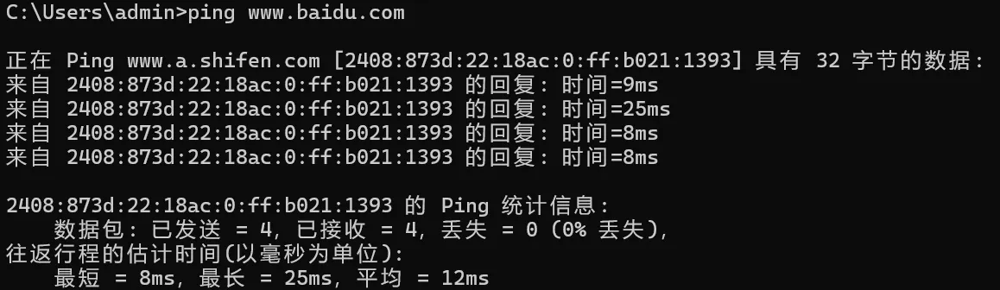
  
  2. 得到ip： `2408:873d:22:18ac:0:ff:b021:1393` 
  
  3. 通过Hosts强制绑定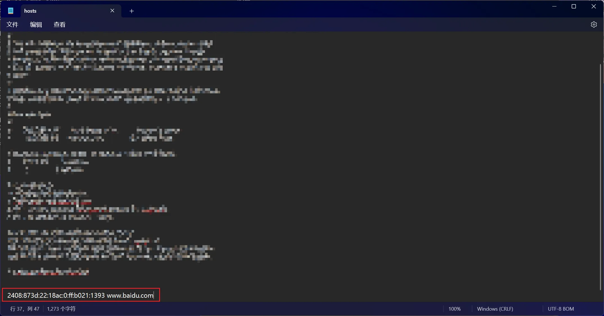
  
  4. 通过WireShark进行抓包，可以看到，客户端发送的 `Client Hello` 可以清晰地看到 `Server Name` 字段，并且也能正常收到 `Server Hello` 然后双方便开始通信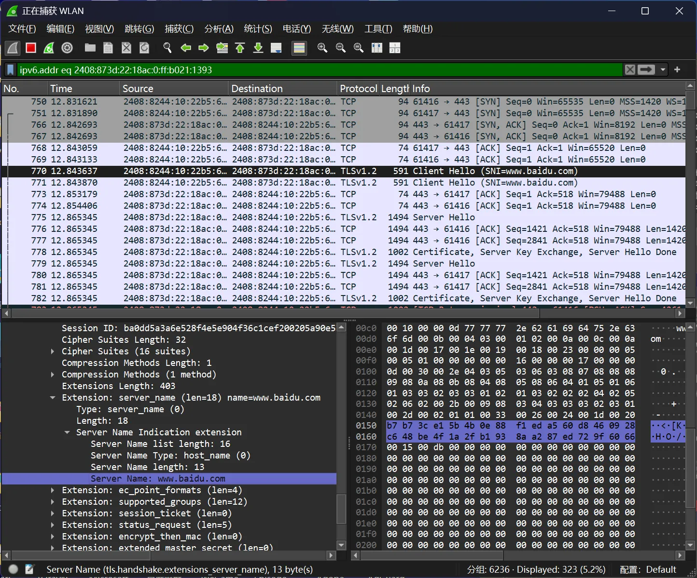
  
  5. 查看浏览器，网站正常访问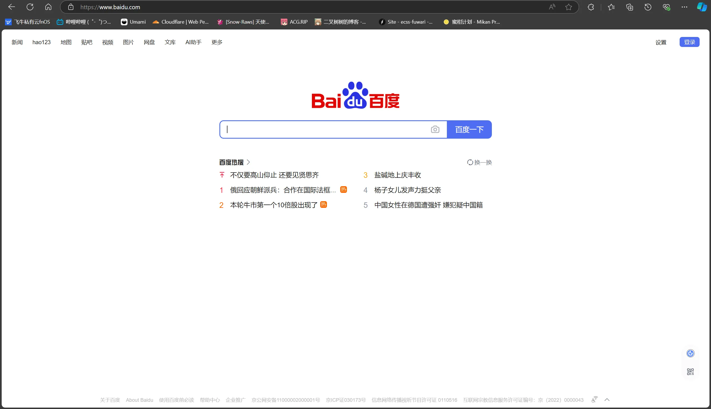

- 让我们试试访问 `discord.com`
  
  1. 我们先ping一下，可以发现，域名和解析到的IP均不通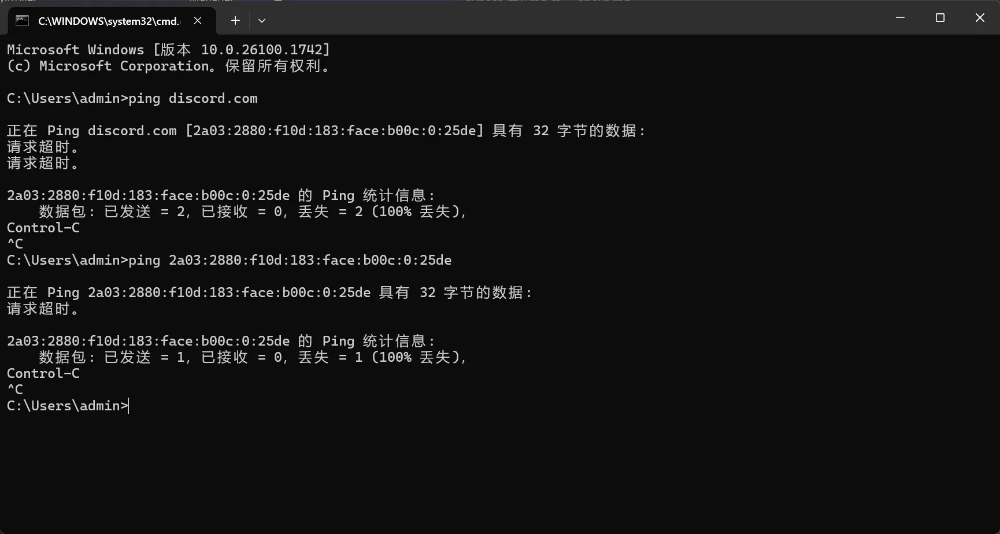
  
  2. 此时我们尝试使用 `itdog.cn` 进行v4 ping，并且依次对解析出的域名进行ping
  
  3. 可见，第一个IP通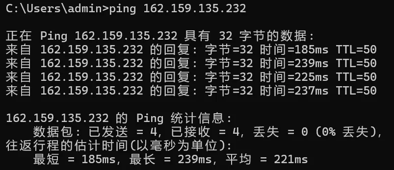
  
  4. 强制绑定Hosts，尝试抓包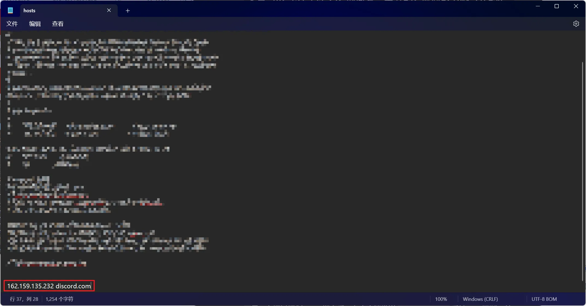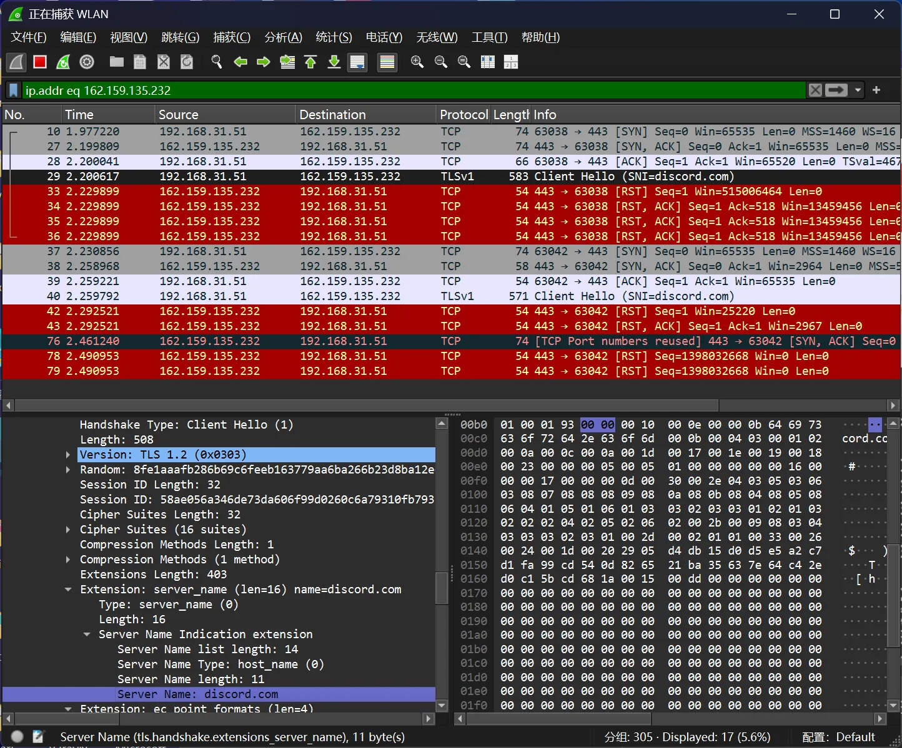
  
  5. 可见，在通过强制Hosts绑定后，在客户端发送 `Client Hello` 后被GFW检测到`Server Name` 字段，然后GFW向客户端发送一个 `RST` 报文，即要求重置客户端连接。在客户端侧，则会收到 `ERR_CONNECTION_RESET` 即：连接已重置。用户无法访问网页。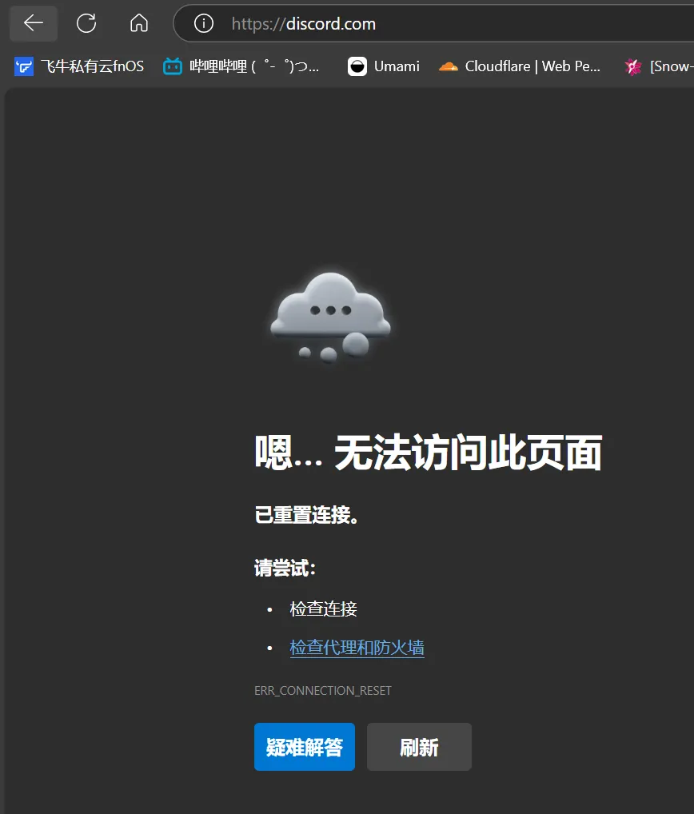

### 继续，尝试发送空 `Server Name` 报文

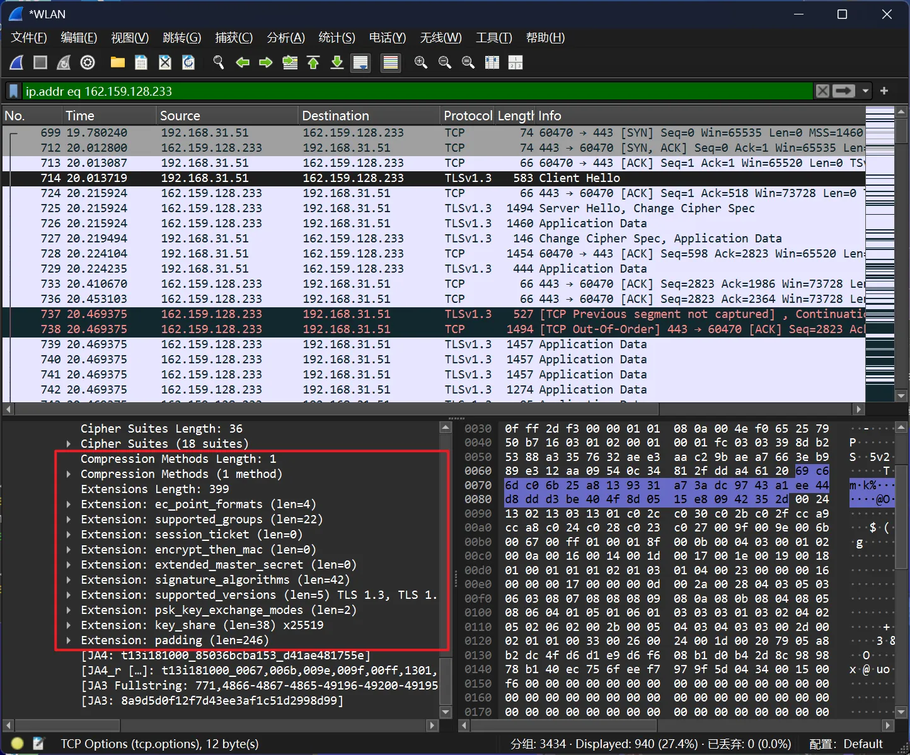


成功访问。在WireShark中并未发现 `Server Name` 字段

那么，有没有什么软件可以帮我们不发送Server Name呢？有的，兄弟有的

# 方法一：ECH
>注意：本方法实际上是启用一个尚未普及的技术：加密SNI。该方法并不能让所有明确被SNI阻断的网站恢复正常访问。尽管客户端（你）支持ECH，若服务器不支持，则在服务器看来那就是一个非法请求，不予受理
>如果想要本方法奏效，你需要确保：
>1. 网站托管在Cloudflare或者托管商声明支持ECH
>2. 网站域名被SNI阻断，客户端被发RST包

首先我提供一个网站：https://www.cloudflare-cn.com/ssl/encrypted-sni/#results
这个网站可以查询你的浏览器是否正在使用ECH。进入网站点击 `检查我的浏览器` ，待检查完毕后，检查 `安全 SNI` 一项是否为 `√` 
如果你为 `×` ，也不要气馁，我们现在来解决
### Edge浏览器
右键桌面的快捷方式点击属性，在目标一栏中添加 `--enable-features=EncryptedClientHello`
打开设置，搜索DNS，找到 `使用安全的 DNS 指定如何查找网站的网络地址` （当前版本我叫这个。反正就是配置DoH的地方）
选择`Cloudflare （1.1.1.1）`
再次测试即可
（其他浏览器我没测试，应该大同小异，网上搜索一下XX浏览器开启ECH就行）
接下来尝试访问：https://iwara.tv 。你应该能直连了
# 方法二：Accesser
>本方法采用一个神奇的方法来绕过SNI阻断，域前置。原理为客户端先找网站要一张SSL证书，然后再用这个通用证书写好要访问的网站发给服务器，这样，GFW也就看不见你要访问的网站，也就没法进行SNI阻断。
>注意：本方法需要在本地运行一个程序并且劫持所有HTTP流量，可能会导致某些正常上网情况下不会出现的问题，请酌情使用
>
[https://github.com/URenko/Accesser](https://github.com/URenko/Accesser)

Accesser是一个HTTP代理。它通过中间人的身份处理终端的HTTP出口流量，以绕过SNI阻断。我们正常访问网站时，客户端会发送Client Hello，而这个报文是明文，并且通常会携带ServerName，这个时候GFW就能通过检测ServerName来进行阻断，代替网站向客户端发送一个RST报文重置连接，做到网站被“墙”的效果

而通过Accesser代理后，它会抹掉ServerName然后发送Client Hello。这个时候，如果服务端支持域前置，则会返回客户端一个默认的SSL证书（公钥），然后客户端就能使用这个公钥再次发送一个加密的Client Hello，此时携带上ServerName就不会被GFW阻断了。但是，如果客户端在第一次我们拿公钥的时候拒绝了空ServerName的Client Hello，那这个办法就失效了，不过大部分网站是支持这样做的

### Windows

- 前往开头的的Github仓库

- 下载最新的Release。一般有一个`accesser.exe`

- 直接打开这个软件，看到这个画面即可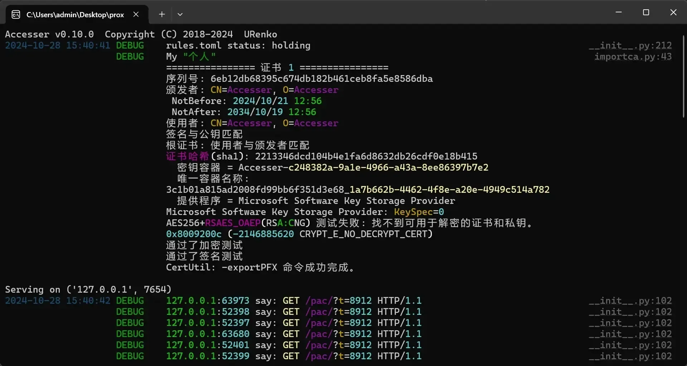

- 它的原理是自动设置系统代理，如果你使用了一些别的代理软件，会被覆盖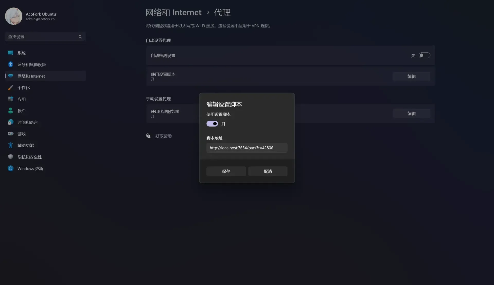

### Linux（以Debian12为例）

- 安装Python：`apt install python3`

- （可选）创建虚拟环境：`python -m venv venv`

- （可选）进入虚拟环境：`source venv/bin/activate`

- 安装Accesser：`python3 -m pip install -U accesser`

- 运行：`accesser`

- 它会提示你需要信任 `root.crt` 。关闭Accesser

- 我的证书文件在 `/root/Accesser/venv/lib/python3.11/site-packages/accesser/CERT/root.crt` 

- cd到你的证书目录：`cd /root/Accesser/venv/lib/python3.11/site-packages/accesser/CERT`

- 信任证书：`sudo cp root.crt /usr/local/share/ca-certificates/`

- 更新证书存储：`sudo update-ca-certificates`

- 设置全局代理：`sudo nano /etc/environment`

- ```
  http_proxy="http://127.0.0.1:7654"
  https_proxy="http://127.0.0.1:7654"
  no_proxy="localhost,127.0.0.1"
  ```

- 重启即可

- 测试连通性：`curl -x https://discord.com`
