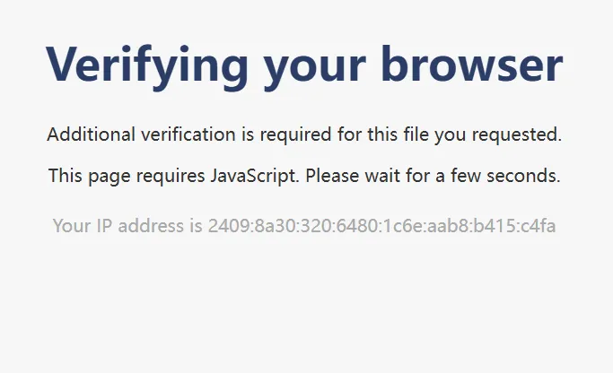

# 前言

当我们去下载类似于 https://mirrors.ustc.edu.cn/debian-cd/12.10.0/amd64/iso-dvd/debian-12.10.0-amd64-DVD-1.iso 这样的大文件时，USTC大概率会给你一个这样的：正在验证你的浏览器 的页面



如果你正在使用一个浏览器，比如Chrome、FireFox等，那过几秒你就能看到文件被成功开始下载

但是，如果你正在使用wget等无JS特性的工具下载这类文件，你将会被网站服务器拒绝： **ERROR 403: Forbidden.**

```shell
~# wget https://mirrors.ustc.edu.cn/debian-cd/12.10.0/amd64/iso-dvd/debian-12.10.0-amd64-DVD-1.iso
--2025-04-04 14:44:13--  https://mirrors.ustc.edu.cn/debian-cd/12.10.0/amd64/iso-dvd/debian-12.10.0-amd64-DVD-1.iso
Resolving mirrors.ustc.edu.cn (mirrors.ustc.edu.cn)... 2001:da8:d800:95::110, 202.141.176.110
Connecting to mirrors.ustc.edu.cn (mirrors.ustc.edu.cn)|2001:da8:d800:95::110|:443... connected.
HTTP request sent, awaiting response... 403 Forbidden
2025-04-04 14:44:14 ERROR 403: Forbidden.
```

在之前，如果我想要下载这类文件我都会使用浏览器去下载，但是今天我在向我的朋友对这件事发牢骚的时候他跟我说他绕过了

于是我便想深挖一下，然后发现其实根本不是什么JS验证！！！

# 分析

让我们首先打开这类链接，然后查询网页源代码

```html
		<h1>Verifying your browser</h1>
		<p>Additional verification is required for this file you requested.</p>
		<p>This page requires JavaScript. Please wait for a few seconds.</p>
		<div class="footer">
			<p>Your IP address is 2409:8a30:320:6480:1c6e:aab8:b415:c4fa</p>
		</div>
		<script>
			document.cookie = "addr=2409:8a30:320:6480:1c6e:aab8:b415:c4fa; max-age=300";
			setTimeout(function () {
				location.reload();
			}, 2000);
		</script>
```

你会发现，代码其实非常简洁干练，如果你的浏览器支持JavaScript，浏览器则会将 `addr=2409:8a30:320:6480:1c6e:aab8:b415:c4fa`这一串内容写入你的Cookie，之后等待两秒重载页面，然后网站发现你携带了这个Cookie，就会让你成功下载了。反之，如果你的浏览器不支持JavaScript，就会触发403，导致无法下载

那么这个`addr=2409:8a30:320:6480:1c6e:aab8:b415:c4fa`到底是什么呢？

我们注意到在网页上还显示了一句：`Your IP address is 2409:8a30:320:6480:1c6e:aab8:b415:c4fa`，那么显然，网站正是通过你能不能通过JS把你的IP写入你的Cookie来验证你的浏览器的

那么换一个思路去想，我是不是只要携带了这个Cookie，就能绕过JS验证呢？

让我们来试一试

# 实战

首先我们使用默认的wget。403

```shell
root@AcoFork-NAS:~# wget https://mirrors.ustc.edu.cn/debian-cd/12.10.0/amd64/iso-dvd/debian-12.10.0-amd64-DVD-1.iso
--2025-04-04 14:55:00--  https://mirrors.ustc.edu.cn/debian-cd/12.10.0/amd64/iso-dvd/debian-12.10.0-amd64-DVD-1.iso
Resolving mirrors.ustc.edu.cn (mirrors.ustc.edu.cn)... 2001:da8:d800:95::110, 202.141.176.110
Connecting to mirrors.ustc.edu.cn (mirrors.ustc.edu.cn)|2001:da8:d800:95::110|:443... connected.
HTTP request sent, awaiting response... 403 Forbidden
2025-04-04 14:55:00 ERROR 403: Forbidden.
```

然后让我们携带上Cookie，但是首先我们要获得网站获取到的我们的访问IP。

这很简单，我们先用curl得到网页源码。可以看到网页得到的我们的访问IP为：`2409:8a30:320:6480::458`

```html
root@AcoFork-NAS:~# curl https://mirrors.ustc.edu.cn/dbian-cd/12.10.0/amd64/iso-dvd/debian-12.10.0-amd64-DVD-1.iso                                                                 <!DOCTYPE html>
<html lang="en">
        <head>
                <meta charset="UTF-8">
                <meta name="viewport" content="width=device-width, initial-scale=1.0">
                <title>403 Forbidden</title>
                <style>
这里是无关紧要的CSS，省略
                </style>
        </head>
        <body>
                <h1>403 Forbidden</h1>
                <p>USTC Mirrors has denied your access due to one of the following reasons:</p>
                <p>1. This directory is not intended for web browsing.</p>
                <p>2. Your computer or network has exhibited suspicious activity.</p>
                <p>If you have any question, email us at lug (AT) ustc.edu.cn with your IP address.</p>
                <div class="footer">
                        <p>Your IP address is 2409:8a30:320:6480::458</p>
                </div>
        </body>
</html>
```

接下来让我们携带Cookie：`addr=2409:8a30:320:6480::458`，再次尝试wget。可惜仍然报错，思考了一下，我们可能需要伪造一下UA

```shell
root@AcoFork-NAS:~# wget --header="Cookie: addr=2409:8a30:320:6480::458" \
     https://mirrors.ustc.edu.cn/debian-cd/12.10.0/amd64/iso-dvd/debian-12.10.0-amd64-DVD-1.iso
--2025-04-04 14:57:58--  https://mirrors.ustc.edu.cn/debian-cd/12.10.0/amd64/iso-dvd/debian-12.10.0-amd64-DVD-1.iso
Resolving mirrors.ustc.edu.cn (mirrors.ustc.edu.cn)... 2001:da8:d800:95::110, 202.141.176.110
Connecting to mirrors.ustc.edu.cn (mirrors.ustc.edu.cn)|2001:da8:d800:95::110|:443... connected.
HTTP request sent, awaiting response... 403 Forbidden
2025-04-04 14:57:58 ERROR 403: Forbidden.
```

那么接下来我们携带必要的Cookie，再去伪造一个Chrome浏览器的UA。可见，已经成功下载

```shell
root@AcoFork-NAS:~# wget --header="Cookie: addr=2409:8a30:320:6480::458" \
     --user-agent="Mozilla/5.0 (Windows NT 10.0; Win64; x64; rv:109.0) Gecko/20100101 Firefox/115.0" \
     "https://mirrors.ustc.edu.cn/debian-cd/12.10.0/amd64/iso-dvd/debian-12.10.0-amd64-DVD-1.iso"
--2025-04-04 14:59:24--  https://mirrors.ustc.edu.cn/debian-cd/12.10.0/amd64/iso-dvd/debian-12.10.0-amd64-DVD-1.iso
Resolving mirrors.ustc.edu.cn (mirrors.ustc.edu.cn)... 2001:da8:d800:95::110, 202.141.176.110
Connecting to mirrors.ustc.edu.cn (mirrors.ustc.edu.cn)|2001:da8:d800:95::110|:443... connected.
HTTP request sent, awaiting response... 200 OK
Length: 3994091520 (3.7G) [application/octet-stream]
Saving to: ‘debian-12.10.0-amd64-DVD-1.iso.2’

debian-12.10.0-amd64-DVD-1.iso.2-   5%[>                          ] 207.26M  72.9MB/s 
```

# 