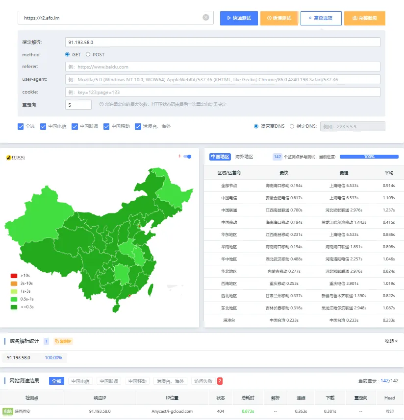

# 这是什么

Cloudflare Byoip，即如果用户自己拥有一个IP、IP段，可以将其托管给Cloudflare，并使其受益于Cloudflare全球网络的加速与安全

人话讲就是，有一些IP不直接隶属于Cloudflare，但是我们CNAME到这个IP后仍然可以正常访问到我们部署在Cloudflare上的服务。这些IP可能并不是Anycast，但是国内延迟可能会明显优于Cloudflare的官方IP段

# 如何找到Cloudflare Byoip？

可以前往 [AS209242 Cloudflare London, LLC details | Ipregistry](https://ipregistry.co/AS209242#ranges)

尝试使用ITDog强制绑定IP访问你的Cloudflare服务，不返回403即可

> 我这里返回404是正常的，因为 r2.afo.im 直接连接到Cloudflare R2对象存储，直接访问就是404

需要注意，有一些Byoip可能会强制跳转到它自己的网站。需要查看ITDog的测试日志是否有重定向，别让你的网站成为他人的引流站

# 可以长久使用吗？

这些Byoip固然比Cloudflare官方IP段质量更好，但如果你真的要用，请设置好一个机器定时筛选不可用的IP，以及添加一些Cloudflare官方IP段，防止您的服务宕机
