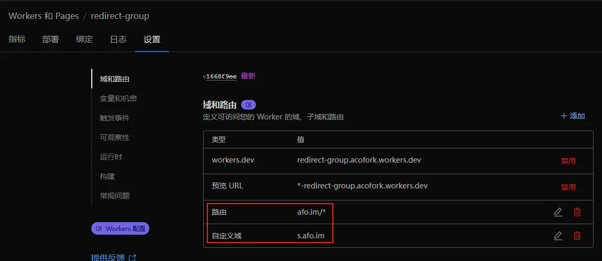
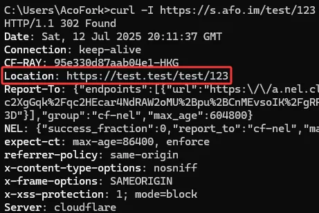

# 快速上手！

直接 Fork我的[仓库]([GitHub - afoim/Redirect_Group](https://github.com/afoim/Redirect_Group))。

接着将该仓库连接到Cloudflare部署Worker或Page，然后绑定你的域名



接着更改 `_redirects` 内的文件


例如： 

```bash
/ https://www.afo.im/ 301
/test/* https://test.test/test/:splat 302
```

则意味着

访问 `/` 301 永久重定向到 `https://www.afo.im/` 


访问 `/test/*` 302 临时重定向到 `https://test.test/test/*`



已经非常强大了。而且不占用重定向规则配额也不耗费Worker请求数！
