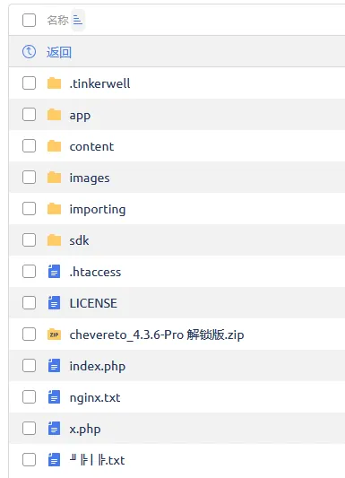
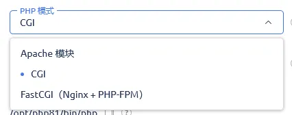
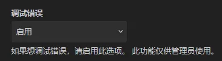

# 视频教程

https://b23.tv/E8Z34KM

# 正式开始

资源： https://r2.2x.nz/chevereto_4.3.6-Pro_unlock.zip （感谢宝塔开心版站长！）

使用 **PHP 8.1.29 & MySQL 8.0.36** 创建一个网站，然后将我们刚刚下载的ZIP上传到站点根目录并解压

你就会得到这一坨



这里开始分支！如果你是Apache请什么都不要动，它会自动检测 `.htaccess` 。如果你是Nginx请配置 `nginx.txt` 里面的伪静态规则

然后根据原 `教程.txt` 

```bash
PHP 需要 8.1 以上

需要以下PHP扩展：
fileinfo
imagemagick
exif

如果是宝塔 还得删除 PHP 禁用函数
putenv
proc_open 


MYSQL 需要 8.0 以上

伪静态需要使用我提供的 nginx.txt 里面的
```

如果你用的虚拟主机跟博主一样，也是ispmanager，请这样设置PHP



一切就绪，访问你的站点进行Chevereto的安装向导

# 疑难解答

如果出现问题，请尝试以管理员身份登录Chevereto，在管理员设置 -> 系统中开启调试模式。这样设置后，Chevereto在出现错误就会告诉你具体发生了什么问题



如果我连系统设置都进不去？请自行找你的PHP Error Log来分析问题

# 我搭建好的

https://chevereto.php.afo.im/upload

登录后查看所有图片：

https://chevereto.php.afo.im/explore/images
