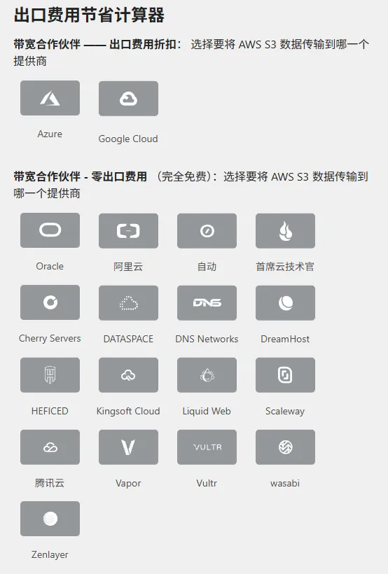
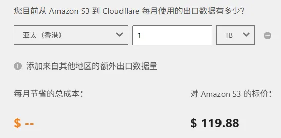

# 这是什么

Cloudflare带宽联盟（Bandwidth Alliance） 由一群具有前瞻性思维的云服务和网络公司组成，致力于为共同客户降低或免除数据传输（带宽）费用。

人话：你买的阿里云OSS，腾讯云COS套上CF就可以免流量费

# 具体哪些服务支持免流量费？

可以前往 [Cloudflare云服务_数据传输_高速云数据传输服务_|Cloudflare中国官网 | Cloudflare](https://www.cloudflare.com/zh-cn/bandwidth-alliance/) 查看

截止到文章发布日，这些服务支持

在这里可以看到，如果您每月需要传输1TB的流量，Cloudflare将为您每月节省如此多的美刀

# 如何使用？

假如您有一个阿里云OSS实例，正常来说如果您需要绑定自定义域名，需要CNAME到阿里云的Endpoint，如果您恰好使用Cloudflare NS服务器托管您的域名，只需要打开小黄云即可。

Cloudflare将托管您的阿里云OSS流量，从Cloudflare出口的流量将不收取流量费用

基于阿里云5G内存储费用免费的政策，您可以白嫖5G的对象存储

# 注意事项

永远不要泄露您的源站，也就是上文所说的阿里云OSS Endpoint，如果有人发现了您的源站，这些流量不从Cloudflare出口，您将会被收取费用

当然，大部分对象存储服务商支持配置私有访问，详细规则和使用方法请咨询各方客服
