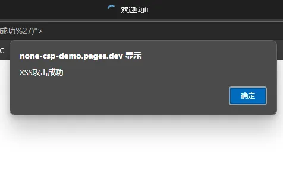
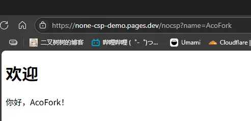
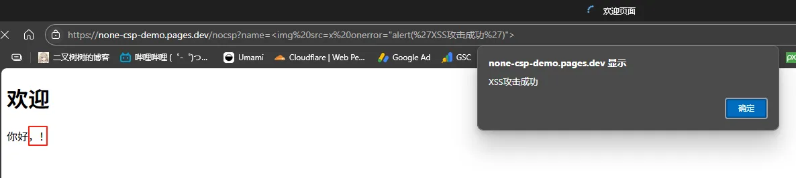
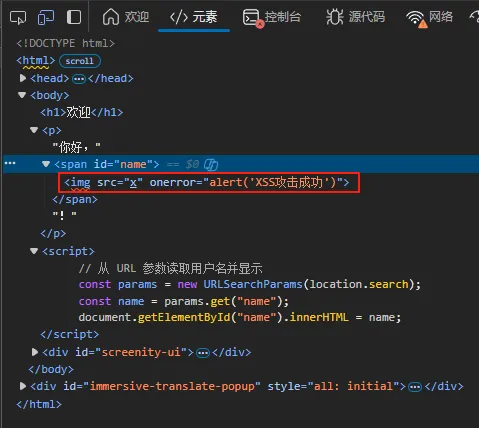
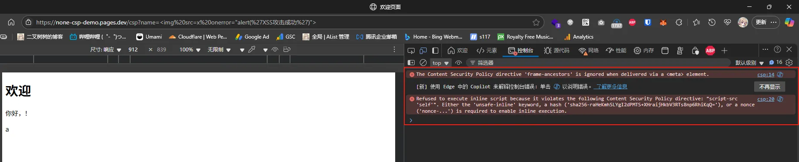

# 举个例子吧！

这是一个无CSP标头的网站： [点我](https://none-csp-demo.pages.dev/nocsp?name=%3Cimg%20src=x%20onerror=%22alert(%27XSS%E6%94%BB%E5%87%BB%E6%88%90%E5%8A%9F%27)%22%3E)

不出意外，你的浏览器会弹出一个提示



# 这是如何做到的？

这个项目开源在 [afoim/none_csp_demo](https://github.com/afoim/none_csp_demo)

HTML内容为

```html
<!DOCTYPE html>
<html>
<head>
  <meta charset="UTF-8">
  <title>欢迎页面</title>
</head>
<body>
  <h1>欢迎</h1>
  <p>你好，<span id="name"></span>！</p>

  <script>
    // 从 URL 参数读取用户名并显示
    const params = new URLSearchParams(location.search);
    const name = params.get("name");
    document.getElementById("name").innerHTML = name;
  </script>
</body>
</html>
```

这个网站非常简单，网页通过查询符 `?name=xxx` 来动态显示用户名

比如你输入 https://none-csp-demo.pages.dev/nocsp?name=AcoFork 网页就会显示



而根据源码 网页是通过 `innerHTML` 直接进行文本插入的

这种方式没有任何的安全审查，会将传入的内容直接拼接到HTML中

那么...如果我们给网站这样一个 `name` 呢？

尝试输入 

https://none-csp-demo.pages.dev/nocsp?name=%3Cimg%20src=x%20onerror=%22alert(%27XSS%E6%94%BB%E5%87%BB%E6%88%90%E5%8A%9F%27)%22%3E

你会发现网站并没有打印出任何用户名，而且浏览器还弹出了一个奇怪的窗口



我们F12查看当前网页的源代码



发现在 `<span id="name"></span>` 中

被插入了一条 `` ！

也就是说，网页把我们传入的 `name` 并没有解析为纯文本

而是暴力的直接插入了HTML

导致浏览器并没有渲染出来  `你好， ！` 

而是直接将 `` 作为HTML去执行了！

由于 `src=x` 必定无法获取，又因为设置了 `onerror` 这个回退源

导致浏览器直接执行了 `alert('XSS攻击成功')` 这个脚本！

# 有什么危害？

举一反三，既然我们能让浏览器弹出一个提示框

那也就能做到其他事情

攻击者完全可以伪造一条URL，然后发给你，比如**获取你的浏览器Cookie然后通过Fetch发送到指定的服务器**！！！
`https://victim-site.com/page?name=`

# 如何设置CSP以避免这类攻击？

尝试访问这个URL，该URL设置了严格的CSP策略

https://none-csp-demo.pages.dev/csp?name=%3Cimg%20src=x%20onerror=%22alert(%27XSS%E6%94%BB%E5%87%BB%E6%88%90%E5%8A%9F%27)%22%3E

你会发现并未弹出提示框，并且F12控制台出现报错



**以下是GPT给出的翻译和解释**

**翻译：**

> 拒绝执行内联脚本，因为它违反了以下 CSP 指令：`script-src 'self'`。要允许执行内联脚本，必须使用 `'unsafe-inline'` 关键字、指定哈希值（例如 `'sha256-raHeKmhSLYgI2dPMTS+XHraijHkbV3RTs8np6RhiKqQ='`），或使用随机数（例如 `'nonce-...'`）。

**解释：**  
你的 CSP 策略里规定只能加载本域（`'self'`）的脚本，但是你在 HTML 页面中写了 `<script>...</script>` 这样的**内联脚本**（inline script）。这被当前 CSP 限制了，无法执行。

这样我们就成功避免了XSS攻击

在HTML head中添加以下内容即可

```html
  <!-- 安全的 CSP 策略 -->
  <meta http-equiv="Content-Security-Policy" content="
    default-src 'self';
    script-src 'self';
    object-src 'none';
    frame-ancestors 'none';
    base-uri 'self';
  ">
```

# 如何保证我的数据安全？

1. 如果你正在运营站点，**请确保各个站点设置了严格的CSP策略**。这样，即使有攻击者想要XSS注入，也会被CSP策略拦截

2. **不要随意点击来历不明的链接或扫描来历不明的二维码**。对于短链接、混淆后的链接，首先先解析出最终链接，评估风险后再访问。或者使用无痕模式访问。也许目标网站并没有严格的CSP策略，这可能会导致你的个人数据泄露
