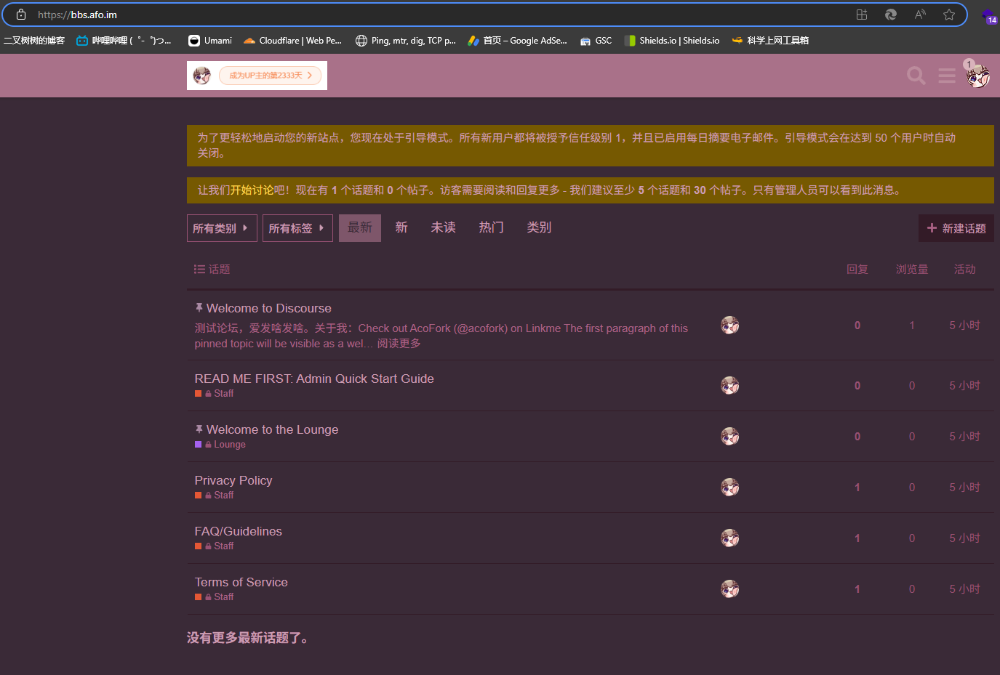

# 正式开始

确保你安装了 `Docker` 和 `Docker-Compose` 

选一个目录创建 `docker-compose.yml`

写入内容

```yaml
version: '2'
services:
  postgresql:
    image: docker.io/bitnami/postgresql:11
    volumes:
      - 'postgresql_data:/bitnami/postgresql'
    environment:
      - POSTGRESQL_POSTGRES_PASSWORD=admin12345
      - POSTGRESQL_USERNAME=ex_discourse
      - POSTGRESQL_PASSWORD=user12345
      - POSTGRESQL_DATABASE=example_discourse
  redis:
    image: docker.io/bitnami/redis:6.0
    environment:
      - REDIS_PASSWORD=redis12345
    volumes:
      - 'redis_data:/bitnami/redis'
  discourse:
    image: docker.io/bitnami/discourse:2
    ports:
      - '127.0.0.1:880:3000'
    volumes:
      - 'discourse_data:/bitnami/discourse'
    depends_on:
      - postgresql
      - redis
    environment:
      # 用户和站点配置
      - DISCOURSE_HOST=example.com
      - DISCOURSE_USERNAME=siteadmin
      - DISCOURSE_PASSWORD=siteadmin12345
      - DISCOURSE_EMAIL=siteadmin@gmail.com
      # 数据库连接配置
      - DISCOURSE_DATABASE_HOST=postgresql
      - DISCOURSE_DATABASE_PORT_NUMBER=5432
      - DISCOURSE_DATABASE_USER=ex_discourse
      - DISCOURSE_DATABASE_PASSWORD=user12345
      - DISCOURSE_DATABASE_NAME=example_discourse
      # Redis 连接配置
      - DISCOURSE_REDIS_HOST=redis
      - DISCOURSE_REDIS_PORT_NUMBER=6379
      - DISCOURSE_REDIS_PASSWORD=redis12345
      # 使用 postgresql-client 为 Discourse 创建数据库
      - POSTGRESQL_CLIENT_POSTGRES_USER=postgres
      - POSTGRESQL_CLIENT_POSTGRES_PASSWORD=admin12345
      - POSTGRESQL_CLIENT_CREATE_DATABASE_NAME=example_discourse
      - POSTGRESQL_CLIENT_CREATE_DATABASE_EXTENSIONS=hstore,pg_trgm
      # SMTP
      - DISCOURSE_SMTP_HOST=smtp.mailgun.org
      - DISCOURSE_SMTP_PORT=587
      - DISCOURSE_SMTP_USER=邮箱用户名
      - DISCOURSE_SMTP_PASSWORD=邮箱密码
      - DISCOURSE_SMTP_PROTOCOL=tls或ssl
      - DISCOURSE_SMTP_AUTH=login
  sidekiq:
    image: docker.io/bitnami/discourse:2
    depends_on:
      - discourse
    volumes:
      - 'sidekiq_data:/bitnami/discourse'
    command: /opt/bitnami/scripts/discourse-sidekiq/run.sh
    environment:
      # 用户和站点配置
      - DISCOURSE_HOST=example.com
      - DISCOURSE_USERNAME=siteadmin
      - DISCOURSE_PASSWORD=siteadmin12345
      - DISCOURSE_EMAIL=siteadmin@gmail.com
      # 数据库连接配置
      - DISCOURSE_DATABASE_HOST=postgresql
      - DISCOURSE_DATABASE_PORT_NUMBER=5432
      - DISCOURSE_DATABASE_USER=ex_discourse
      - DISCOURSE_DATABASE_PASSWORD=user12345
      - DISCOURSE_DATABASE_NAME=example_discourse
      # Redis 连接配置
      - DISCOURSE_REDIS_HOST=redis
      - DISCOURSE_REDIS_PORT_NUMBER=6379
      - DISCOURSE_REDIS_PASSWORD=redis12345
      # SMTP
      - DISCOURSE_SMTP_HOST=smtp.mailgun.org
      - DISCOURSE_SMTP_PORT=587
      - DISCOURSE_SMTP_USER=邮箱用户名
      - DISCOURSE_SMTP_PASSWORD=邮箱密码
      - DISCOURSE_SMTP_PROTOCOL=tls或ssl
      - DISCOURSE_SMTP_AUTH=login
volumes:
  postgresql_data:
    driver: local
  redis_data:
    driver: local
  discourse_data:
    driver: local
  sidekiq_data:
    driver: local
```

需要修改的部分。配置文件中两份都要改


| 需替换值                | 解释                      |
| ------------------- | ----------------------- |
| admin12345          | 数据库管理员密码（可选）            |
| ex_discourse        | 数据库用户名（可选）              |
| user12345           | 数据库用户密码（可选）             |
| example_discourse   | 数据库名（可选）                |
| redis12345          | Redis 密码（可选）            |
| 127.0.0.1:880       | 映射端口（可选）                |
| example.com         | 网站IP或域名(不加HTTP)（**必改**） |
| siteadmin           | 网站管理员用户名（**必改**）        |
| siteadmin12345      | 网站管理员密码（**必改**）         |
| siteadmin@gmail.com | 网站管理员邮箱（**必改**）         |
| smtp.mailgun.org    | 邮箱HOST（**必改**）          |
| 587                 | 邮箱端口。只能用587端口（**必改**）   |
| 邮箱用户名               | 邮箱用户名（**必改**）           |
| 邮箱密码                | 邮箱密码（或者授权码）（**必改**）     |
| tls                 | 邮箱协议。只能用TLS协议（**必改**）   |

如果需要一个支持SMTP TLS的邮箱服务可以使用[微信企业邮](/posts/exmail-qq/)

构建：

```bash
docker compose up -d
```

如果遇到 `docker.io` 无法访问。可以使用镜像源

部署完毕后查看 `discourse-discourse-1` 容器的日志

如果看到下述日志，则Discourse正在进行预编译资源，稍等几分钟即可

```
INFO  ==> Precompiling assets, this may take some time...
```

如果看到下述日志，证明Discourse已经在容器内3000端口启动了

```bash
Accessible via: http://0.0.0.0:3000/
```

接下来访问你设置的域名（如果没有做解析或者网站在内网可以使用Cloudflare Tunnel曲线救国）

访问，大功告成


