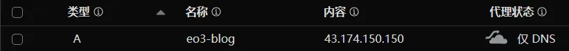
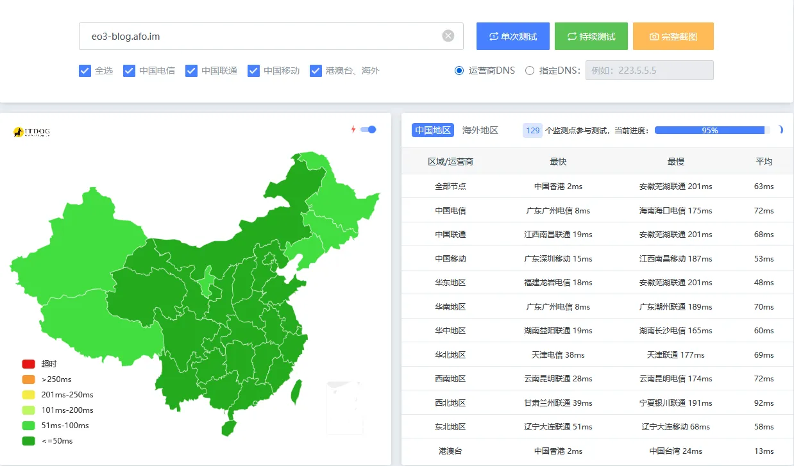
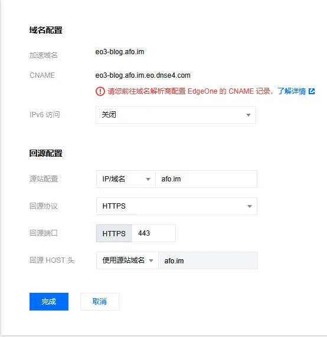
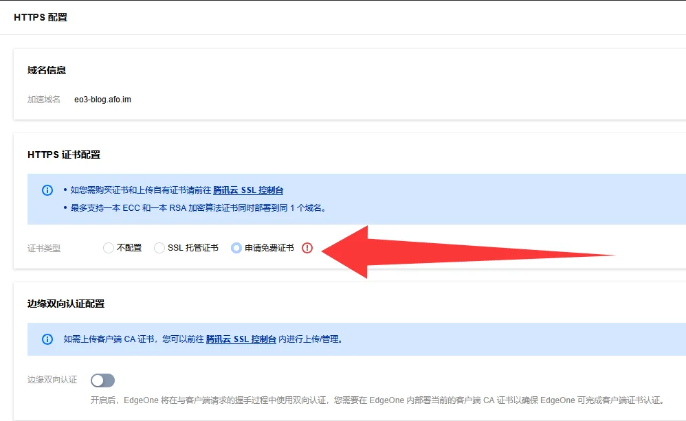
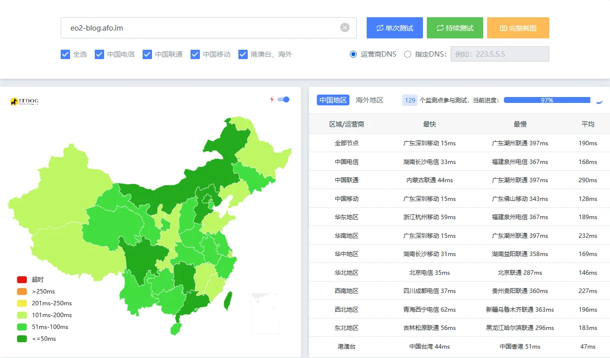

# 这是个啥？

在我的[早期文章](/posts/static-web)中提过EdgeOne，当时它还仅有Page业务，而且IP是很垃圾的新加坡，并且还会吞提交。故我当时给出了不如Cloudflare Page的评价

不过这玩意最近出了CDN业务，并且还是免费。所以我又重拾起来了

# 我要怎么用上？

浏览器访问： https://edgeone.ai 注册账号

或者看视频： https://www.bilibili.com/video/BV1KmNUzVEEL

# 关于EdgeOne CDN - 网站安全加速

> 以下言论仅适用于**未备案**用户

需要搞免费版兑换码。或者直接买个人版后可用，需要外币卡。

通过创建 `加速区域全球可用区（不含中国大陆）` 。会分配给你一个类似 `eo3-blog.afo.im.eo.dnse4.com` 这样的CNAME地址要求你做CNAME解析。IP很烂。**可以直接做优选。** 获取方式很简单，直接ITDOG PING `edgeone.ai` 找个最快的IP直接写A解析（貌似国内的也可以🤔），如图。**本人EdgeOne优选：** `eo.072103.xyz`

因为这玩意是一个CDN，需要一个源站。如果你是静态站点可以用Cloudflare Page部署一个站，然后设置回源如下（注意回源Hosts头要填写源站域名，否则CF可能会报423 Locked *他妈的比腾讯云的418我是个茶壶规范多了😅*）

最后开启SSL，结束，享受它吧

# 关于EdgeOne Pages（新）

不用花钱，注册账号后即可用

不管你的加速区域在哪，都建议绑定自己的域名，否则可能出现访问401。含中国大陆的区域需要域名备案

> 以下言论仅适用于**未备案**用户

通过创建 `加速区域全球可用区（不含中国大陆）` 。IP现在从新加坡Anycast改为了俩IP（如果按国内可用来算）43.175.44.57（中国香港。非移动延迟250ms+，移动延迟100ms-）， 43.132.85.153（日本东京。三网200ms左右）。比起之前的新加坡平均300ms的神奇IP好了很多

**EdgeOne Pages无法优选**。如果将EdgeOne Pages托管的域名指向非 `edgeone.app` 解析出的IP。会报418（比如EdgeOne CDN节点IP）

默认时延情况，如图

> 以下言论仅适用于**备案**用户

默认延迟50ms以下（中国大陆）

优选不能将IP指向EdgeOne CDN节点的IP，否则报418。 
