本群已删除 ~~此文本来是针对于 matrix.afo.im 的，现在更改为了 m.2x.nz~~

---

# 正式开始

> 如果你是App，请确保已经使用 m.2x.nz ，并且点击使用Github登录，无需注册

使用浏览器访问： https://matrix.to/#/#acofork:m.2x.nz

点击 Continue

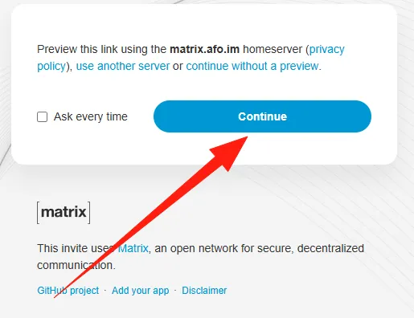

选择Element 卡片上的 Continue

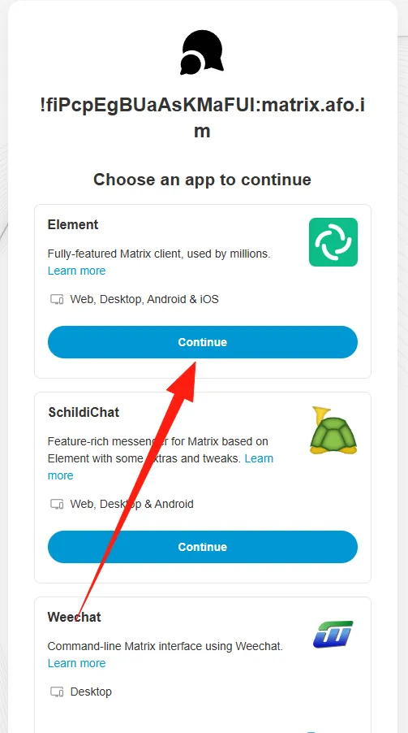

选择在浏览器中继续， Continue in your browser

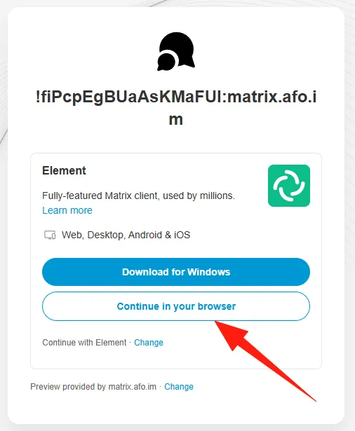

接着来到Element门户页，首先更改语言

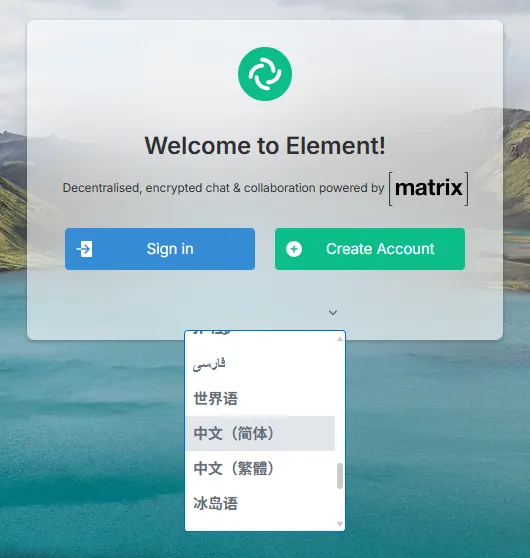

接着点击登录

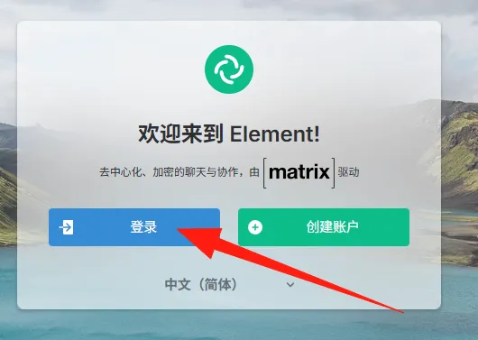

编辑 家服务器

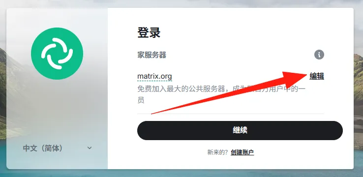

使用 其他自定义服务器： `m.2x.nz` 。然后点击继续

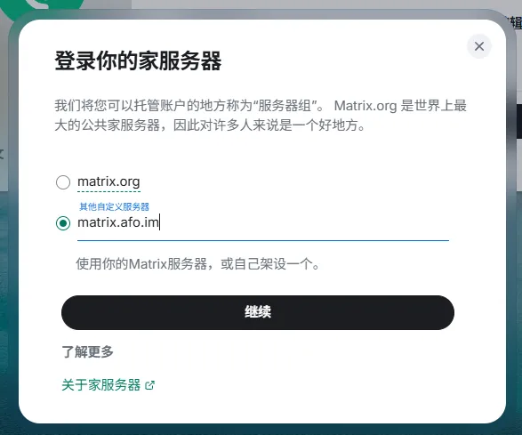

点击使用Github继续

> 该服务器已禁用传统的邮箱注册

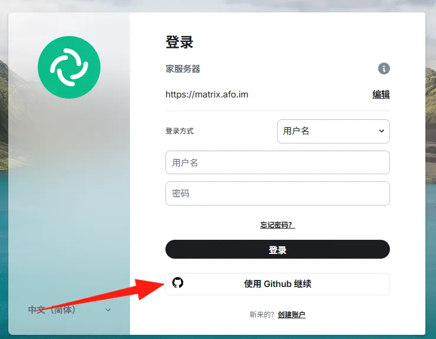

在结束 Github OAuth2 授权 后。浏览器会自动返回到 `m.2x.nz` 域，点击 Continue

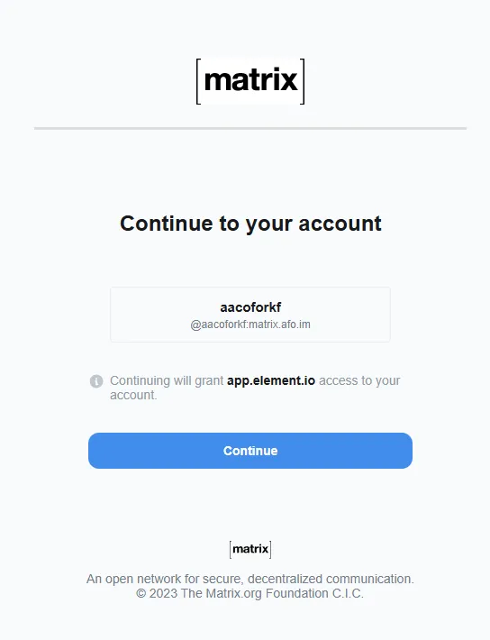

现在，你已成功登入Matrix

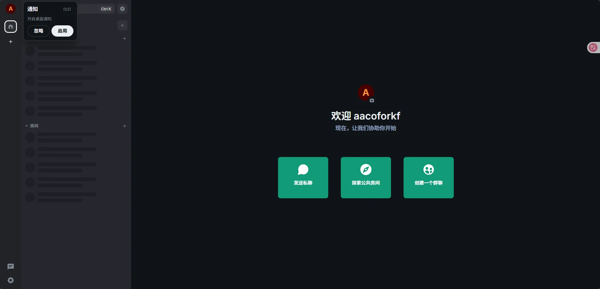

接着，再次访问最开始的邀请链接（在文章开头）。此时会弹出受邀界面，点击加入讨论即可

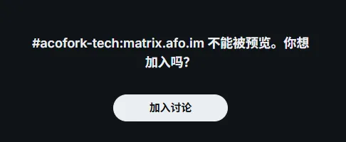

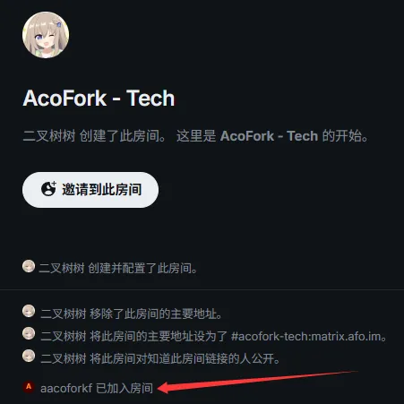

# 疑难解答

### 本服务器

无法注册？：直接点击登录，然后通过Github授权即可

无法登录？：Github用户名不能为纯数字

如何更改我的密码？：Github单点登录无密码，您只需要保证您的Github账户不丢失/封禁即可

### 联邦

如何加入？：输入 `#acofork:m.2x.nz` 即可加入

### 通知

安卓如果无法使用 `Google通知` 可以尝试安装 https://play.google.com/store/apps/details?id=chat.fluffy.fluffychat 。然后安装Ntfy配置通知 https://github.com/krille-chan/fluffychat/wiki/Push-Notifications-without-Google-Services 。可能需要等一段时间才能自动配置完成
