# 引言

主播也是搞到了EdgeOne免费版激活码了，终于可以大展宏图了😋

# 我怎么换到EdgeOne免费版？

前往 [腾讯云EdgeOne免费计划兑换码 - 立即体验](https://edgeone.ai/zh/redemption)

推荐直接发推，按照要求发

发完后私信EO官方即可

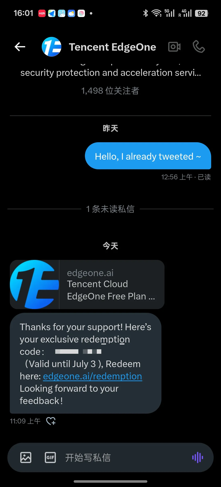

# 默认EdgeOne给的Anycast CNAME过于垃圾？

默认在EO添加域名EO会发给你一个类似 `afo.im.eo.dnse4.com` 这样的CNAME

也就是 `你的域名.eo.dnse4.com` 

emm 这玩意吧 你们自己看速度吧

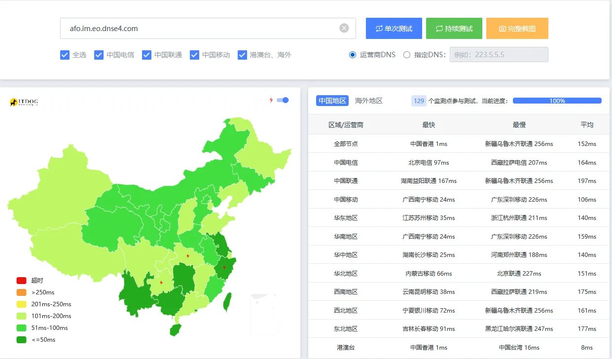

我推荐大家使用 `43.174.150.150` 。是一个中国香港的三网优化IP。速度如下。**本人EdgeOne优选：** `eo.072103.xyz`

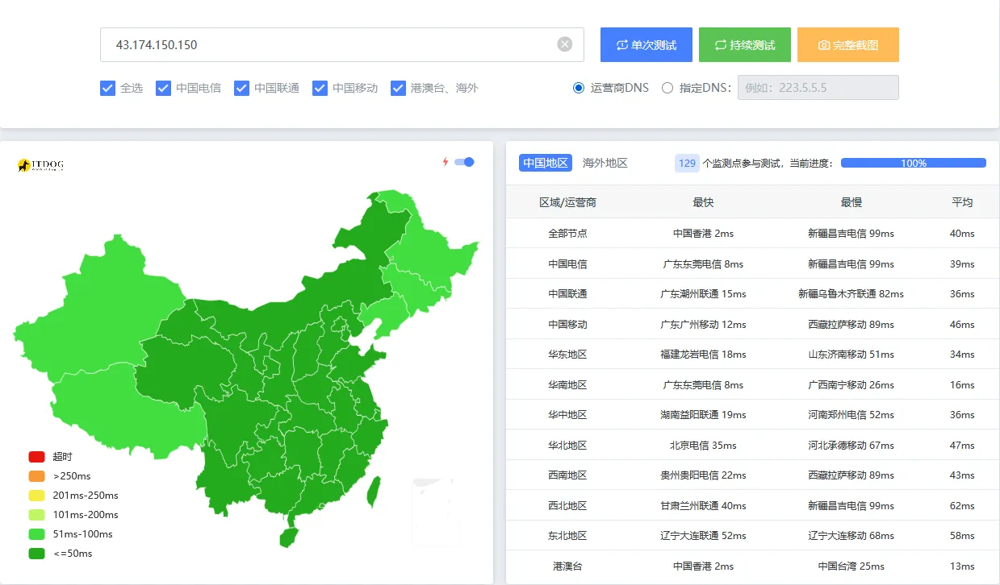

# 换了CNAME后无法自动申请免费SSL？

如果你将你的域名托管给EO并且没有用EO给你的CNAME，则这个选项不可用

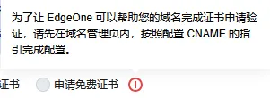

我推荐采用1panel、宝塔、acme.sh手动申请泛域名证书然后上传到腾讯云SSL控制台，就像这样

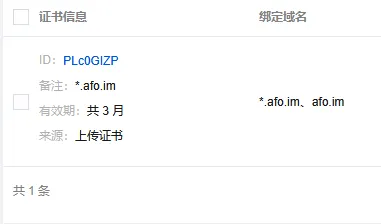

# EdgeOne怎么做重定向？

在这里

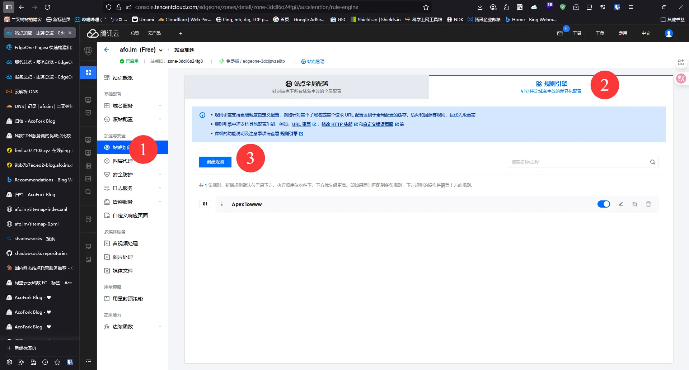

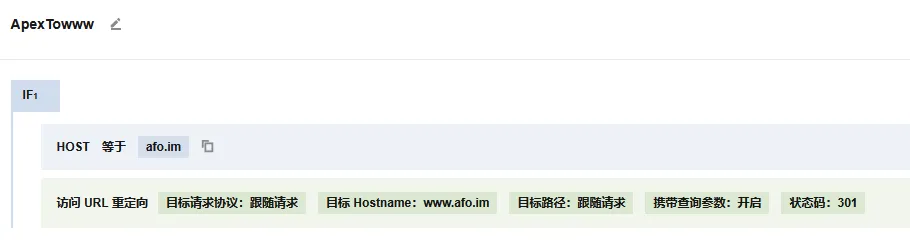

EO边缘函数也支持重定向，支持更细化的重定向规则

但是这玩意记录请求数，不如用Cloudflare的重定向规则

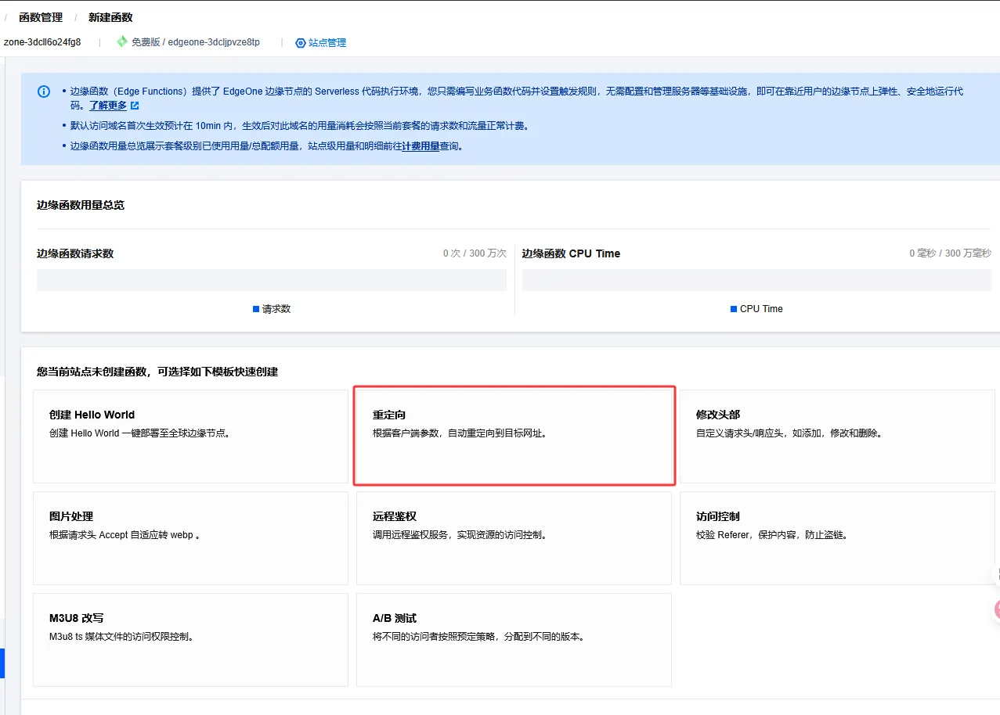

首先我们在CF写这样一个规则
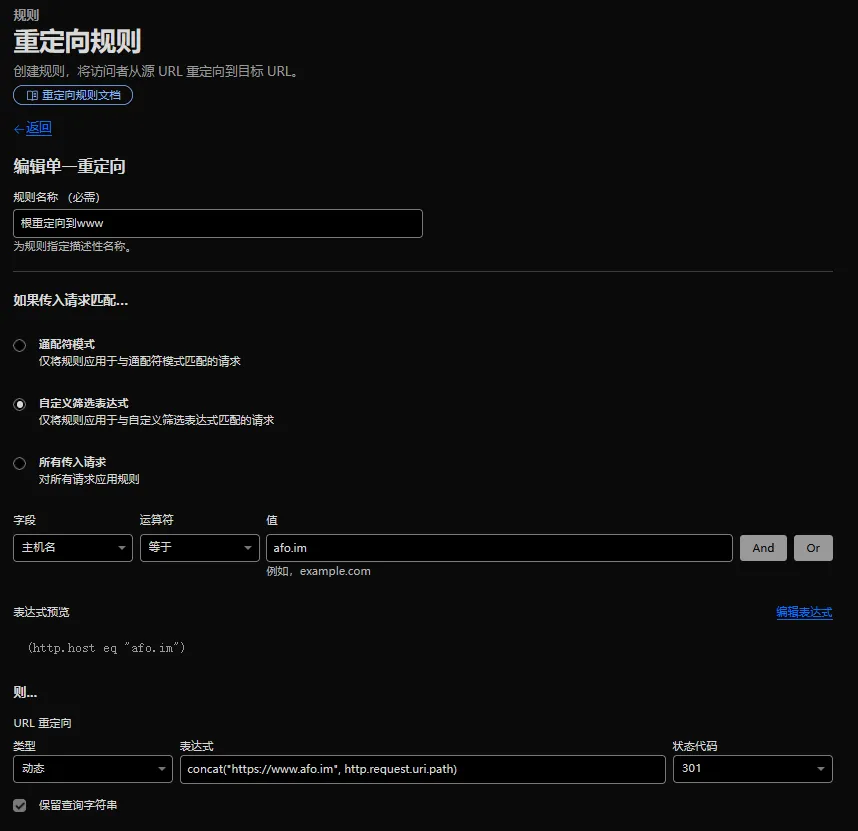

然后让EO回源到CF边缘节点。最简单就是随便填个IP然后套CDN

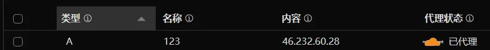

接着配置EO回源，这里一定要使用加速域名作为回源Host头

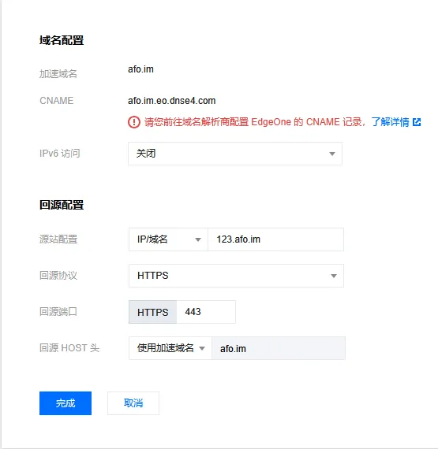

原理：用户 - EO - CF - CF识别到Host匹配重定向规则 - 301

# EdgeOne反代一切？

> 大部分情况将 `回源HOST头` 改为源站就能解决反代后网站无法访问的问题
> 
> 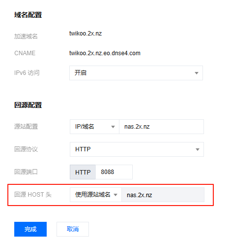
