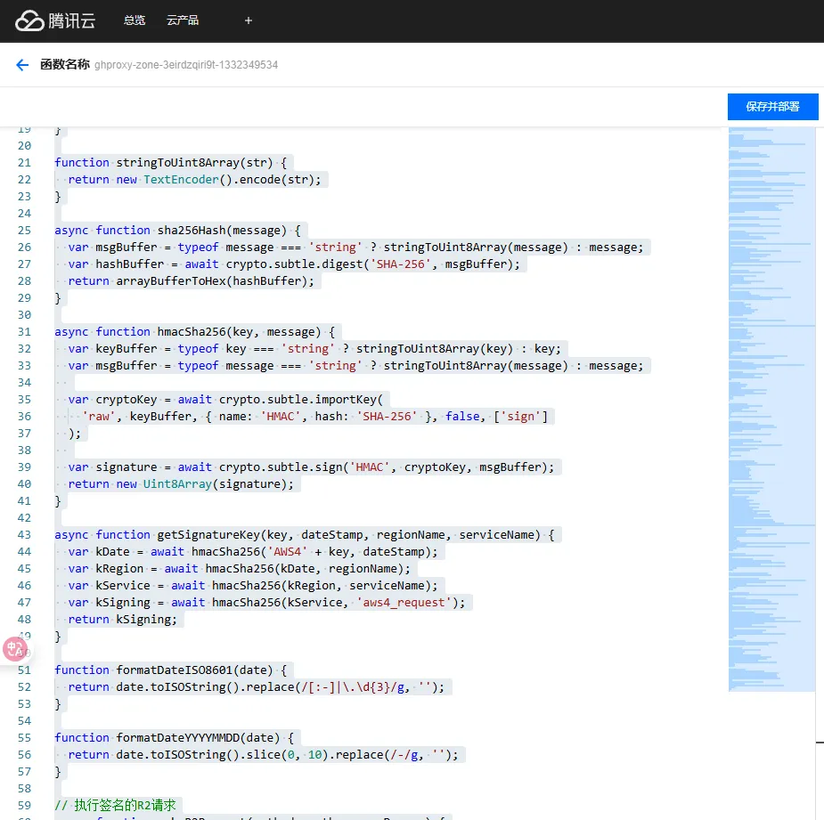
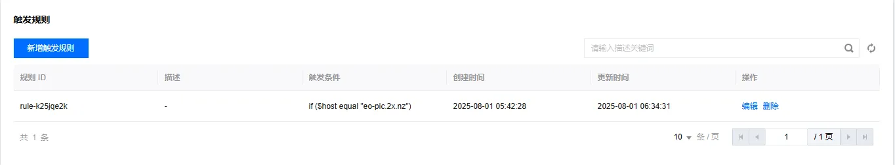

# 正式开始

前往 [afoim/EdgeOne_Function_PicAPI: 适用于EdgeOne边缘函数的随机图API](https://github.com/afoim/EdgeOne_Function_PicAPI)

复制 `worker.js` 代码

部署到EdgeOne边缘函数



将代码开头的 `R2_CONFIG` 设为你自己的

```js
var R2_CONFIG = {
  region: 'auto',
  service: 's3',
  accountId: '',
  accessKeyId: '',
  secretAccessKey: '',
  bucketName: ''
};
```

配置你的R2，将横屏随机图放到 `ri/h` 和 `ri/v` 。保证跟代码中的路径一样

```js
    // 根据路径确定前缀
    var prefix = '';
    if (pathname === '/h') {
      prefix = 'ri/h/';
    } else if (pathname === '/v') {
      prefix = 'ri/v/';
    } else if (pathname === '/') {
```

访问 `/h` 则展示一张横屏随机图，访问 `/v` 则展示一张竖屏随机图


如果需要绑定域名请设置触发规则



# 注意

边缘函数每月有300万次的请求数限制，暂不知道超出是否扣费
