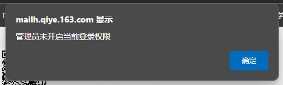
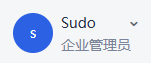
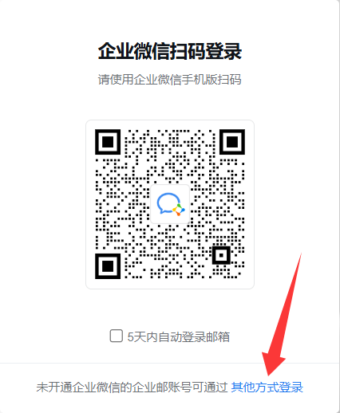
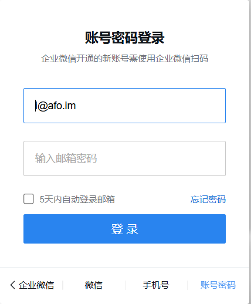
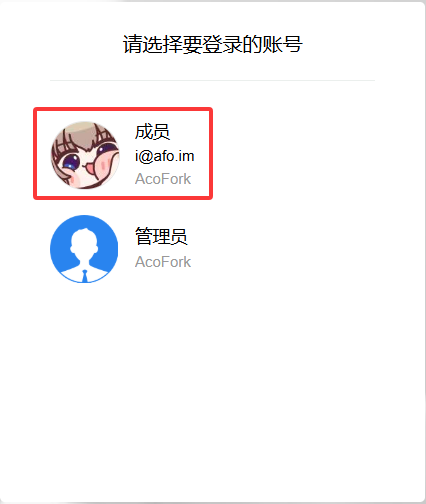
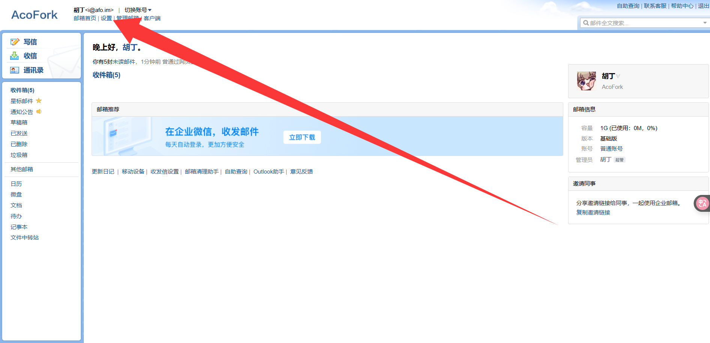
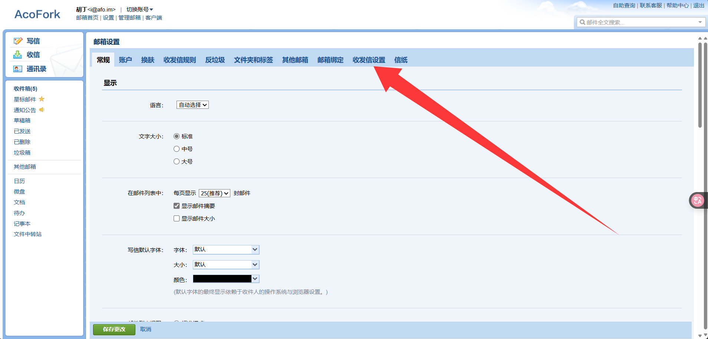
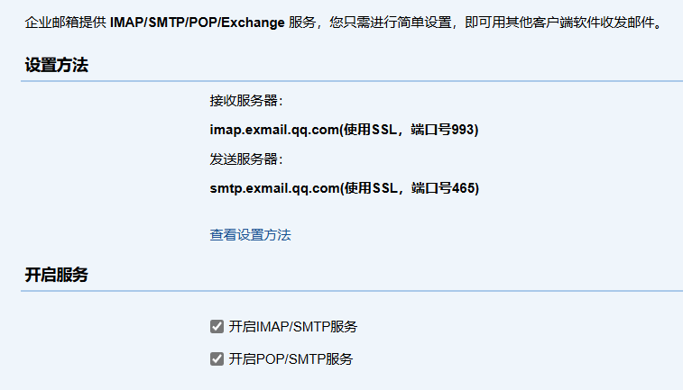
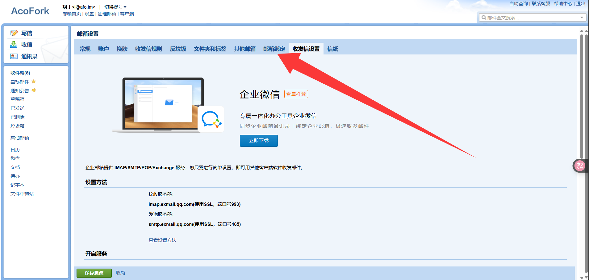
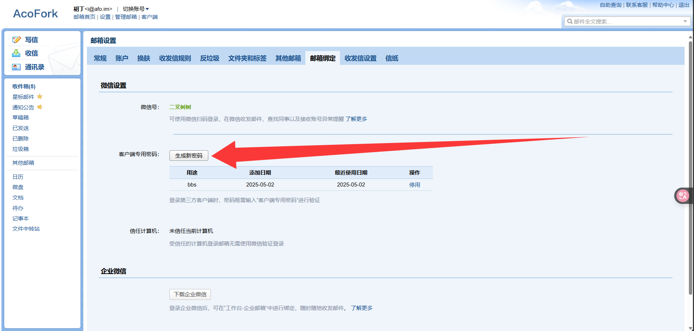

# 前情提要

之前我写过一篇[网易企业邮](/posts/163-free-domain-email/)的文章，但真的投入使用后发现各种毛病是层出不穷。比如SMTP/IMAP/POP3默认是关的，你想打开就弹出一个 `管理员未开启当前登录权限` ...

我TM是不是管理员啊，你倒是TM告诉我TMD这个在哪开啊！

而微信企业邮完美解决了这些问题，开启SMTP/IMAP/POP3服务非常简单，而且也没有网易那么草台

# 正式开始

首先进入 [腾讯企业邮箱](https://work.weixin.qq.com/mail/) 创建一个企业，会让你绑定企业微信，按照步骤弄好就行

接下来绑定域名，添加几条MX记录即可

最后是重头戏，开启SMTP/IMAP/POP3

我们需要前往 [腾讯企业邮箱-登录入口](https://exmail.qq.com/login)

注意，这里点击 `其他方式登录`

然后选择账号密码登录

接着选择成员登录（如果直接进去了就跳过这一步）

接下来左上角点击设置

收发信设置

这里就能查看到SMTP和IMAP的地址和端口（实测TLS也是支持的，只是它没写）

接下来前往邮箱绑定

生成新密码

接着随便找一个邮箱客户端去测试即可

接着你就可以拿这个邮箱给你的博客论坛用啦