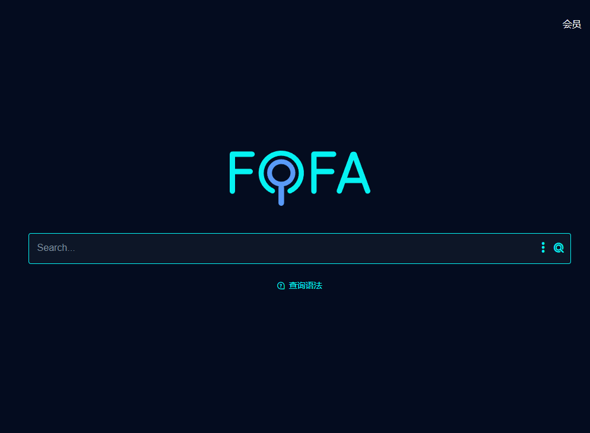
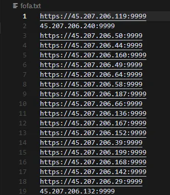
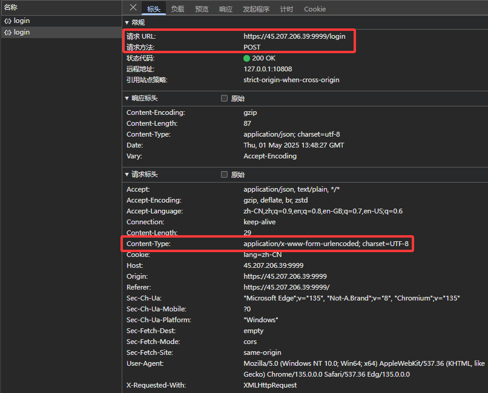
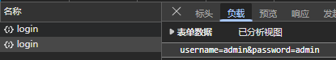
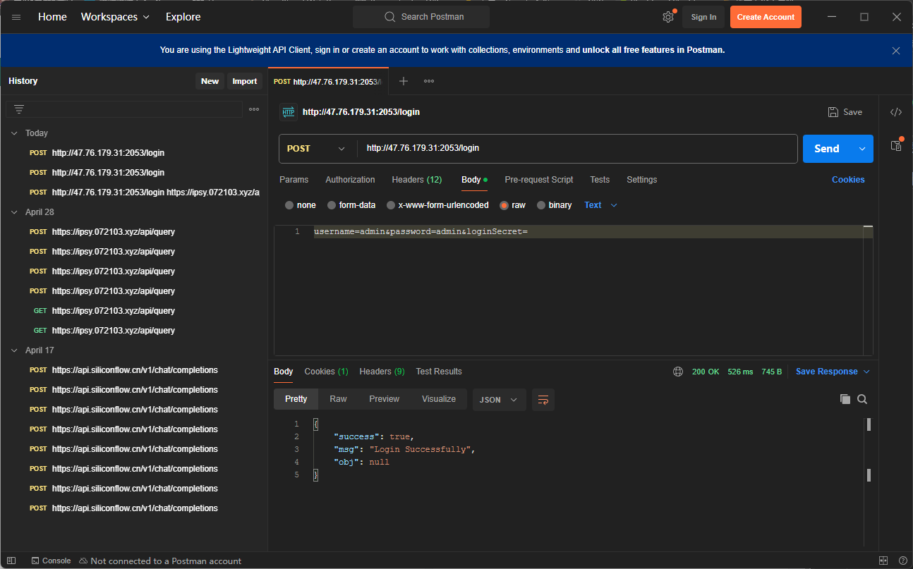
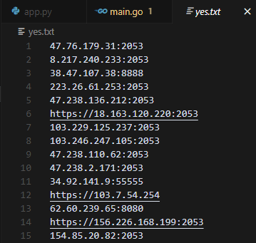

# 正式开始

首先我们要先找到互联网上搭建了3x-ui的网站，可以使用 [网络空间测绘，网络空间安全搜索引擎，网络空间搜索引擎，安全态势感知 - FOFA网络空间测绘系统](https://fofa.info/)

进入后我们搜索：`app="3x-ui" && region="HK"` 即寻找3x-ui网站，并且地区为中国香港的

接下来我们制作一个TXT文档，里面全部都是搭建了3x-ui的网站，如图

然后我们就要找到3x-ui的登录原理

通过正常登录可知，他会请求 `/login` 并且以 `application/x-www-form-urlencoded; charset=UTF-8` 格式发送请求体

接下来让我们查看请求体，非常简单！只有一个 `username` 和 `password`

然后让我们在Postman中模拟请求...完全没有问题！

接下来就可以编写爬虫了！

大致原理：依次请求TXT内的网站，并且模拟登录，如果弱口令登录成功，并且网站返回登录成功的JSON，就将它记录到另一个TXT。循环结束后就能得到非常非常多的白嫖的节点了！

