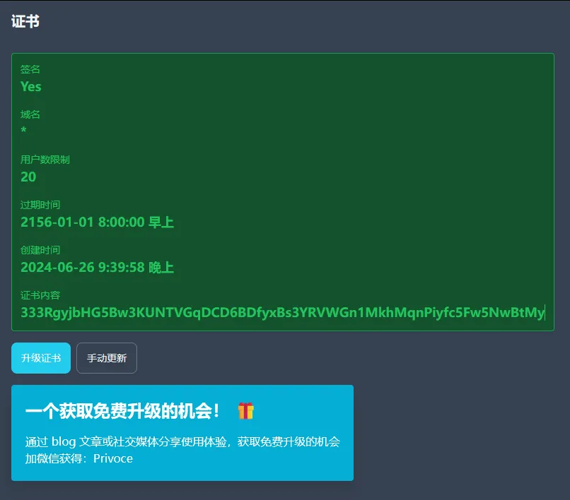
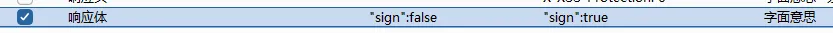
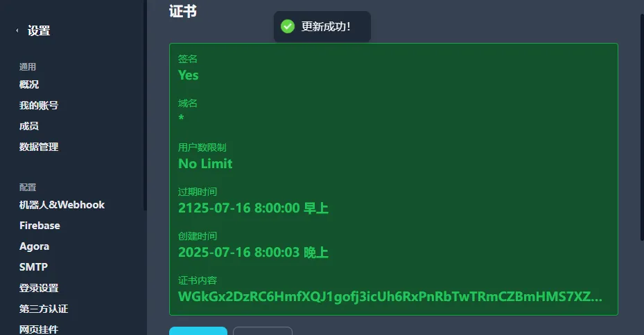
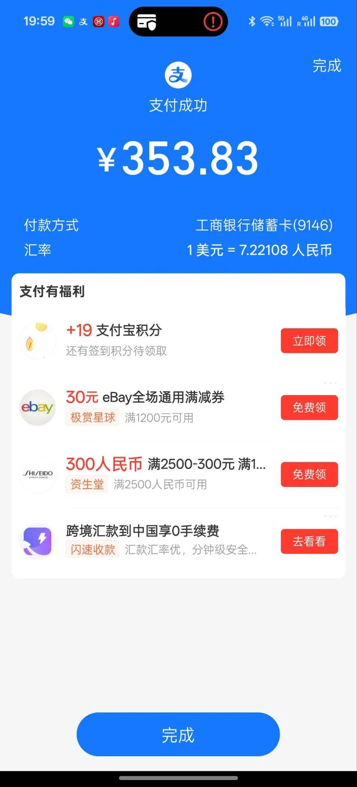

# 前因

可以直接看 [记录被voce.chat坑了350 - 屮蛋Blog](https://info.php.afo.im/index.php/archives/12/)

# 正版激活的原理？

一般来说。大部分授权系的软件会将你的授权文件首先经过加密，然后发送到授权服务器，等待授权服务器返回一个正确的状态，然后激活

# 如何伪造这个正确的状态？

大部分软件的授权通信是通过后端进行的（但是vocechat不一样，它在前端🤣），我们需要捕获软件向授权服务器发送的授权请求以及授权服务器返回的正确状态

假如你发送一个有效的许可证，得到 `check: true` 这个响应，同时软件本体显示 `已激活` 。然后发送一个无效的许可证，得到 `check: false` 这个响应，同时软件本体显示 `许可证无效` 。那么我们可以非常简单的去破解，只需要让对方服务器无论对软件发送的任意许可证都返回 `check: true` 即可。

这涉及到响应体修改，需要使用第三方软件，推荐 `BurpSuite`

> 上面的情况是一个最简单的授权激活方案。真实情况下可能授权服务器并不会返回一个明确的值，会返回一串密文，然后软件进行解密得到授权可信性信息。如果你使用的软件并未开源，后续的一系列操作就看你造化了

# 正片，怎么破解VoceChat？

> 不需要你有一个正版许可证，因为我花350买了😭

部署完毕VoceChat后，进入授权界面开启浏览器的DevTools，如图



设置你的 `BurpSuite` 软件，全局替换 `"sign": false` 为 `"sign": true` 



点击手动更新，上传如下内容

```bash
LkA5K1paaxyiNckLwYxdektr64uk6zFs322ZAXDp4aQWkTNcY9ztKKFBwpPbonS3TeFTnveHi6w5VR1MVLL4WyEw3QTfHuitLcVkQFjYZoiQumdQ4XPTN9Xo5hwdEZwCmb7rSus1Sg51b87HjRFZEGHSYYUoqRZPhte1sqBxXdRqwpvLubkhvH4kPB4PXddcdLj2bmXSF7Ww3UZ3Sp6LvueXGw3GggDkgKDP4C7466VVhX6gPBZnaQNovX2G5ugnuN9B6uUeeg63jDSVFnZRPF1bZUxPM5cqdA6U399x8uzEpamhMTMkT3ZiQmVerjszsr3vB8K5DvwKXYp6qKtuna5MgQMC4oFKMNKCSPg7F4Eox8s61i1yjtE33JgxXqrwqkJYqDfqQv1La5h3mYnu6PLDcmmgSEuUHaetzbcEfRJrzi4KwiZwmy4kX6RjEp12KjEvVdS7uwd8wEYjiohXFPG2WRhLe9Cz2oLpsy15ssa8Y34EUVbABryKiqv6xpdb8ujiiucyvybAtgsurnYv3D8eRGWZyttnBWfcqWnXWFZvFZx4ZtuW6ML7ZEcNpM3qcdW8mU8L7Jg2C1so1dFE2phwtLpFyCNwSK8QbPFwdg3Fr4BbMDE8Yq5UPwAQrMtEcAJ1nQyDTZSJa4n2CTC3Lo48jHdbVWZYTejfD2a4y4sJxwRTZQkgs4Jx3kAeepAM5weLfq9ogBY4VWRwjCuNJyt1GoVRmhRs7ZvqNTdBvhRx8LSo6cKFx6LZWPZP7q5Pefo3qmof9QdTYU6PGWQNXR5fp7vc
```

然后你就能得到



# 原理剖析

VoceChat是前端验证（没绷住），刚才给你们的内容是一个经过base58编码后的内容，解码后为

```bash
*,999999,2025-07-16T12:00:03.675696030+00:00,2125-07-16T00:00:00+00:00,266c90ae11f5d0c2f7a42f29108cc4c6480d6c6d16c561adba7d6ff28aab54eaa7236e708efdfd9315a9a88d88709fae5c3029129494d16470121835aca6b9280c41d5c5f73a78d70c8231a8f66b9dbcd513629dd17456d771d2d0caa670208bdcacdf51fca89204b300b35a123fd99978754713e60ec50dcb7ddb5c64e129488250feca1dd52a258bcbf8d6dd8a93601e0f103c8cc457c4da16641777f9d0a440796af0ad32d3551e406b56e129bd40ac19e88423b645e732e991344781a235b7f83a40190c80dbab1ed56259cab296e5ec183228dfd49c0574d1b535b77954542636c0ae5c05e8f542007c608fe0634bcfd8dfabacdf152c006e14c3d30975
```

一共有4个字段

`*` 即被授权的域名，这里填 `*` 就是所有域名的意思。如果你从官方买还只能绑定一个域名🤣。如果你想伪造的更完美就把 `*` 改为你正在用VoceChat的域名即可

`999999` 为用户数限制，前端会显示为 `No Limit`

`2025-07-16T12:00:03.675696030+00:00` 为授权开始日期

`2125-07-16T00:00:00+00:00` 为授权结束日期

`266c***975` 似乎是一个验证码，类似身份证的最后一位验证位，但是貌似不起作用😂

# 那我花350买的授权谁给我补啊🤣


