> 请先通过[这篇文章](/posts/github-edu/)拿到Github Edu~

前往 [GitHub 学生开发者包 - GitHub Education](https://education.github.com/pack)

往下滚直到找到这个

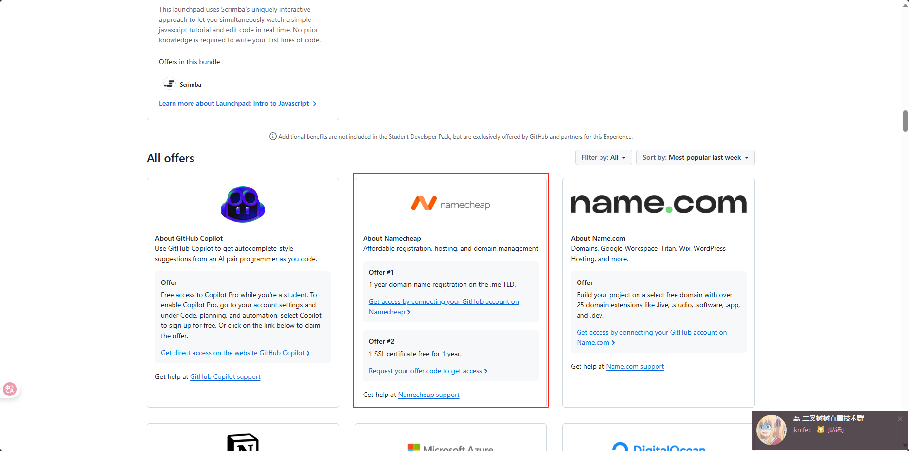

点击这里

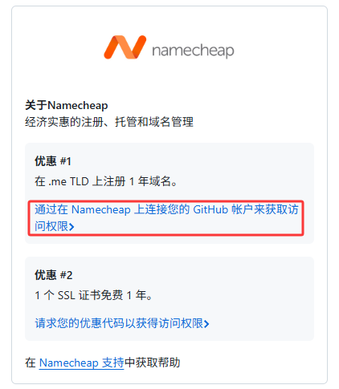

进行Github授权

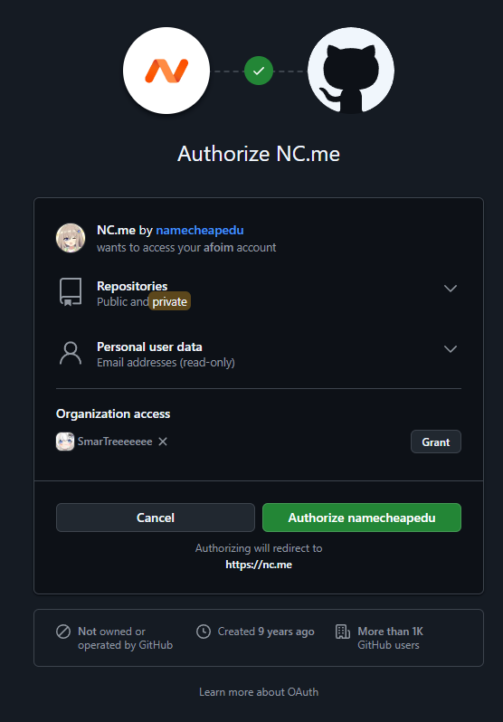

成功验证学生资格咯~

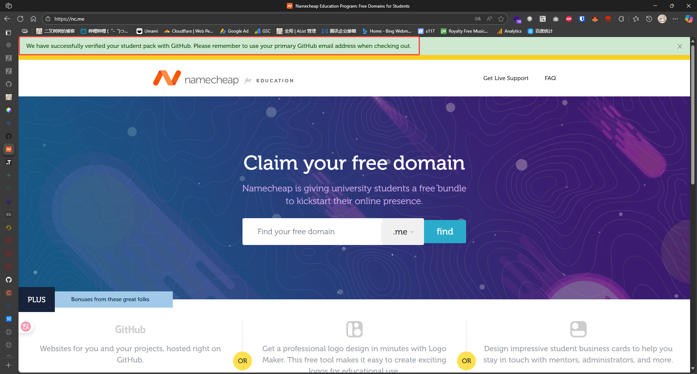

选一个你喜欢的 .me 域名，然后加入购物车（FREE！）

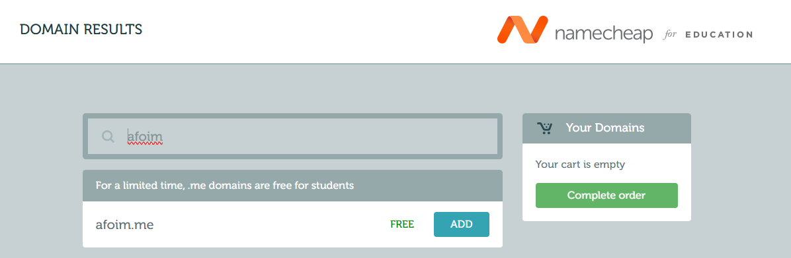

勾上Github Page，填上你的Github邮箱

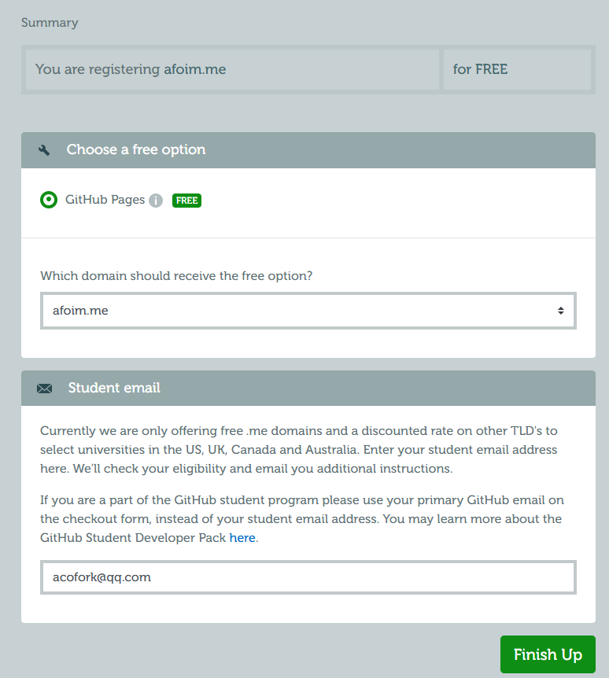

接下来登录使用Github邮箱注册的号，没有号就注册一个！

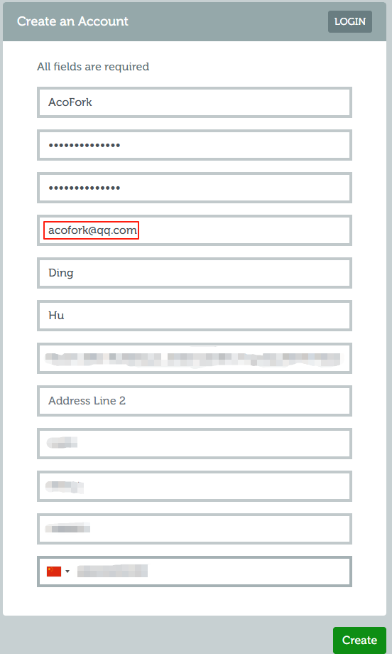

完成订单咯~

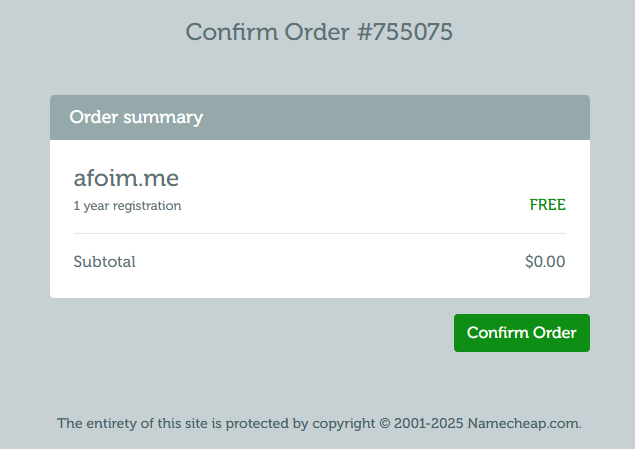

在控制台将NS转到Cloudflare！

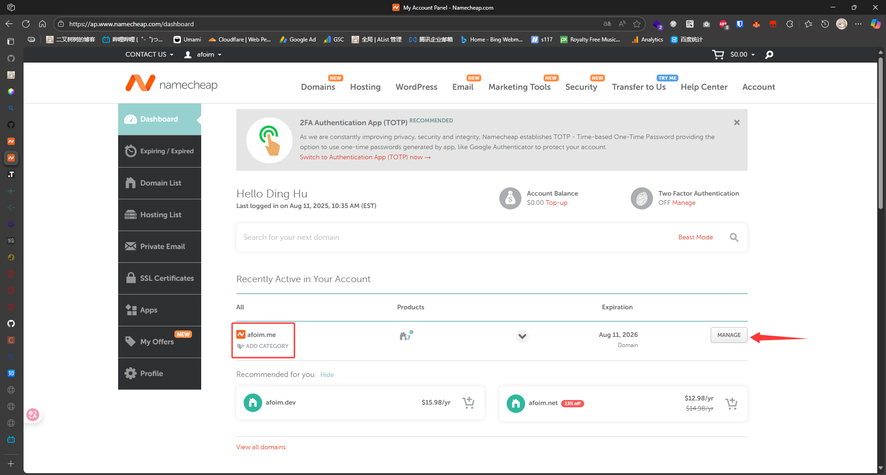

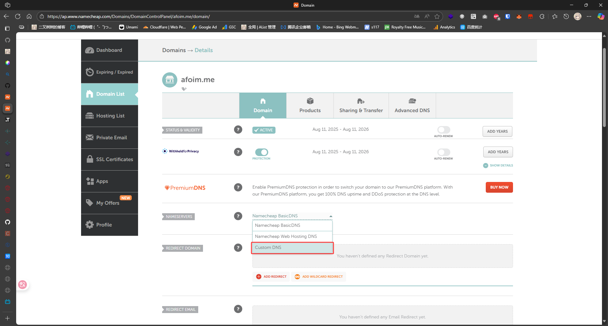

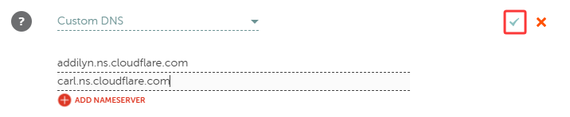

NameCheap的NS传播似乎有些慢，等等咯~

半小时后有咯~

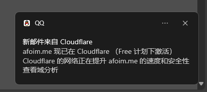
