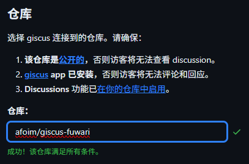
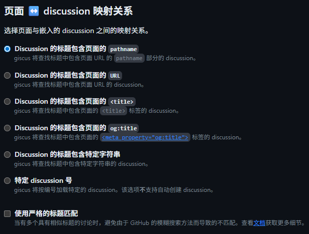
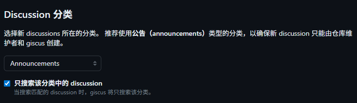
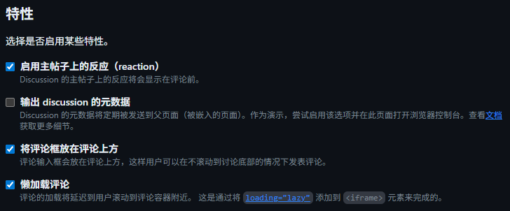
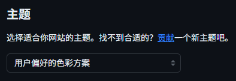
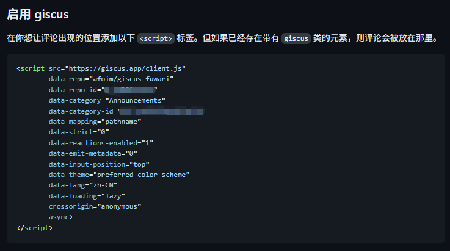
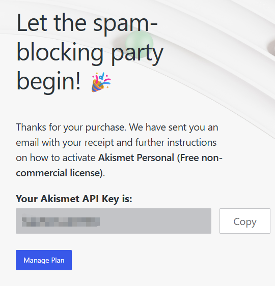
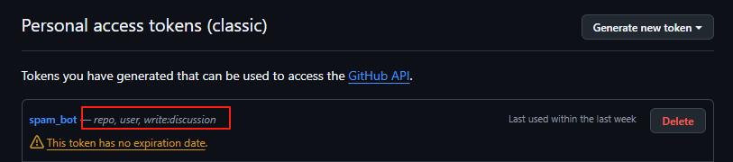
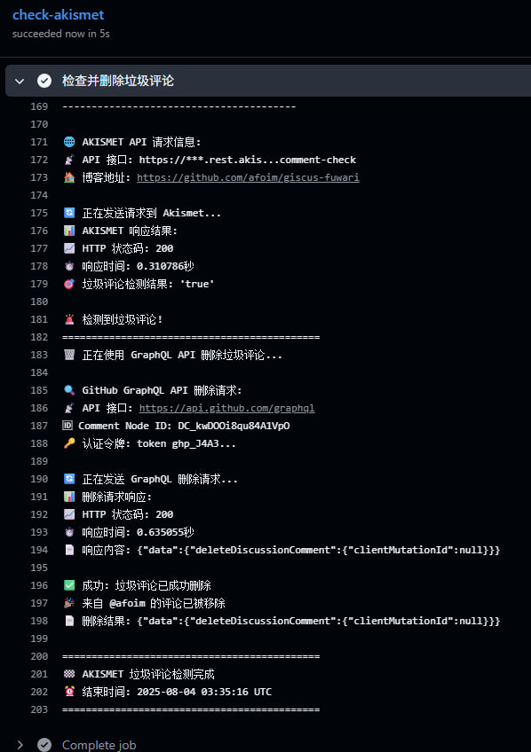
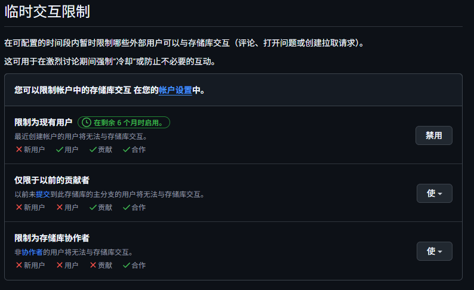

# 配置Giscus

> Giscus使用Github Discussion实现存储用户评论，无需自托管

首先你需要创建一个 **公开仓库** （建议新开一个干净的空仓库）

然后在仓库设置中 **启用** `Discussion` 功能

前往 https://giscus.app/zh-CN

首先填写你的仓库，通过检查

接下来的 `映射关系` 十分重要！

- pathname **（最推荐）**：假如你的文章路径为 `posts/helloworld` 。那么只要你保证这个路径不变，评论和页面就永远匹配

- url：只要你换**域名**了，评论和页面就无法匹配

- title：只要你换**标题**了，评论和页面就无法匹配

分类推荐选择 **公告（announcements）**

特性按需勾选

主题按喜好选择。更改后主题会立即呈现

最后将这段JS复制，放置在你想作为评论区的区块即可

# 配置Akismet

> Akismet (Automattic Kismet) 是应用广泛的一个垃圾留言过滤系统，其作者是大名鼎鼎的 WordPress 创始人 Matt Mullenweg，Akismet 也是 WordPress 默认安装的插件，其使用非常广泛，设计目标便是帮助博客网站来过滤垃圾留言。

注册 [akismet.com](https://akismet.com/)

选择 Akismet Personal 订阅，将滑块拉到0$，记录得到的 Akismet API Key

前往 https://github.com/afoim/giscus-fuwari/blob/main/.github/workflows/akismet-comment-check.yml

将这个Github Action部署到你的启用了Giscus的仓库

配置Secret：

- AKISMET_API_KEY：你的Akismet API Key

- GH_TOKEN：前往 https://github.com/settings/tokens 创建一个具有 `repo` `write:discussion` `user` 权限的Github个人令牌

测试反垃圾是否有效，发送内容为 `viagra-test-123` 的评论。该评论一定会被当作垃圾评论

查看Github Action是否做出删评行为

# 封禁用户

> 如果有人一直刷屏但是反垃圾未检测到？

你可以前往该用户个人信息页面手动封禁它

详见 [阻止用户访问您的个人帐户 - GitHub 文档](https://docs.github.com/zh/communities/maintaining-your-safety-on-github/blocking-a-user-from-your-personal-account#blocking-a-user-from-their-profile-page)

# 防止新用户刷评

> 如果有人一直开小号刷评？

使用 https://github.com/你的用户名/你的仓库/settings/interaction_limits

配置临时交互限制，这样新用户就无法对您的存储库进行任何操作

