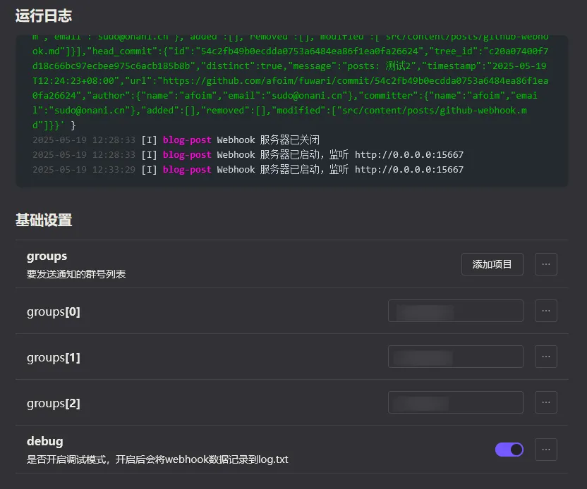
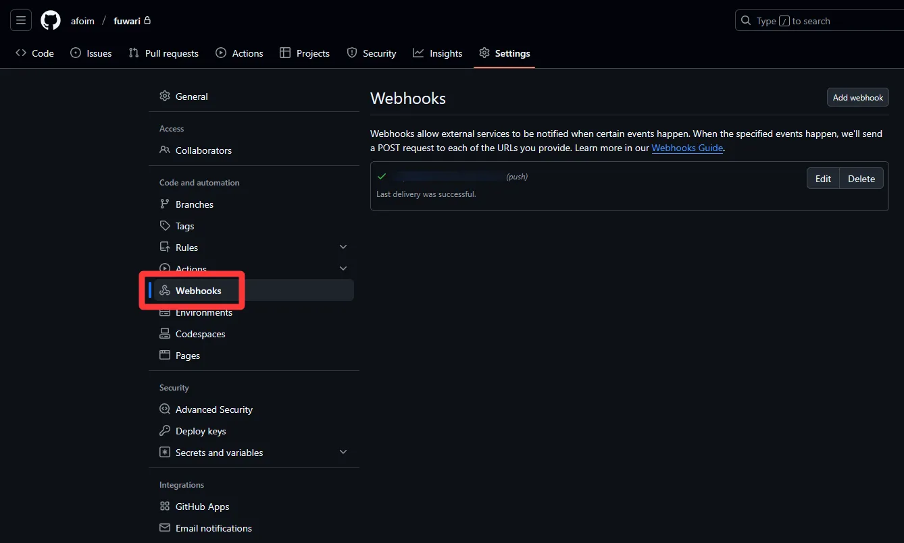
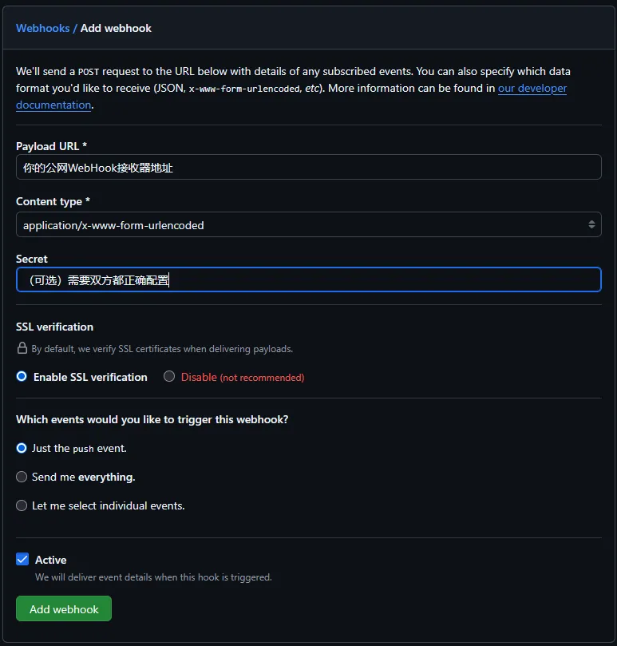

# 原理解析

我们都知道静态博客一般会托管在Github来方便其他静态网站构建服务提供商，如Cloudflare进行自动构建和发布站点。

我们可以在每一次Push后调用WebHook将提交信息发送给自己托管的服务（如QQBot），然后在你的订阅群广播这个消息即可

> 注意：根据框架和构建提供商的不同，构建时长也会不同，请为广播消息设置一个延迟时间.
> 
> 以便让你的订阅者收到文章更新消息后能够立即打开阅览而不是看到404或者错误的内容

# 正式开始

## 设置你的自托管WebHook接收器

我使用Koishi编写一个插件创建一个HTTP服务器用于接受WebHook，并且在接收到指定提交信息的WebHook后将在2分钟后在我的群里广播文章更新消息

如果你的服务在内网，可以使用Cloudflared将WebHook接收服务器开放到公网。否则Github将无法将WebHook信息发送到你的服务

## 配置Github Repo WebHook

打开你的博客仓库。

在仓库设置找到WebHooks

添加一个新的WebHook，如图设置

## 开发测试

在你的博客仓库进行一次Push操作，检查是否收到了WebHook信息并且分析信息配置你的WebHook接收器做后续操作
