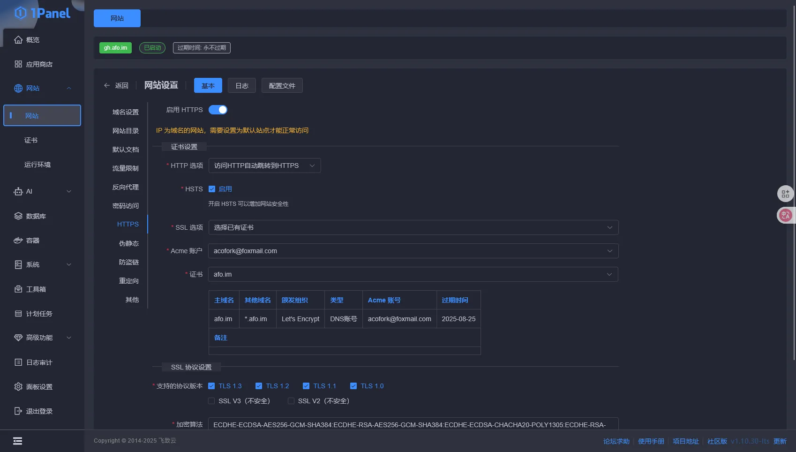
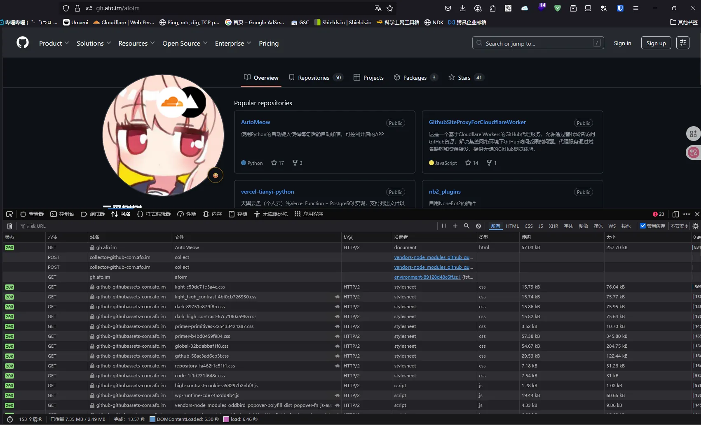

# 引言

至今我仍在维护一个Github全站反代的服务，就是 https://gh.072103.xyz/afoim 。也跟大家谈过[原理](/posts/gh-proxy/)。最近弄到了一个免费的VPS，就想着将Cloudflare Worker的反代移植到VPS上来

# 正式开始

VPS安装Golang运行时

```bash
apt install golang
```

创建一个文件夹。放置 `main.go` 源码如下

```go
package main

import (
	"fmt"
	"io"
	"log"
	"net/http"
	"net/url"
	"regexp"
	"strings"
	"time"
)

// 域名映射配置
var domainMappings = map[string]string{
	"github.com":                    "gh.",
	"avatars.githubusercontent.com": "avatars-githubusercontent-com.",
	"github.githubassets.com":       "github-githubassets-com.",
	"collector.github.com":          "collector-github-com.",
	"api.github.com":                "api-github-com.",
	"raw.githubusercontent.com":     "raw-githubusercontent-com.",
	"gist.githubusercontent.com":    "gist-githubusercontent-com.",
	"github.io":                     "github-io.",
	"assets-cdn.github.com":         "assets-cdn-github-com.",
	"cdn.jsdelivr.net":              "cdn.jsdelivr-net.",
	"securitylab.github.com":        "securitylab-github-com.",
	"www.githubstatus.com":          "www-githubstatus-com.",
	"npmjs.com":                     "npmjs-com.",
	"git-lfs.github.com":            "git-lfs-github-com.",
	"githubusercontent.com":         "githubusercontent-com.",
	"github.global.ssl.fastly.net":  "github-global-ssl-fastly-net.",
	"api.npms.io":                   "api-npms-io.",
	"github.community":              "github-community.",
}

// 需要重定向的路径
var redirectPaths = []string{"/", "/login", "/signup", "/copilot"}

// 检查路径是否需要重定向
func shouldRedirect(path string) bool {
	for _, p := range redirectPaths {
		if path == p {
			return true
		}
	}
	return false
}

// 获取代理前缀
func getProxyPrefix(host string) string {
	if strings.HasPrefix(host, "gh.") {
		return "gh."
	}

	for _, prefix := range domainMappings {
		if strings.HasPrefix(host, prefix) {
			return prefix
		}
	}

	return ""
}

// 根据前缀获取目标域名
func getTargetHost(prefix string) string {
	for original, p := range domainMappings {
		if p == prefix {
			return original
		}
	}
	return ""
}

// 处理响应内容，替换域名引用
func modifyResponse(body []byte, contentType, hostPrefix, currentHostname string) []byte {
	// 只处理文本内容
	if !strings.Contains(contentType, "text/") &&
		!strings.Contains(contentType, "application/json") &&
		!strings.Contains(contentType, "application/javascript") &&
		!strings.Contains(contentType, "application/xml") {
		return body
	}

	text := string(body)

	// 获取当前域名的后缀部分
	domainSuffix := currentHostname[len(hostPrefix):]

	// 替换所有域名引用
	for originalDomain, proxyPrefix := range domainMappings {
		fullProxyDomain := proxyPrefix + domainSuffix

		// 替换完整URLs - 使用简单的字符串替换
		text = strings.ReplaceAll(text, "https://"+originalDomain, "https://"+fullProxyDomain)
		text = strings.ReplaceAll(text, "http://"+originalDomain, "https://"+fullProxyDomain)

		// 替换协议相对URLs
		text = strings.ReplaceAll(text, "//"+originalDomain, "//"+fullProxyDomain)
		
		// 替换带引号的域名引用
		text = strings.ReplaceAll(text, `"`+originalDomain+`"`, `"`+fullProxyDomain+`"`)
		text = strings.ReplaceAll(text, `'`+originalDomain+`'`, `'`+fullProxyDomain+`'`)
	}

	// 处理相对路径 - 使用简单的字符串替换
	if hostPrefix == "gh." {
		// 替换引号内的相对路径
		text = strings.ReplaceAll(text, `"/`, `"https://`+currentHostname+`/`)
		text = strings.ReplaceAll(text, `'/`, `'https://`+currentHostname+`/`)
	}

	return []byte(text)
}

// 处理请求
func handleRequest(w http.ResponseWriter, r *http.Request) {
	currentHost := r.Host

	// 检查特殊路径重定向
	if shouldRedirect(r.URL.Path) {
		http.Redirect(w, r, "https://www.gov.cn", http.StatusFound)
		return
	}

	// 从当前主机名中提取前缀
	hostPrefix := getProxyPrefix(currentHost)
	if hostPrefix == "" {
		http.Error(w, "Domain not configured for proxy", http.StatusNotFound)
		return
	}

	// 根据前缀找到对应的原始域名
	targetHost := getTargetHost(hostPrefix)
	if targetHost == "" {
		http.Error(w, "Domain not configured for proxy", http.StatusNotFound)
		return
	}

	// 处理路径，修复嵌套URL问题
	pathname := r.URL.Path

	// 修复特定的嵌套URL模式
	// 处理 URL 编码的嵌套路径
	re1 := regexp.MustCompile(`(/[^/]+/[^/]+/(?:latest-commit|tree-commit-info)/[^/]+)/https%3A//[^/]+.*`)
	pathname = re1.ReplaceAllString(pathname, "$1")

	// 处理未编码的嵌套路径
	re2 := regexp.MustCompile(`(/[^/]+/[^/]+/(?:latest-commit|tree-commit-info)/[^/]+)/https://[^/]+.*`)
	pathname = re2.ReplaceAllString(pathname, "$1")

	// 处理简化的嵌套路径（如 /main/https:/domain/）
	re3 := regexp.MustCompile(`(/[^/]+/[^/]+/(?:latest-commit|tree-commit-info)/[^/]+)/https:/[^/]+.*`)
	pathname = re3.ReplaceAllString(pathname, "$1")

	// 构建目标URL
	targetURL := &url.URL{
		Scheme:   "https",
		Host:     targetHost,
		Path:     pathname,
		RawQuery: r.URL.RawQuery,
	}

	// 创建新的请求
	req, err := http.NewRequest(r.Method, targetURL.String(), r.Body)
	if err != nil {
		http.Error(w, fmt.Sprintf("Failed to create request: %v", err), http.StatusInternalServerError)
		return
	}

	// 复制请求头
	for key, values := range r.Header {
		for _, value := range values {
			req.Header.Add(key, value)
		}
	}

	// 设置必要的请求头
	req.Header.Set("Host", targetHost)
	req.Header.Set("Referer", targetURL.String())
	// 禁用压缩以避免编码问题
	req.Header.Set("Accept-Encoding", "identity")

	// 创建HTTP客户端
	client := &http.Client{
		Timeout: 30 * time.Second,
	}

	// 发起请求
	resp, err := client.Do(req)
	if err != nil {
		http.Error(w, fmt.Sprintf("Proxy Error: %v", err), http.StatusBadGateway)
		return
	}
	defer resp.Body.Close()

	// 读取响应体
	body, err := io.ReadAll(resp.Body)
	if err != nil {
		http.Error(w, fmt.Sprintf("Failed to read response: %v", err), http.StatusInternalServerError)
		return
	}

	// 处理响应内容
	contentType := resp.Header.Get("Content-Type")
	modifiedBody := modifyResponse(body, contentType, hostPrefix, currentHost)

	// 设置响应头（排除压缩相关头部）
	for key, values := range resp.Header {
		// 跳过压缩相关的头部，因为Go已经自动解压缩了内容
		if key == "Content-Encoding" || key == "Content-Length" {
			continue
		}
		for _, value := range values {
			w.Header().Add(key, value)
		}
	}

	// 设置CORS和缓存头
	w.Header().Set("Access-Control-Allow-Origin", "*")
	w.Header().Set("Access-Control-Allow-Credentials", "true")
	w.Header().Set("Cache-Control", "public, max-age=14400")
	w.Header().Del("Content-Security-Policy")
	w.Header().Del("Content-Security-Policy-Report-Only")
	w.Header().Del("Clear-Site-Data")

	// 设置正确的Content-Length
	w.Header().Set("Content-Length", fmt.Sprintf("%d", len(modifiedBody)))

	// 设置状态码
	w.WriteHeader(resp.StatusCode)

	// 写入响应
	w.Write(modifiedBody)
}

func main() {
	// 创建路由处理器
	http.HandleFunc("/", handleRequest)

	// 启动服务器
	port := ":8080"
	log.Printf("GitHub代理服务器启动在端口 %s", port)
	log.Printf("请确保你的域名已正确配置并指向此服务器")

	if err := http.ListenAndServe(port, nil); err != nil {
		log.Fatal("服务器启动失败:", err)
	}
}
```

继续放置 `go.mod` 。源码如下

```go
module github-proxy

go 1.19
```

运行。默认跑在8080端口

```bash
go run .
```

输出以下日志即成功

```bash
root@localhost:~/go_proxy# go run .
2025/06/20 23:13:17 GitHub代理服务器启动在端口 :8080
2025/06/20 23:13:17 请确保你的域名已正确配置并指向此服务器
```

使用Nginx或者OpenResty反向代理 `localhost:8080` 。配置域名，格式为 `gh.你的域名` 。我的配置如下


签发泛域名证书并且部署，配置完毕后如下



访问，现在你通过自己的域名+VPS代理访问Github。国内直连，无需梯子


