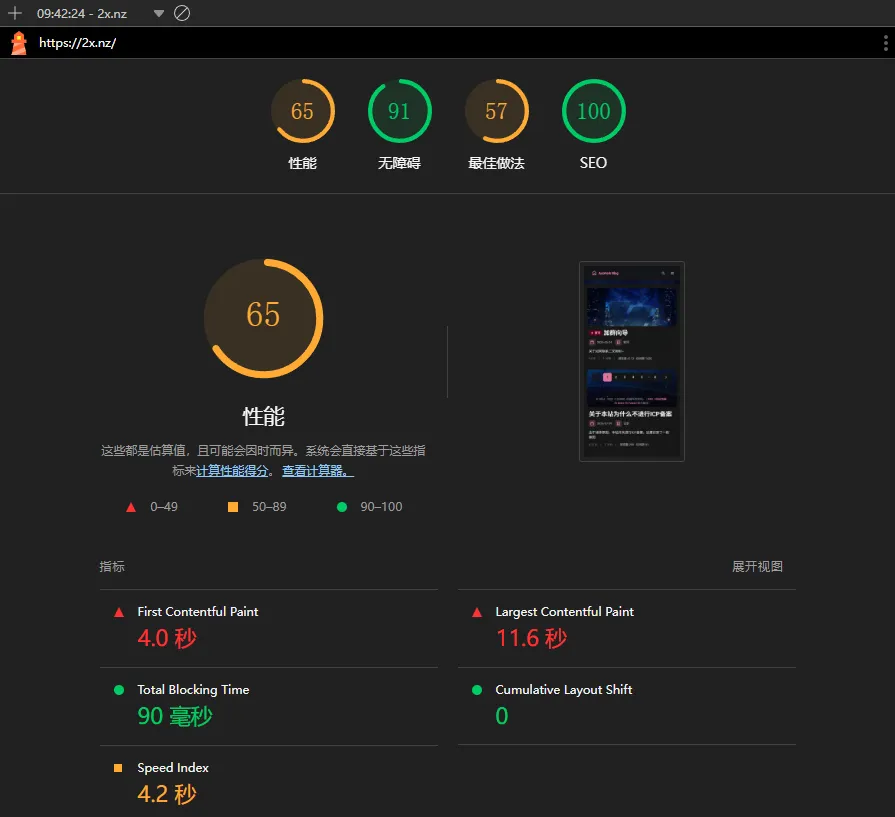
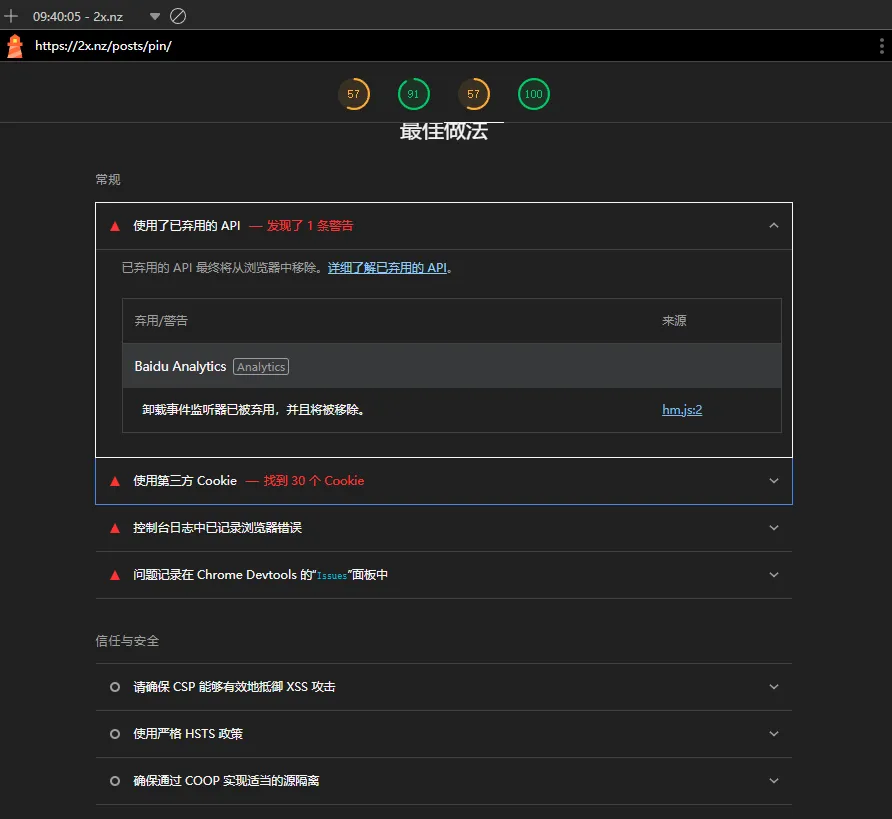
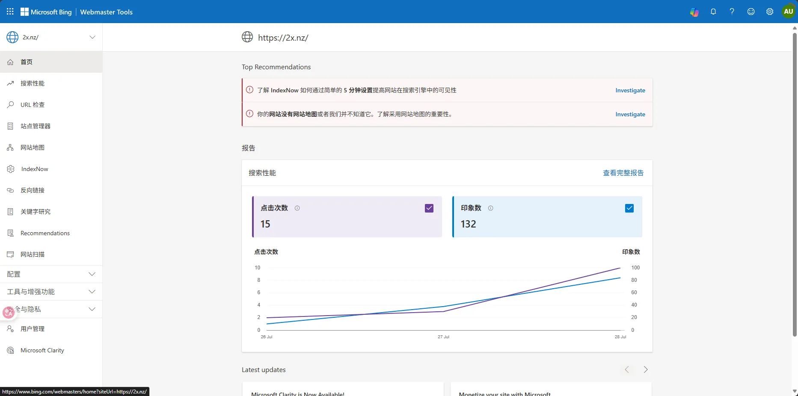
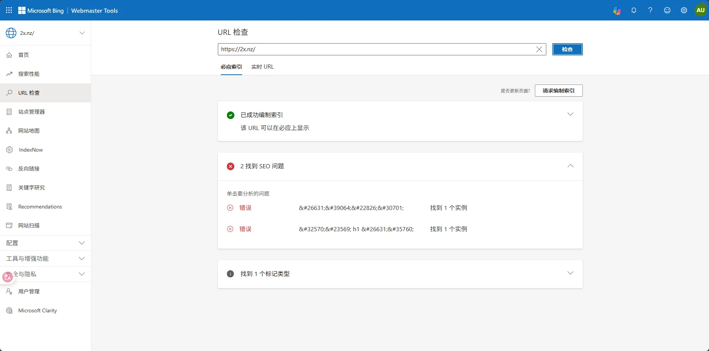
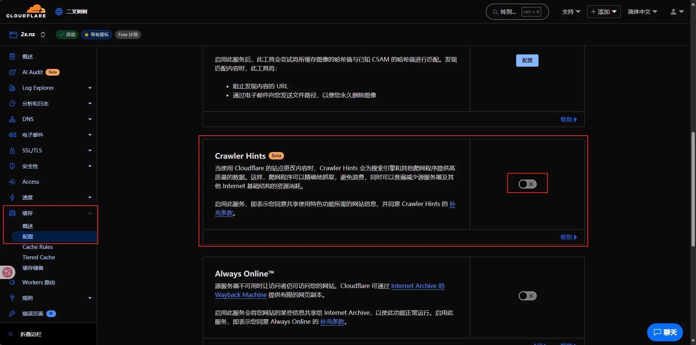

# 标题

> 即每个HTML head部分的 `title`

### 不要重名

如果你的标题是中文，请确保不要和任何知名事物关联上，比如不要叫 `树叶博客` ，而是 `叶树博客` 。

搜索引擎对于知名事物给的权重很高，如果你还和这些知名事物重名，大众则很难搜索到你

### 使用英文标题

比如 `AcoFork Blog`，`afoim Blog` 。

尝试自创一个单词，和中文一样，不要和知名事物重名

搜索引擎会将无法关联的网页作为独立权重

直接搜索您的自创单词，大概率就能找到您的网站，如：`AcoFork`

### 跨页面使用主标题锚定

一个网站大部分情况都有多个页面，如 主页，分类，归档等等

除了主页面要展示您的特有标题，其他页面也需要

比如主页面标题为 `AcoFork Blog` ，则副页面可以为 `分类 - AcoFork Blog` 或

`AcoFork Blog - 分类` 。

但是请不要直接单写一个 `分类` 。虽然这可能并不会误导搜索引擎的判断（只要还是同一个域名），但可能会误导用户的判断

比如搜索您的网站排在第一位的是一个标题为 `分类` 的网页

# 言简意赅写明description

> 即每个HTML head部分的 `meta name="description"`

网站描述不要写的太短，也不应太长，更不能没有

我的网站简介是

`分享网络技术、服务器部署、内网穿透、静态网站搭建、CDN优化、容器化部署等技术教程与实践经验的个人技术博客，专注于云原生、无服务器架构和前后端开发，作者为AcoFork/afoim/二叉树树`

# 关键词

> 即每个HTML head部分的 `meta name="keywords"`

现代搜索引擎基本不看，很容易被滥用。所以不需要写

# 同内容网站只能有一个

> 如无必要，请不要变更域名。也不要将其他域名指向您的站点

假如我有 `acofork.com` `acofork.cn` 。都想指向我的同一个网站？

**请使用 301 重定向**

否则你的SEO将被破坏，搜索引擎不会将这两个站点视为同一个站点

同时，确保你的域名日后仅作重定向用。因为301重定向会在客户端种下一个种子

客户端第一次访问时，服务器返回301状态码，日后客户端则不会请求服务器，直接重定向到目标URL

如果日后需要将域名挪作他用，那么请不要写任何解析，避免日后部署其他服务部分用户不可用

**解决这个问题需要引导用户清除浏览器的本地缓存，非常麻烦**

# 避免使用相同名字的云托管服务

比如 xLog。我曾经创建过一个 `acofork.xlog.app` 的站点。现在不用了，又由于xLog是区块链，我还丢失了私钥助记词，现在无人能登上，自然也无法删除其中的内容。至今仍在破坏我站的SEO

# 使用Lighthouse分析站点分数

Lighthouse是一个浏览器插件，可以分析站点的性能、无障碍、最佳做法和性能

可以前往各自的浏览器插件商店搜索 `Lighthouse` 进行安装测试

注意需要使用无痕模式进行测试，以免其他浏览器插件影响Lighthouse的测试结果

对于每一项出现的问题以及如何解决都有明确的指示。可以根据警告对您的站点进行优化

# 接入必应网站管理员

前往 https://www.bing.com/webmasters

接入您的站点后，必应爬虫将会分析您的网站，并且告知您的网站是否可以在搜索结果中展示

必应爬虫还会针对它的视角提出您网站的问题，您可以根据提出的问题进行优化

# 接入各大分析

可以将网站接入各大分析，这样不仅能看到网站的流量，也能让搜索引擎知道这个网站是在被精心运营的

百度统计： https://tongji.baidu.com/

必应网站管理员： https://www.bing.com/webmaster/

谷歌搜索控制台： https://search.google.com/

谷歌分析： https://analytics.google.com/

谷歌广告： https://www.google.com/adsense/

# 使用IndexNow

曾经，如果想要提高网站的SEO，我们只能静静等待各大搜索引擎爬虫进行网站内容的爬取

而 **IndexNow** 允许网站主动向各大搜索引擎提交高质量的内容。详见： [Why IndexNow | Bing Webmaster Tools](https://www.bing.com/indexnow)

如果您使用Cloudflare CDN，这是开箱即用的只需要导航到您的域名 -> 缓存 -> 配置 -> 启用 **Crawler Hints** 即可

