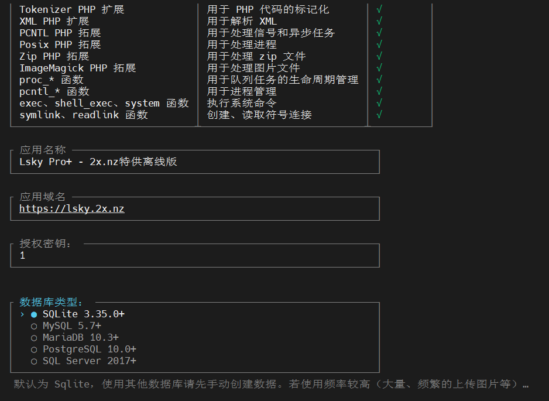
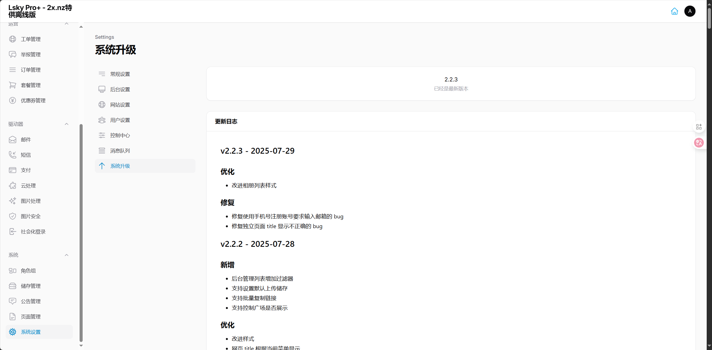
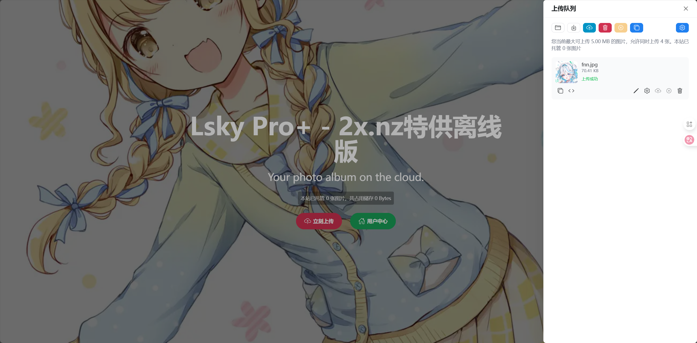

> 仅供学习交流，请在下载后24h内删除。体验地址： [https://lsky.2x.nz](https://lsky.2x.nz)
> 视频教程： https://www.bilibili.com/video/BV1UieUzQEvq/

# 安装包体

http://r2.072103.xyz/2xnzlskypro223.zpaq 密码： 2xnz二叉树树

zpaq可以使用 [Bandizip 官方网站 - 免费压缩软件下载 (Windows)](https://www.bandisoft.com/bandizip/) 进行解压，旧版不支持

# 我们做了什么？

- 安装过程中无论输入授权密钥为任何值直接内部返回true，不再请求授权服务器

- 版本更新不再请求授权服务器，始终返回当前版本为最新版本

- 所有操作不经过授权服务器，全部本地执行

# 其余环境配置和通用安装步骤

参考 上一篇的 [授权绕过教程](/posts/hack-lskypro/)

# 简略安装过程

授权密钥随便填直接过

系统升级已Hook，定死版本

最终效果

