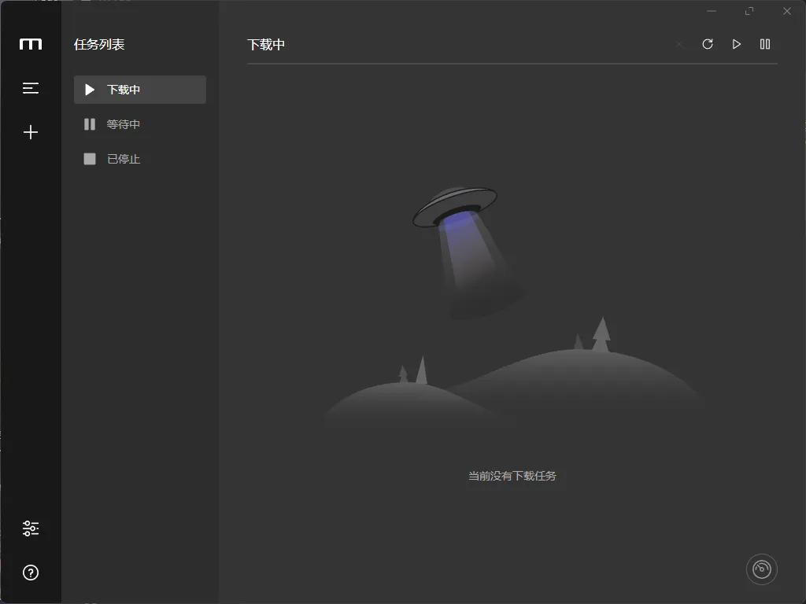
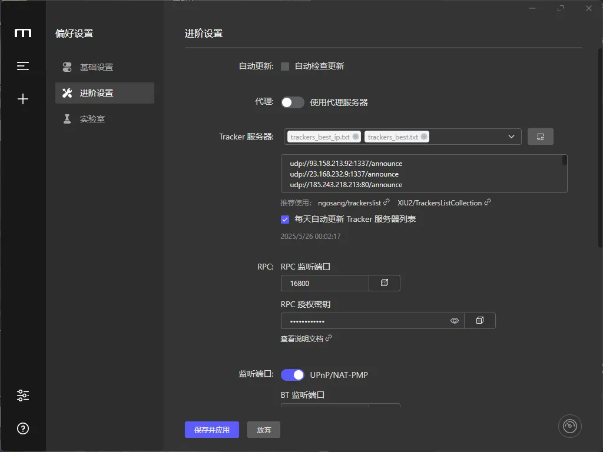
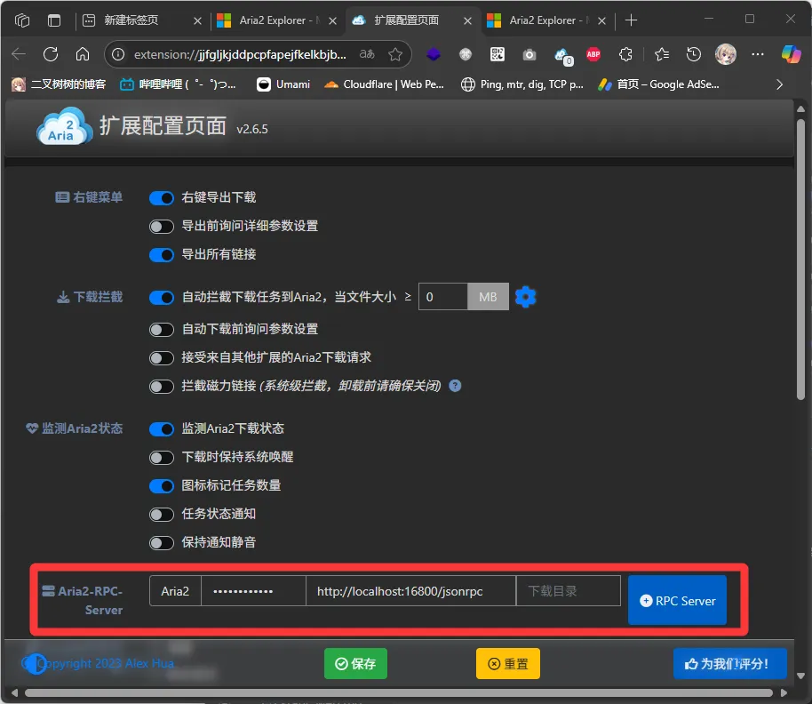
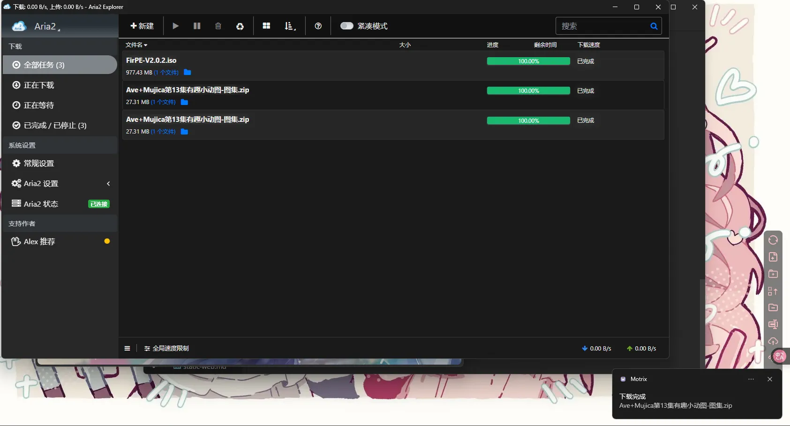

# 原理

使用一个浏览器插件拦截下载请求然后将原请求发送给Motrix实现三方下载

# 下载Motrix

前往官网： https://motrix.app/ 。下载Motrix

什么？你说我下载Motrix也奇慢无比？~~忍一忍就过去了~~

当你安装完毕后应该长这样

# 配置Motrix

打开Motrix - 进阶设置 - RPC。你可以看到RPC监听端口（默认为16800），和一个RPC授权密钥（随机的）

我们需要记住监听端口，复制好授权密钥（点击小眼睛然后复制，旁边的骰子图标是随机一个新的密钥）。然后点击保存并应用

# 配置浏览器

> 仅支持Chromium系（如：Chrome和新版Microsoft Edge，FireFox另寻它案

寻找浏览器扩展： **Aria2 Explorer**

安装，然后 右键 - 扩展选项。在这里对接Motrix的RPC设置

最后，右键扩展，勾选上下载拦截，然后尝试进行下载。如果一切顺利，浏览器的下载将被Aria2 Explorer捕获并且发送给Motrix。你可以在**Aria2 Explorer**和**Motrix**处看到下载中的文件

