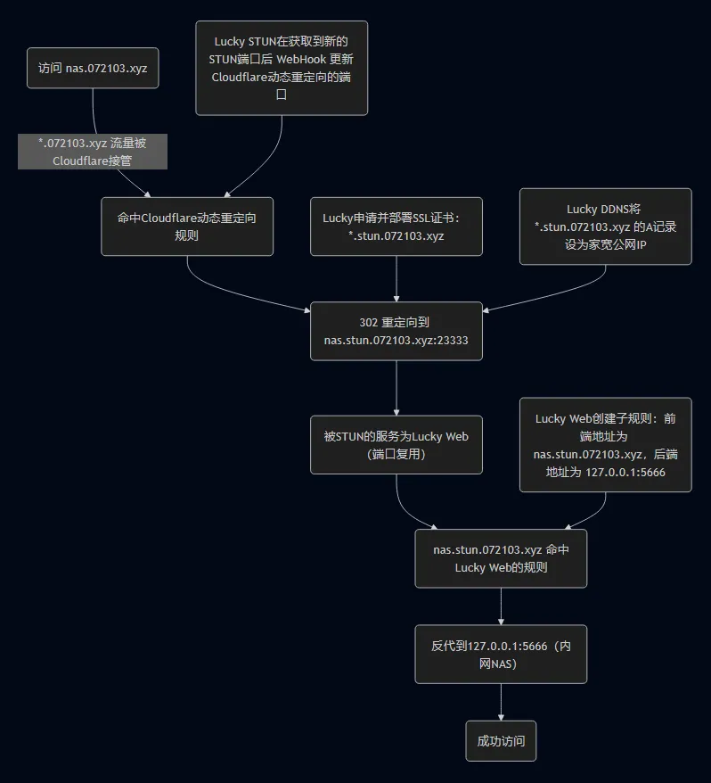
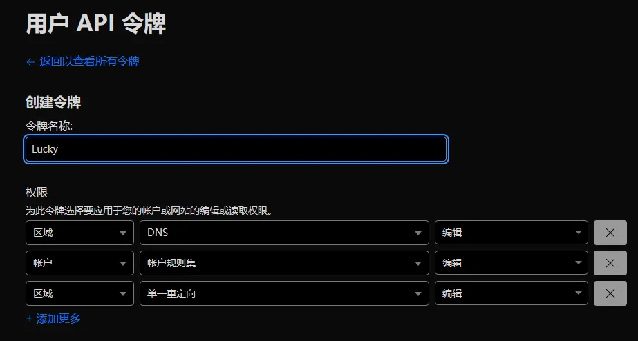
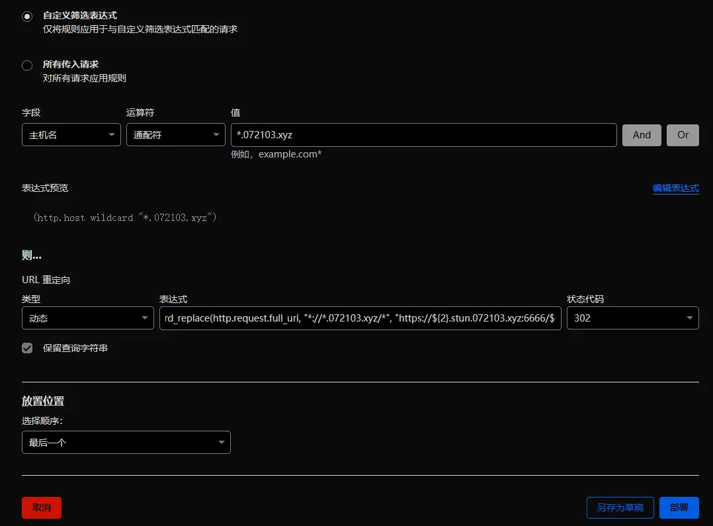
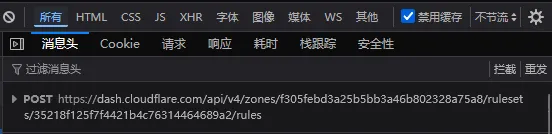
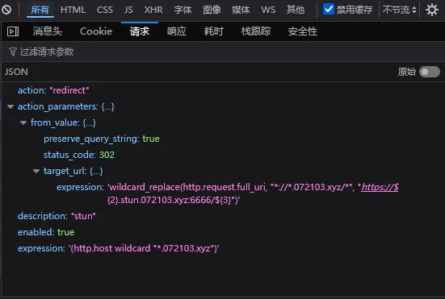
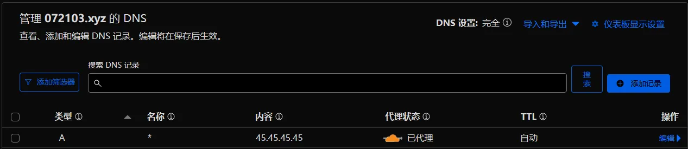
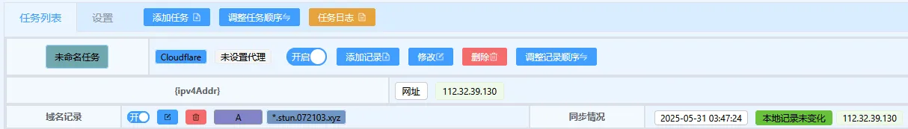
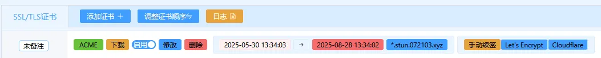
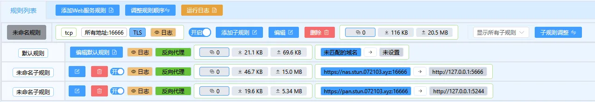
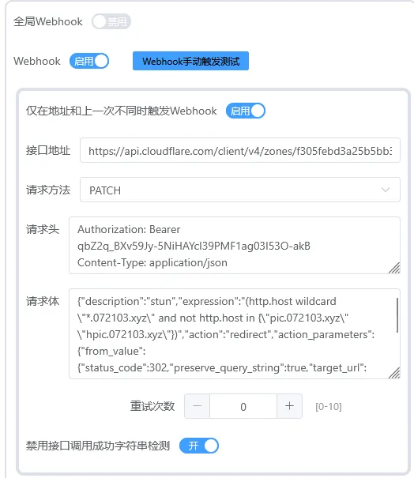

# 配套视频

<iframe src="//player.bilibili.com/player.html?isOutside=true&aid=114597528936170&bvid=BV1hY7szUEbu&cid=30235755189&p=1" scrolling="no" border="0" frameborder="no" framespacing="0" allowfullscreen="true"></iframe>

# 原理



# 正式开始

### 创建必要的Cloudflare API令牌

创建拥有如下图权限的令牌，使得Lucky可以使用此令牌设置DDNS、签发SSL、更新Cloudflare动态重定向



### 创建基底Cloudflare动态重定向规则

如图填写，替换为你的域名


表达式： `wildcard_replace(http.request.full_uri, "*://*.072103.xyz/*", "https://${2}.stun.072103.xyz:6666/${3}")`

观察网址，记录下如下图的数据


打开开发者工具后，再保存，确保抓到这样的包，保存备用


将 `dash.cloudflare.com/api` 改为 `api.cloudflare.com/client` 。将刚才获得的红框内的内容填写到 `rules` 后面



如果你不是第一次更新，可能会带有一个 `"position":{"index":1},` 删除它，否则后面的WebHook将会出错。

将我们硬编码的 `6666` 端口改为Lucky STUN的变量 `#{port}`

---

最终我们记录了以下信息

```
https://api.cloudflare.com/client/v4/zones/f305febd3a25b5bb3a46b802328a75a8/rulesets/35218f125f7f4421b4c76314464689a2/rules/17228a4add70429c9cdd38eb7fec1d02

{"description":"stun","expression":"(http.host wildcard \"*.072103.xyz\" and not http.host in {\"pic.072103.xyz\" \"hpic.072103.xyz\"})","action":"redirect","action_parameters":{"from_value":{"status_code":301,"preserve_query_string":true,"target_url":{"expression":"wildcard_replace(http.request.full_uri, \"*://*.072103.xyz/*\", \"https://${2}.stun.072103.xyz:#{port}/${3}\")"}}},"enabled":true}
```

### 让Cloudflare接管 *.072103.xyz 的流量



### 配置Lucky DDNS



### 配置Lucky SSL/TLS证书



### 配置Lucky Web服务



### 配置Lucky STUN

注：我这里使用了路由器的端口转发，将Lucky的16666（Web服务）端口转发到了路由器的17777端口。如果你不会端口转发，请**不要启用** `不使用Lucky内置端口转发` 并且**目标端口**填写16666


### 配置WebHook

如图配置



接口地址：你之前记录的 `https://api.cloudflare.com/...`

请求方法： `PATCH` 或者 `POST`

请求头：

```
Authorization: Bearer 你的API令牌
Content-Type: application/json
```

请求体：你之前记录的 `{"description":...` 

# End.
