# 前情提要（坐牢实况）

其实本来这篇文章应该在一个月前就发出来的，当时已经把部署方法写好了，但是脑子一热给系统重装了。教程没留下，模型没留下，prompt（提示词）没留下，图也没留下。然后就脱坑AI绘图了，然后就开始研究别的东西了

契机是昨天晚上（2025-05-12）看到有大佬在发一些精美的AI绘图。我这不服输的胜负欲啊...

然后就边和群u唱歌边研究AI绘图，前前后后把Stable Diffusion WebUI、Stable Diffusion Forge WebUI、Comfyui全装了一遍各种找教程、实操、试错

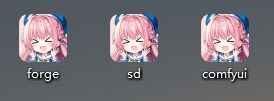

好在凭借着仅剩的记忆也是顺着这些蛛丝马迹把我曾经丢掉的知识找回来了，在纯小白的情况下，你可以跑出类似下面的图！（跑不出来你打死我！）


# 正式开始

## 下载NoobAI-V预测模型

前往 [NoobAI-XL (NAI-XL) - V-Pred-1.0-Version | NoobAI Checkpoint | Civitai](https://civitai.com/models/833294?modelVersionId=1190596) （需魔法）

点击下载即可

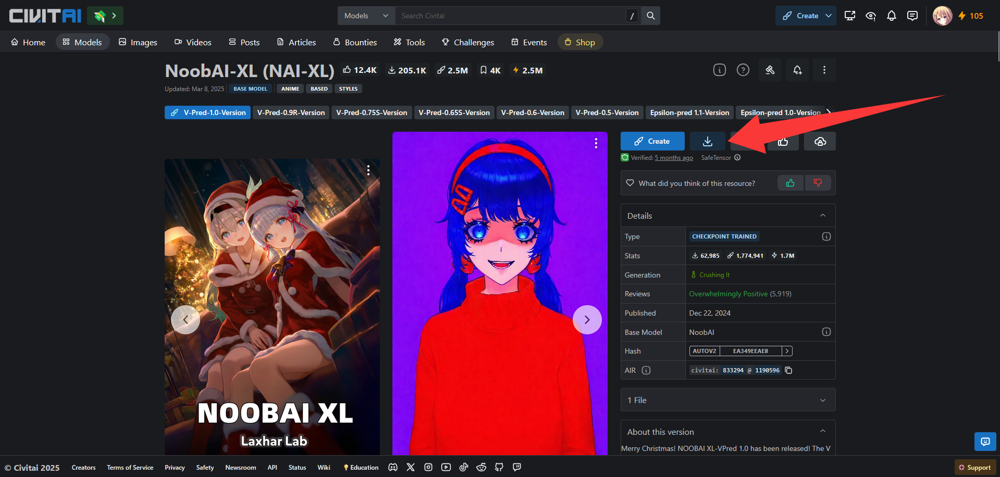

## 安装Comfyui

前往秋叶的视频评论区下载Comfyui整合包，下载并解压： https://www.bilibili.com/video/BV1Ew411776J

解压完后打开文件夹，打开 `A绘世启动器`

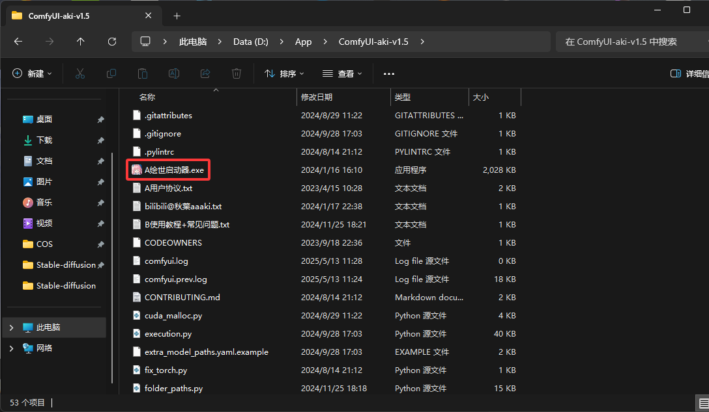

点击右下角的开始运行，先让他进行初始化，直到它自动打开你的浏览器并且可以正常进入Comfyui的界面，如下图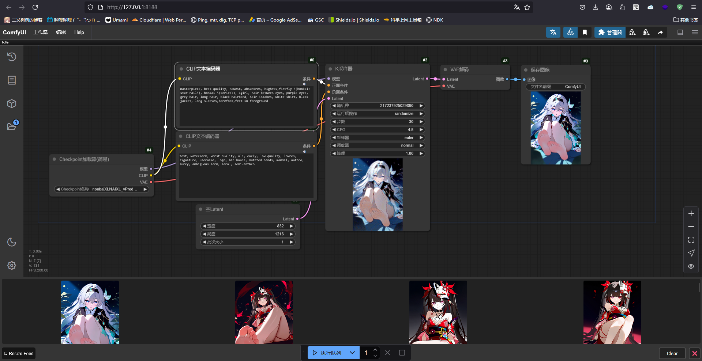

## 放置模型

将我们刚才下载的NoobAI-V预测模型，类似 `noobaiXLNAIXL_vPred10Version.safetensors` 这样的文件放到 `ComfyUI-aki-v1.5\models\checkpoints` 下面，如图

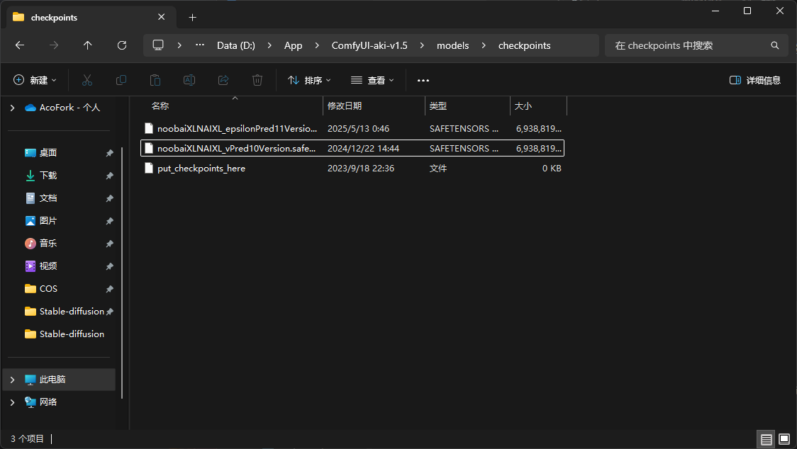

## 开始绘图

刷新Comfyui，你应该可以在 `Checkpoint加载器(简易)` 处可以看到你放置的所有模型，选择带有 `vPred...` 的就是V预测模型

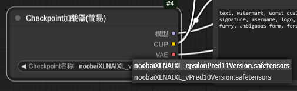

然后你想要画什么呢？比如崩铁的流萤？

进入 [Danbooru characters in NoobAI-XL (NAI-XL)](https://www.downloadmost.com/NoobAI-XL/danbooru-character/)

搜索流萤的英文名 `firefly` 或者搜索 `star rail` 找到所有关于崩铁的角色

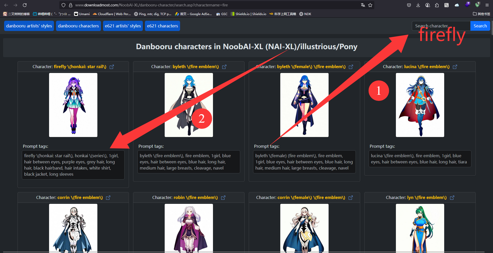

复制 `Prompt tags` 

回到Comfyui，将其粘贴进链接了正面条件的CLIP文本编码器

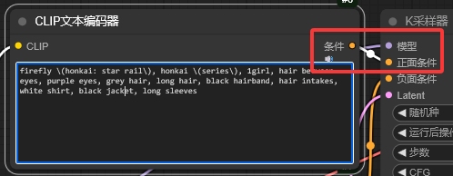

这样角色预设就写好了

我这里也提供了一些起手的提示词

- 正面条件：
  
  ```
  masterpiece, best quality, newest, absurdres, highres
  ```

- 负面条件：
  
  ```
  text, watermark, worst quality, old, early, low quality, lowres, signature, username, logo, bad hands, mutated hands, mammal, anthro, furry, ambiguous form, feral, semi-anthro
  ```

我们将其添加到Comfyui，如下图

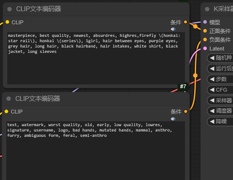

ok！接下来让我们配置K采样器

- 步数：28-35

- CFG：4-5

- 采样器：euler（❗重要！不能更改！可能会崩图！）

没提到的参数自行斟酌调整，如果你不懂就不要乱调！

接下来设置图像尺寸，总面积约为 1024x1024。**最推荐832x1216**。其余：768x1344、896x1152、1024x1024、1152x896、1216x832、1344x768、1024x1536、1536x1024

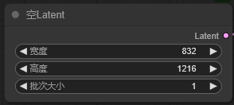

最终工作流如图，然后点击执行队列！
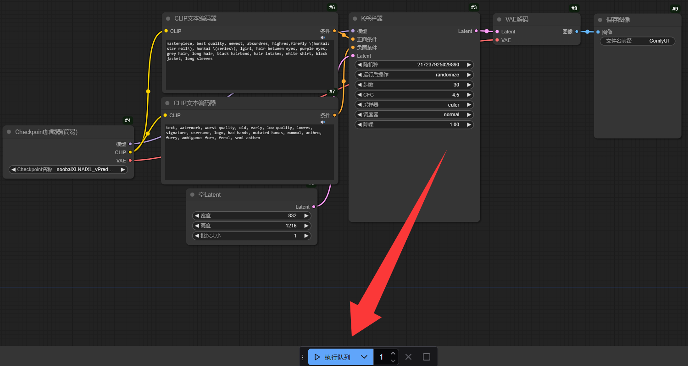

然后你就能得到一张这样的图片：

如果你想要图片是不同的样子请在正面提示词和反面提示词添加（**必须为英文！不知道的用翻译或者问AI！**）。比如我这边想要让足部放到焦点上并且裸足就添加**正面提示词**： `barefoot,feet in foreground`


## 最后

- AI生成的图片随机性较强。每一次生成的图片都不太一样。多试试

- 可以在负面提示词添加：`NSFW` ，在正面提示词添加 `safe` 这样就不会生成涩图

- 由于V预测模型较新，只能在SDForge和Comfyui上运行，原版SD无法运行，会崩图

- 参考：[NoobAI-XL (NAI-XL) - V-Pred-0.5-Version | NoobAI Checkpoint | Civitai](https://civitai.com/models/833294?modelVersionId=1046043)。关于更多的此模型的技巧可以到图片对应处的About查看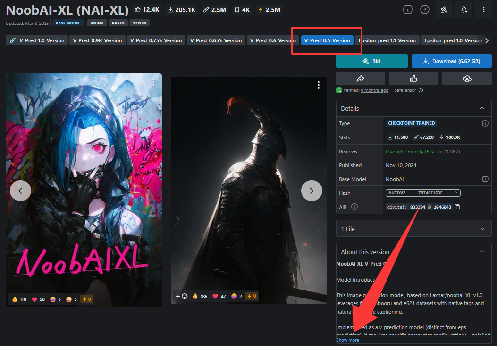
