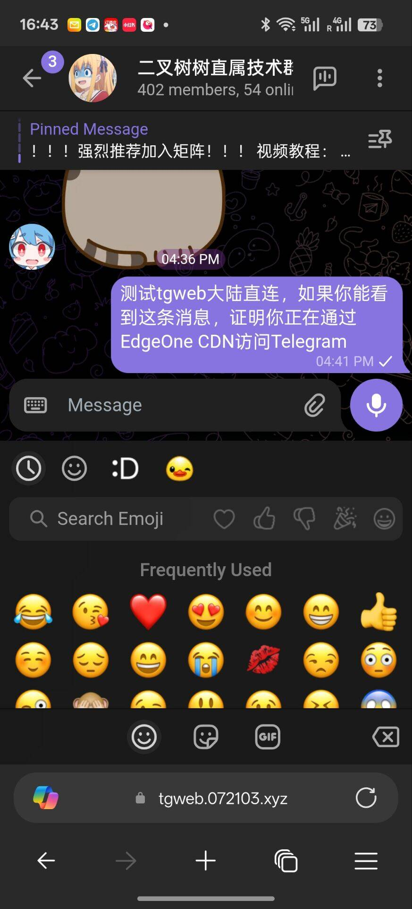

# 注意，将该项目直接绑定到你的域名会吃Abuse

推荐将 `index.html` 重命名。让别人访问根路径无法访问到正常页面即可，但不保证永远不会吃Abuse

然后创建一个新的 `index.html` 写入：

```html
<html><head>
	<title>Welcome to nginx!</title>
	<style>
		body {
			width: 35em;
			margin: 0 auto;
			font-family: Tahoma, Verdana, Arial, sans-serif;
		}
	</style>
	<style data-id="immersive-translate-input-injected-css">.immersive-translate-input {
  position: absolute;
  top: 0;
  right: 0;
  left: 0;
  bottom: 0;
  z-index: 2147483647;
  display: flex;
  justify-content: center;
  align-items: center;
}
.immersive-translate-attach-loading::after {
  content: " ";

  --loading-color: #f78fb6;
  width: 6px;
  height: 6px;
  border-radius: 50%;
  display: block;
  margin: 12px auto;
  position: relative;
  color: white;
  left: -100px;
  box-sizing: border-box;
  animation: immersiveTranslateShadowRolling 1.5s linear infinite;

  position: absolute;
  top: 50%;
  left: 50%;
  transform: translate(-2000%, -50%);
  z-index: 100;
}

.immersive-translate-loading-spinner {
  vertical-align: middle !important;
  width: 10px !important;
  height: 10px !important;
  display: inline-block !important;
  margin: 0 4px !important;
  border: 2px rgba(221, 244, 255, 0.6) solid !important;
  border-top: 2px rgba(0, 0, 0, 0.375) solid !important;
  border-left: 2px rgba(0, 0, 0, 0.375) solid !important;
  border-radius: 50% !important;
  padding: 0 !important;
  -webkit-animation: immersive-translate-loading-animation 0.6s infinite linear !important;
  animation: immersive-translate-loading-animation 0.6s infinite linear !important;
}

@-webkit-keyframes immersive-translate-loading-animation {
  from {
    -webkit-transform: rotate(0deg);
  }

  to {
    -webkit-transform: rotate(359deg);
  }
}

@keyframes immersive-translate-loading-animation {
  from {
    transform: rotate(0deg);
  }

  to {
    transform: rotate(359deg);
  }
}

.immersive-translate-input-loading {
  --loading-color: #f78fb6;
  width: 6px;
  height: 6px;
  border-radius: 50%;
  display: block;
  margin: 12px auto;
  position: relative;
  color: white;
  left: -100px;
  box-sizing: border-box;
  animation: immersiveTranslateShadowRolling 1.5s linear infinite;
}

@keyframes immersiveTranslateShadowRolling {
  0% {
    box-shadow: 0px 0 rgba(255, 255, 255, 0), 0px 0 rgba(255, 255, 255, 0),
      0px 0 rgba(255, 255, 255, 0), 0px 0 rgba(255, 255, 255, 0);
  }

  12% {
    box-shadow: 100px 0 var(--loading-color), 0px 0 rgba(255, 255, 255, 0),
      0px 0 rgba(255, 255, 255, 0), 0px 0 rgba(255, 255, 255, 0);
  }

  25% {
    box-shadow: 110px 0 var(--loading-color), 100px 0 var(--loading-color),
      0px 0 rgba(255, 255, 255, 0), 0px 0 rgba(255, 255, 255, 0);
  }

  36% {
    box-shadow: 120px 0 var(--loading-color), 110px 0 var(--loading-color),
      100px 0 var(--loading-color), 0px 0 rgba(255, 255, 255, 0);
  }

  50% {
    box-shadow: 130px 0 var(--loading-color), 120px 0 var(--loading-color),
      110px 0 var(--loading-color), 100px 0 var(--loading-color);
  }

  62% {
    box-shadow: 200px 0 rgba(255, 255, 255, 0), 130px 0 var(--loading-color),
      120px 0 var(--loading-color), 110px 0 var(--loading-color);
  }

  75% {
    box-shadow: 200px 0 rgba(255, 255, 255, 0), 200px 0 rgba(255, 255, 255, 0),
      130px 0 var(--loading-color), 120px 0 var(--loading-color);
  }

  87% {
    box-shadow: 200px 0 rgba(255, 255, 255, 0), 200px 0 rgba(255, 255, 255, 0),
      200px 0 rgba(255, 255, 255, 0), 130px 0 var(--loading-color);
  }

  100% {
    box-shadow: 200px 0 rgba(255, 255, 255, 0), 200px 0 rgba(255, 255, 255, 0),
      200px 0 rgba(255, 255, 255, 0), 200px 0 rgba(255, 255, 255, 0);
  }
}

.immersive-translate-toast {
  display: flex;
  position: fixed;
  z-index: 2147483647;
  left: 0;
  right: 0;
  top: 1%;
  width: fit-content;
  padding: 12px 20px;
  margin: auto;
  overflow: auto;
  background: #fef6f9;
  box-shadow: 0px 4px 10px 0px rgba(0, 10, 30, 0.06);
  font-size: 15px;
  border-radius: 8px;
  color: #333;
}

.immersive-translate-toast-content {
  display: flex;
  flex-direction: row;
  align-items: center;
}

.immersive-translate-toast-hidden {
  margin: 0 20px 0 72px;
  text-decoration: underline;
  cursor: pointer;
}

.immersive-translate-toast-close {
  color: #666666;
  font-size: 20px;
  font-weight: bold;
  padding: 0 10px;
  cursor: pointer;
}

@media screen and (max-width: 768px) {
  .immersive-translate-toast {
    top: 0;
    padding: 12px 0px 0 10px;
  }
  .immersive-translate-toast-content {
    flex-direction: column;
    text-align: center;
  }
  .immersive-translate-toast-hidden {
    margin: 10px auto;
  }
}

.immersive-translate-modal {
  display: none;
  position: fixed;
  z-index: 2147483647;
  left: 0;
  top: 0;
  width: 100%;
  height: 100%;
  overflow: auto;
  background-color: rgb(0, 0, 0);
  background-color: rgba(0, 0, 0, 0.4);
  font-size: 15px;
}

.immersive-translate-modal-content {
  background-color: #fefefe;
  margin: 10% auto;
  padding: 40px 24px 24px;
  border-radius: 12px;
  width: 350px;
  font-family: system-ui, -apple-system, "Segoe UI", "Roboto", "Ubuntu",
    "Cantarell", "Noto Sans", sans-serif, "Apple Color Emoji", "Segoe UI Emoji",
    "Segoe UI Symbol", "Noto Color Emoji";
  position: relative;
}

@media screen and (max-width: 768px) {
  .immersive-translate-modal-content {
    margin: 50% auto !important;
  }
}

.immersive-translate-modal .immersive-translate-modal-content-in-input {
  max-width: 500px;
}
.immersive-translate-modal-content-in-input .immersive-translate-modal-body {
  text-align: left;
  max-height: unset;
}

.immersive-translate-modal-title {
  text-align: center;
  font-size: 16px;
  font-weight: 700;
  color: #333333;
}

.immersive-translate-modal-body {
  text-align: center;
  font-size: 14px;
  font-weight: 400;
  color: #333333;
  margin-top: 24px;
}

@media screen and (max-width: 768px) {
  .immersive-translate-modal-body {
    max-height: 250px;
    overflow-y: auto;
  }
}

.immersive-translate-close {
  color: #666666;
  position: absolute;
  right: 16px;
  top: 16px;
  font-size: 20px;
  font-weight: bold;
}

.immersive-translate-close:hover,
.immersive-translate-close:focus {
  text-decoration: none;
  cursor: pointer;
}

.immersive-translate-modal-footer {
  display: flex;
  justify-content: center;
  flex-wrap: wrap;
  margin-top: 24px;
}

.immersive-translate-btn {
  width: fit-content;
  color: #fff;
  background-color: #ea4c89;
  border: none;
  font-size: 14px;
  margin: 0 8px;
  padding: 9px 30px;
  border-radius: 5px;
  display: flex;
  align-items: center;
  justify-content: center;
  cursor: pointer;
  transition: background-color 0.3s ease;
}

.immersive-translate-btn-container {
  display: flex;
  flex-direction: column;
  align-items: center;
  justify-content: center;
  gap: 8px;
}

.immersive-translate-btn:hover {
  background-color: #f082ac;
}
.immersive-translate-btn:disabled {
  opacity: 0.6;
  cursor: not-allowed;
}
.immersive-translate-btn:disabled:hover {
  background-color: #ea4c89;
}

.immersive-translate-link-btn {
  background-color: transparent;
  color: #ea4c89;
  border: none;
  cursor: pointer;
  height: 30px;
  line-height: 30px;
}

.immersive-translate-cancel-btn {
  /* gray color */
  background-color: rgb(89, 107, 120);
}

.immersive-translate-cancel-btn:hover {
  background-color: hsl(205, 20%, 32%);
}

.immersive-translate-action-btn {
  background-color: transparent;
  color: #ea4c89;
  border: 1px solid #ea4c89;
}

.immersive-translate-btn svg {
  margin-right: 5px;
}

.immersive-translate-link {
  cursor: pointer;
  user-select: none;
  -webkit-user-drag: none;
  text-decoration: none;
  color: #ea4c89;
  -webkit-tap-highlight-color: rgba(0, 0, 0, 0.1);
}

.immersive-translate-primary-link {
  cursor: pointer;
  user-select: none;
  -webkit-user-drag: none;
  text-decoration: none;
  color: #ea4c89;
  -webkit-tap-highlight-color: rgba(0, 0, 0, 0.1);
}

.immersive-translate-modal input[type="radio"] {
  margin: 0 6px;
  cursor: pointer;
}

.immersive-translate-modal label {
  cursor: pointer;
}

.immersive-translate-close-action {
  position: absolute;
  top: 2px;
  right: 0px;
  cursor: pointer;
}

.imt-image-status {
  background-color: rgba(0, 0, 0, 0.5) !important;
  display: flex !important;
  flex-direction: column !important;
  align-items: center !important;
  justify-content: center !important;
  border-radius: 16px !important;
}
.imt-image-status img,
.imt-image-status svg,
.imt-img-loading {
  width: 28px !important;
  height: 28px !important;
  margin: 0 0 8px 0 !important;
  min-height: 28px !important;
  min-width: 28px !important;
  position: relative !important;
}
.imt-img-loading {
  background-image: url("data:image/png;base64,iVBORw0KGgoAAAANSUhEUgAAADgAAAA4CAMAAACfWMssAAAAtFBMVEUAAAD////////////////////////////////////////////////////////////////////////////////////////////////////////////////////////////////////////////////////////////////////////////////////////////////////////////////////////////////////////////oK74hAAAAPHRSTlMABBMIDyQXHwyBfFdDMSw+OjXCb+5RG51IvV/k0rOqlGRM6KKMhdvNyZBz9MaupmxpWyj437iYd/yJVNZeuUC7AAACt0lEQVRIx53T2XKiUBCA4QYOiyCbiAsuuGBcYtxiYtT3f6/pbqoYHVFO5r+iivpo6DpAWYpqeoFfr9f90DsYAuRSWkFnPO50OgR9PwiCUFcl2GEcx+N/YBh6pvKaefHlUgZd1zVe0NbYcQjGBfzrPE8Xz8aF+71D8gG6DHFPpc4a7xFiCDuhaWgKgGIJQ3d5IMGDrpS4S5KgpIm+en9f6PlAhKby4JwEIxlYJV9h5k5nee9GoxHJ2IDSNB0dwdad1NAxDJ/uXDHYmebdk4PdbkS58CIVHdYSUHTYYRWOJblWSyu2lmy3KNFVJNBhxcuGW4YBVCbYGRZwIooipHsNqjM4FbgOQqQqSKQQU9V8xmi1QlgHqQQ6DDBvRUVCDirs+EzGDGOQTCATgtYTnbCVLgsVgRE0T1QE0qHCFAht2z6dLvJQs3Lo2FQoDxWNUiBhaP4eRgwNkI+dAjVOA/kUrIDwf3CG8NfNOE0eiFotSuo+rBiq8tD9oY4Qzc6YJw99hl1wzpQvD7ef2M8QgnOGJfJw+EltQc+oX2yn907QB22WZcvlUpd143dqQu+8pCJZuGE4xCuPXJqqcs5sNpsI93Rmzym1k4Npk+oD1SH3/a3LOK/JpUBpWfqNySxWzCfNCUITuDG5dtuphrUJ1myeIE9bIsPiKrfqTai5WZxbhtNphYx6GEIHihyGFTI69lje/rxajdh0s0msZ0zYxyPLhYCb1CyHm9Qsd2H37Y3lugVwL9kNh8Ot8cha6fUNQ8nuXi5z9/ExsAO4zQrb/ev1yrCB7lGyQzgYDGuxq1toDN/JGvN+HyWNHKB7zEoK+PX11e12G431erGYzwmytAWU56fkMHY5JJnDRR2eZji3AwtIcrEV8Cojat/BdQ7XOwGV1e1hDjGGjXbdArm8uJZtCH5MbcctVX8A1WpqumJHwckAAAAASUVORK5CYII=");
  background-size: 28px 28px;
  animation: image-loading-rotate 1s linear infinite !important;
}

.imt-image-status span {
  color: var(--bg-2, #fff) !important;
  font-size: 14px !important;
  line-height: 14px !important;
  font-weight: 500 !important;
  font-family: "PingFang SC", Arial, sans-serif !important;
}

@keyframes image-loading-rotate {
  from {
    transform: rotate(360deg);
  }
  to {
    transform: rotate(0deg);
  }
}
</style></head>
	<body>
	<h1>Welcome to nginx!</h1>
	<p>If you see this page, the nginx web server is successfully installed and
	working. Further configuration is required.</p>
	
	<p>For online documentation and support please refer to
	<a href="http://nginx.org/">nginx.org</a>.<br>
	Commercial support is available at
	<a href="http://nginx.com/">nginx.com</a>.</p>
	
	<p><em>Thank you for using nginx.</em></p>
	
	
	<div id="screenity-ui"><div class="screenity-shadow-dom"><div><div class="screenity-scrollbar"></div><div class="screenity-scrollbar"></div></div><style type="text/css">
			#screenity-ui, #screenity-ui div {
				background-color: unset;
				padding: unset;
				width: unset;
				box-shadow: unset;
				display: unset;
				margin: unset;
				border-radius: unset;
			}
			.screenity-outline {
				position: absolute;
				z-index: 99999999999;
				border: 2px solid #3080F8;
				outline-offset: -2px;
				pointer-events: none;
				border-radius: 5px!important;
			}
		.screenity-blur {
			filter: blur(10px)!important;
		}
			.screenity-shadow-dom * {
				transition: unset;
			}
			.screenity-shadow-dom .TooltipContent {
  border-radius: 30px!important;
	background-color: #29292F!important;
  padding: 10px 15px!important;
  font-size: 12px;
	margin-bottom: 10px!important;
	bottom: 100px;
  line-height: 1;
	font-family: 'Satoshi-Medium', sans-serif;
	z-index: 99999999!important;
  color: #FFF;
  box-shadow: hsl(206 22% 7% / 35%) 0px 10px 38px -10px, hsl(206 22% 7% / 20%) 0px 10px 20px -15px!important;
  user-select: none;
	transition: opacity 0.3 ease-in-out;
  will-change: transform, opacity;
	animation-duration: 400ms;
  animation-timing-function: cubic-bezier(0.16, 1, 0.3, 1);
  will-change: transform, opacity;
}

.screenity-shadow-dom .hide-tooltip {
	display: none!important;
}

.screenity-shadow-dom .tooltip-tall {
	margin-bottom: 20px;
}

.screenity-shadow-dom .tooltip-small {
	margin-bottom: 5px;
}

.screenity-shadow-dom .TooltipContent[data-state='delayed-open'][data-side='top'] {
	animation-name: slideDownAndFade;
}
.screenity-shadow-dom .TooltipContent[data-state='delayed-open'][data-side='right'] {
  animation-name: slideLeftAndFade;
}
.screenity-shadow-dom.TooltipContent[data-state='delayed-open'][data-side='bottom'] {
  animation-name: slideUpAndFade;
}
.screenity-shadow-dom.TooltipContent[data-state='delayed-open'][data-side='left'] {
  animation-name: slideRightAndFade;
}

@keyframes slideUpAndFade {
  from {
    opacity: 0;
    transform: translateY(2px);
  }
  to {
    opacity: 1;
    transform: translateY(0);
  }
}

@keyframes slideRightAndFade {
  from {
    opacity: 0;
    transform: translateX(-2px);
  }
  to {
    opacity: 1;
    transform: translateX(0);
  }
}

@keyframes slideDownAndFade {
  from {
    opacity: 0;
    transform: translateY(-2px);
  }
  to {
    opacity: 1;
    transform: translateY(0);
  }
}

@keyframes slideLeftAndFade {
  from {
    opacity: 0;
    transform: translateX(2px);
  }
  to {
    opacity: 1;
    transform: translateX(0);
  }
}

#screenity-ui [data-radix-popper-content-wrapper] { z-index: 999999999999!important; } 

.screenity-shadow-dom .CanvasContainer {
	position: fixed;
	pointer-events: all!important;
	top: 0px!important;
	left: 0px!important;
	z-index: 99999999999!important;
}
.screenity-shadow-dom .canvas {
	position: fixed;
	top: 0px!important;
	left: 0px!important;
	z-index: 99999999999!important;
	background: transparent!important;
}
.screenity-shadow-dom .canvas-container {
	top: 0px!important;
	left: 0px!important;
	z-index: 99999999999;
	position: fixed!important;
	background: transparent!important;
}

.ScreenityDropdownMenuContent {
	z-index: 99999999999!important;
  min-width: 200px;
  background-color: white;
  margin-top: 4px;
  margin-right: 8px;
  padding-top: 12px;
  padding-bottom: 12px;
  border-radius: 15px;
  z-index: 99999;
  font-family: 'Satoshi-Medium', sans-serif;
  color: #29292F;
  box-shadow: 0px 10px 38px -10px rgba(22, 23, 24, 0.35),
    0px 10px 20px -15px rgba(22, 23, 24, 0.2);
  animation-duration: 400ms;
  animation-timing-function: cubic-bezier(0.16, 1, 0.3, 1);
  will-change: transform, opacity;
}
.ScreenityDropdownMenuContent[data-side="top"] {
  animation-name: slideDownAndFade;
}
.ScreenityDropdownMenuContent[data-side="right"] {
  animation-name: slideLeftAndFade;
}
.ScreenityDropdownMenuContent[data-side="bottom"] {
  animation-name: slideUpAndFade;
}
.ScreenityDropdownMenuContent[data-side="left"] {
  animation-name: slideRightAndFade;
}
.ScreenityItemIndicator {
  position: absolute;
  right: 12px; 
  width: 18px;
  height: 18px;
  background: #3080F8;
  border-radius: 50%;
  display: inline-flex;
  align-items: center;
  justify-content: center;
}
.ScreenityDropdownMenuItem,
.ScreenityDropdownMenuRadioItem {
  font-size: 14px;
  line-height: 1;
  display: flex;
  align-items: center;
  height: 40px;
  padding: 0 5px;
  position: relative;
  padding-left: 22px;
  padding-right: 22px;
  user-select: none;
  outline: none;
}
.ScreenityDropdownMenuItem:hover {
    background-color: #F6F7FB !important;
    cursor: pointer;
}
.ScreenityDropdownMenuItem[data-disabled] {
  color: #6E7684; !important;
  cursor: not-allowed;
  background-color: #F6F7FB !important;
}


@keyframes slideUpAndFade {
  from {
    opacity: 0;
    transform: translateY(2px);
  }
  to {
    opacity: 1;
    transform: translateY(0);
  }
}

@keyframes slideRightAndFade {
  from {
    opacity: 0;
    transform: translateX(-2px);
  }
  to {
    opacity: 1;
    transform: translateX(0);
  }
}

@keyframes slideDownAndFade {
  from {
    opacity: 0;
    transform: translateY(-2px);
  }
  to {
    opacity: 1;
    transform: translateY(0);
  }
}

@keyframes slideLeftAndFade {
  from {
    opacity: 0;
    transform: translateX(2px);
  }
  to {
    opacity: 1;
    transform: translateX(0);
  }
}

</style></div></div></body><div id="immersive-translate-popup" style="all: initial"></div></html>
```


# 原理

TG Web采用前后端分离

前端为静态资产，可以直接部署到Cloudflare Page

后端有高达10个API，反代一下即可

然后将前端请求的 `.web.telegram.org`  改为你的域名即可

# 正式开始

> 以 TG Web K举例子

TG 后端API共有10个，分别为

```bash
pluto.web.telegram.org
venus.web.telegram.org
aurora.web.telegram.org
vesta.web.telegram.org
flora.web.telegram.org
pluto-1.web.telegram.org
venus-1.web.telegram.org
aurora-1.web.telegram.org
vesta-1.web.telegram.org
flora-1.web.telegram.org
```

假如我的域名是 `072103.xyz` ，则为 `pluto.web.072103.xyz` 。其他的以此类推

Fork 仓库： [morethanwords/tweb: Telegram Web K, GPL v3](https://github.com/morethanwords/tweb)

全局搜索 `.web.telegram.org` 替换为 `.web.072103.xyz` 

将该仓库部署到Cloudflare Page，构建命令为 `pnpm build` ，构建输出目录为 `public` 

# 成功


