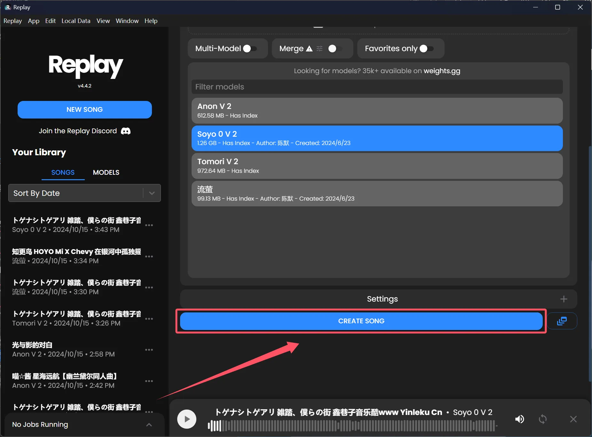

### AI翻唱！仅需两步！

1. 前往[Replay | Free AI Voice Cloning and Stemming using RVC Models (tryreplay.io)](https://www.tryreplay.io/)下载Replay

2. 打开Replay，首先根据引导下载数据包（约11G）。然后根据图片操作，选择歌曲和模型，最后点击 `CREATE SONG` 即可！
