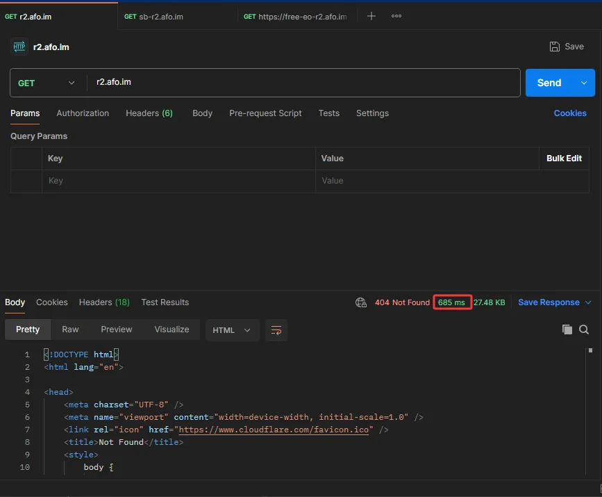
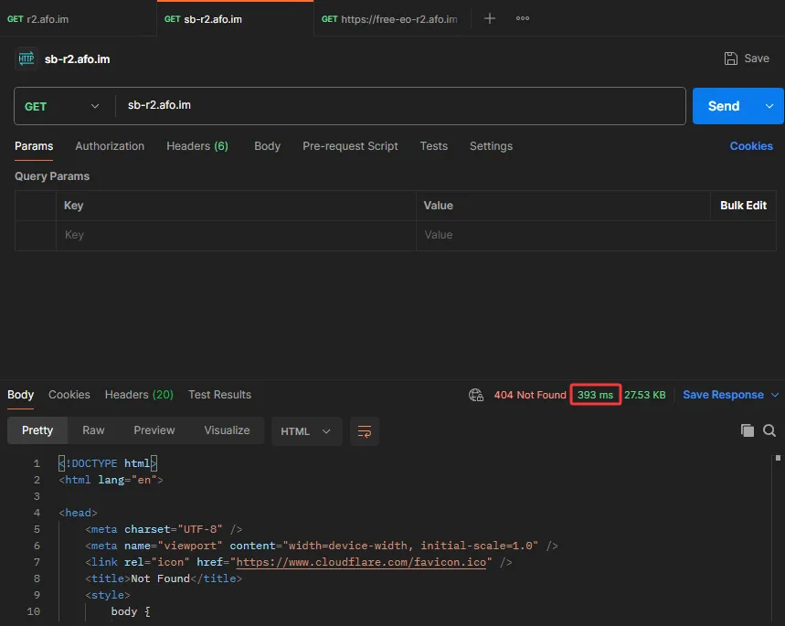
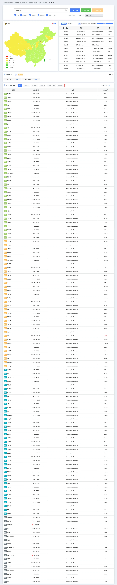
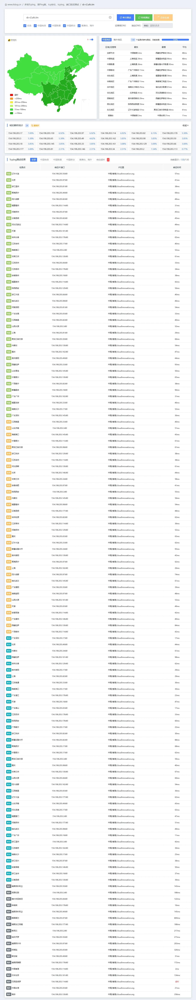
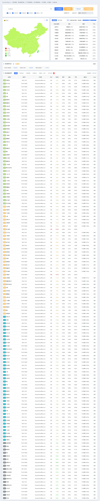
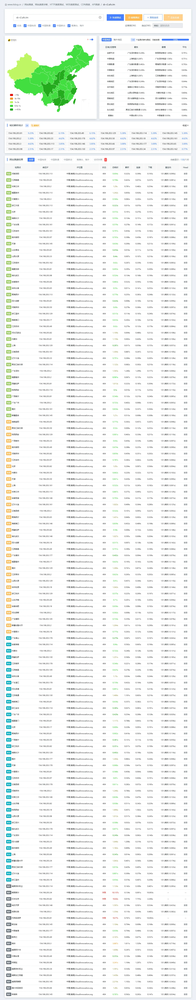
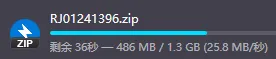
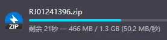

# 官网

https://secbit.ai

# 测试节点信息

安徽合肥移动家宽（本人电脑）  

# PostMan GET测试

测试Cloudflare R2默认的404页面HTML需要多长时间可以接收到

## 直连Cloudflare R2

## Secbit回源Cloudflare R2

# ITDog Tcping测试

## 直连Cloudflare R2

## Secbit回源Cloudflare R2

# ITDog 网站测速

## 直连Cloudflare R2

## Secbit回源Cloudflare R2

# 大文件下载

## 直连Cloudflare R2

## Secbit回源Cloudflare R2

---

# 总结

Secbit相较于Cloudflare对于大陆直连更为友好，延迟更低、带宽更大。唯一的缺点就是直接买很贵，也建议大家可以多多写博客，**网站月ip达到3k可以看置顶文章加群联系我帮你申请**，争取早日拿到属于你们的Secbit😋
