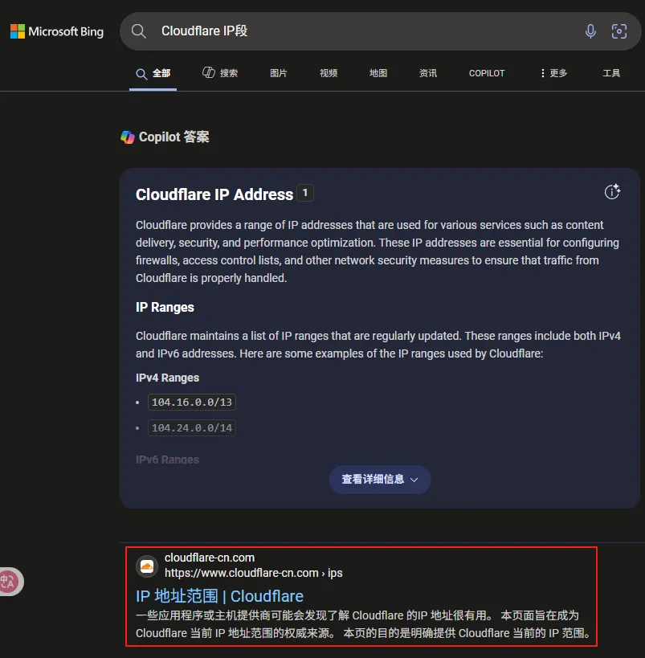

# 基本思路

想要做一个优选域名，我们首先需要筛选那些质量好的IP

筛选到质量好的IP后，通过各大云解析DNS厂商更新指定优选域名的DNS解析

最后，将你的域名投入使用，测试优选后效果

# 如何筛选到质量好的IP？

假设你要提高国内的访问质量，我们肯定需要国内的机子，如果自家有NAS就再好不过了

如果你想要三网都优选，那么只有你一台机子是不够的，需要同时拥有电信，移动，联通三网的机子去做IP筛选。如果你要做更高级的地域优选，那就...把每个省的三网机子都拿到手？

有了测试机，接下来我们就需要编写测试脚本

首先我们要知道一个CDN厂商的IP段是什么，这里以Cloudflare为例

我们搜索 `Cloudflare IP段` 即可找到

对于其他CDN，他们可能并没有直接在网页上公开IP，你需要自行寻找客服咨询

我们得到IP段后，接下来就是编写实际的测试逻辑

我这边仅推荐通过Curl+Resolve实现强制绑定IP访问业务域名然后看返回的状态码正不正常。

**注意，这种方案及其考验您的测试机、路由器、ISP、对端服务器的性能！**

但这也是最稳妥的测试方法，主播已经见过了太多TCPing 443通，https访问418或者ping得通，TCPing不通的稀奇古怪CDNIP。请保证您的测试方法筛选到的IP能正常访问到您的访问，避免您的服务宕机

线程不必拉太高，针对于Cloudflare这样有 150w IP的CDN，我们可以仅测试C段，也就是测试完 `104.18.91.0` 直接测试 `104.18.92.0` 这样可以节省时间，只需要测5000多个IP

最终，我们得到了一组优选IP

# 对接华为云云解析DNS

为什么推荐华为云？

无他，因为仅华为云一家支持**单解析单次记录值支持50个IP**、**可以创建多个同名解析**以及**支持仅缓存DNS解析1s（TTL=1）**

受益于华为云的这些功能，我们个人用户也可以做到一个域名下面绑定几万个IP（虽然IP不是越多越好）

推荐使用海外版，**不需要实名认证**

之后通过API文档自行折腾一下API添加DNS解析即可

# 后期维护

1. 如果你要做三网优选请添加一个默认解析线路，保证您在个别线路宕机时对应线路的用户不会遇到服务宕机

2. 每个CDN厂商的IP段可能会不定时变更，请勤查多看，及时更换失效IP

3. 如果遇到服务异常无法得到优选IP，请不要在脚本中编写危险逻辑，如删除所有解析。这会导致大批量服务宕机

4. 优选并不是主流做法，如果您的站点被攻击，使用自定义CNAME或者IP会导致您的CDN服务商无法为您进行IP调度，高质量IP将被持续攻击，您的CDN服务商可能会采取强制措施如：**关停您的业务，封禁您的账号**等操作来隔断对方的攻击。当您认为您的站点被攻击时请及时切换到官方为您分配的CNAME或IP
