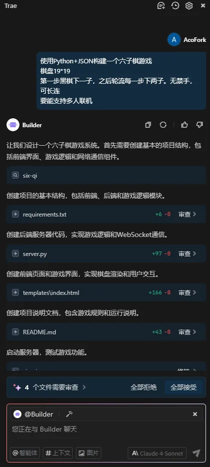
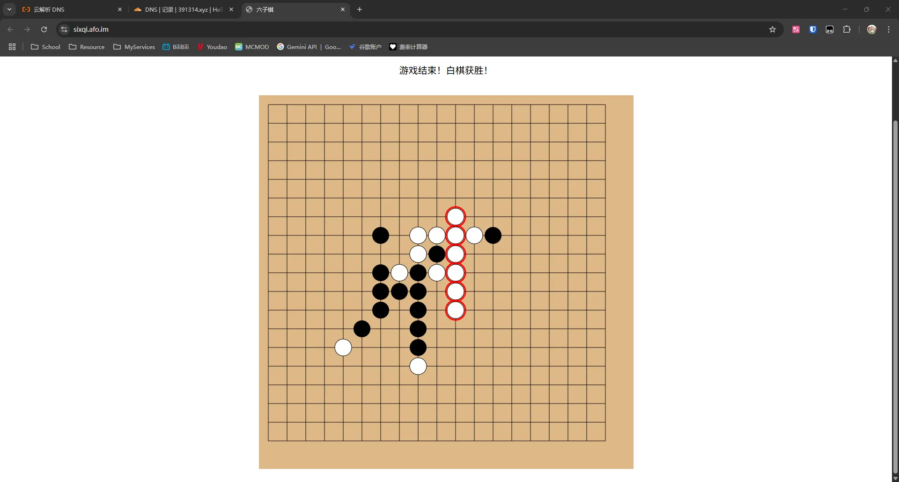

# 前情提要

本来大晚上被干醒了

准备吃点东西睡回笼觉

顺便在QQ群吹水

然后被委托做一个**神经小项目**

于是就...

# 开整！

首先使用最熟悉的Python Flask框架！

然后使用最简单的内存数据库！

然后开始调教AI！

~~这里本想用JSON存的但是聪明小AI最终交付的仍然是内存存储~~

然后就写出来了！（~~并非，总共问了7次~~

# 上线！

现已可在 https://sixqi.afo.im/ 游玩！

开源： [GitHub - afoim/sixqi](https://github.com/afoim/sixqi)

