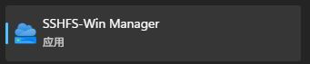
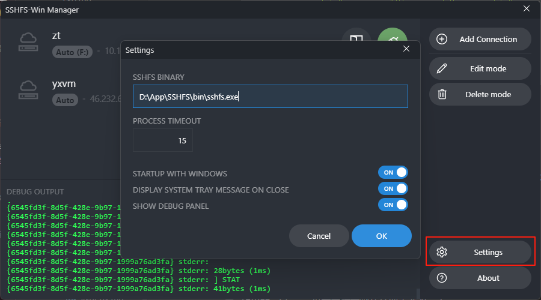
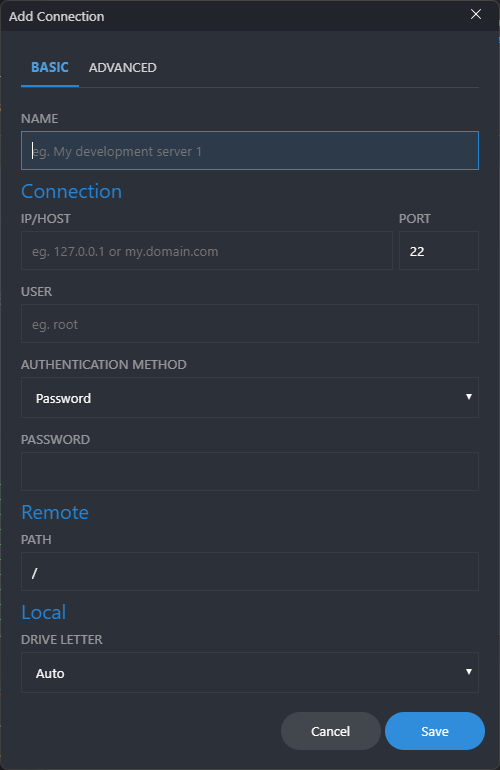
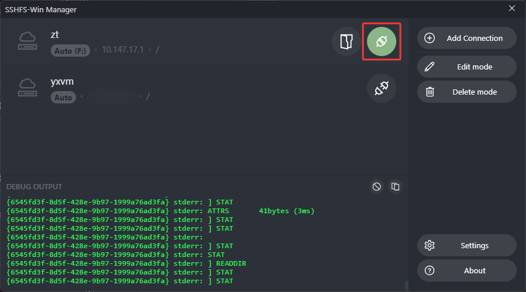
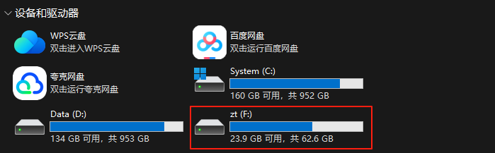

# 正式开始

前往 [winfsp/sshfs-win: SSHFS For Windows](https://github.com/winfsp/sshfs-win)

下载并安装

前往 [evsar3/sshfs-win-manager: A GUI for SSHFS-Win (https://github.com/billziss-gh/sshfs-win)](https://github.com/evsar3/sshfs-win-manager)

下载并安装

打开

如果的sshfs-win没有安装在默认位置需要手动指定一下，进入 `Settings` 

接下来点击 `Add Connection` 懂的都懂

保存后点击连接按钮

接着你就能在文件资源管理器看到你的盘了

