# [Netlify](https://www.netlify.com)

注册门槛高，需要使用谷歌邮箱注册。支持IPv6回源。用量限制较宽松，仅有带宽和构建时间限制。 **我认为是免费计划里最快的CDN！并且限制很少！**

> 需要注意，构建时间是每月限制。但是流量限制较为宽松

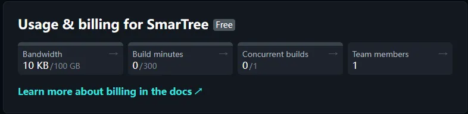

因为节点禁Ping，所以这里用Tcping结果展示

**推荐CNAME：** apex-loadbalancer.netlify.com

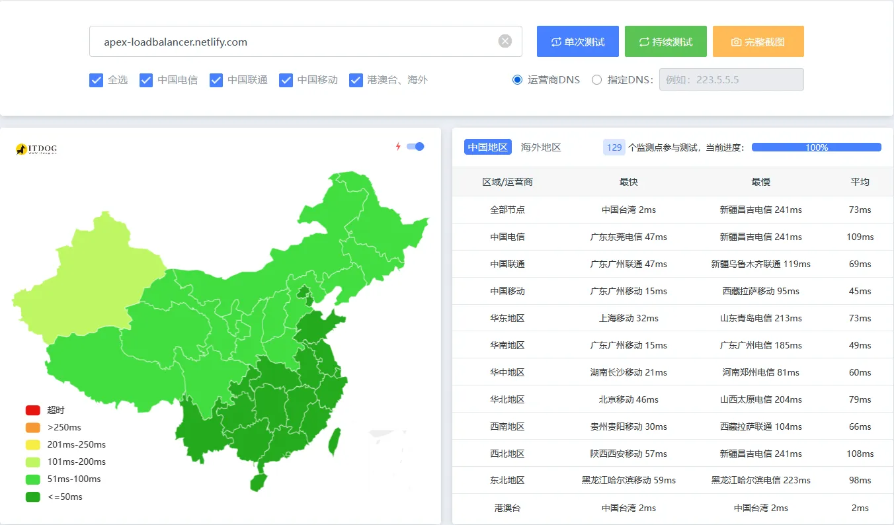

# [Vercel](https://vercel.com)

零成本用上。注册无门槛，延迟良好。用量限制较严格。仅支持IPv4回源。默认的 `*.vercel.app` 在国内会被SNI阻断，需要绑定自己的域名

> Vercel每天可以构建100次，每次构建时间不得超过45分钟

**推荐IP：** 76.76.21.21

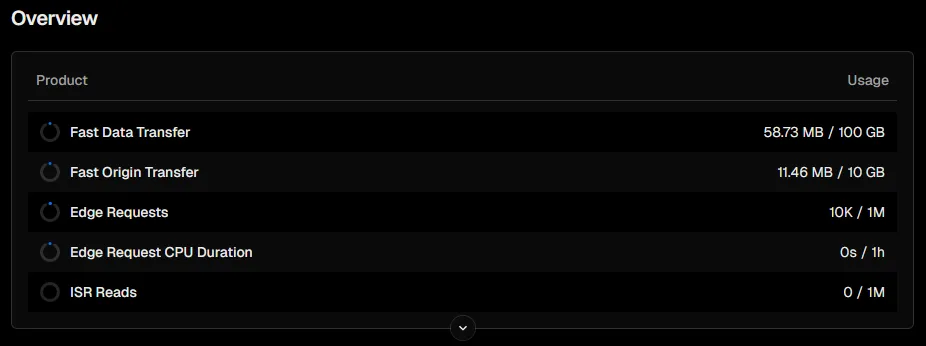

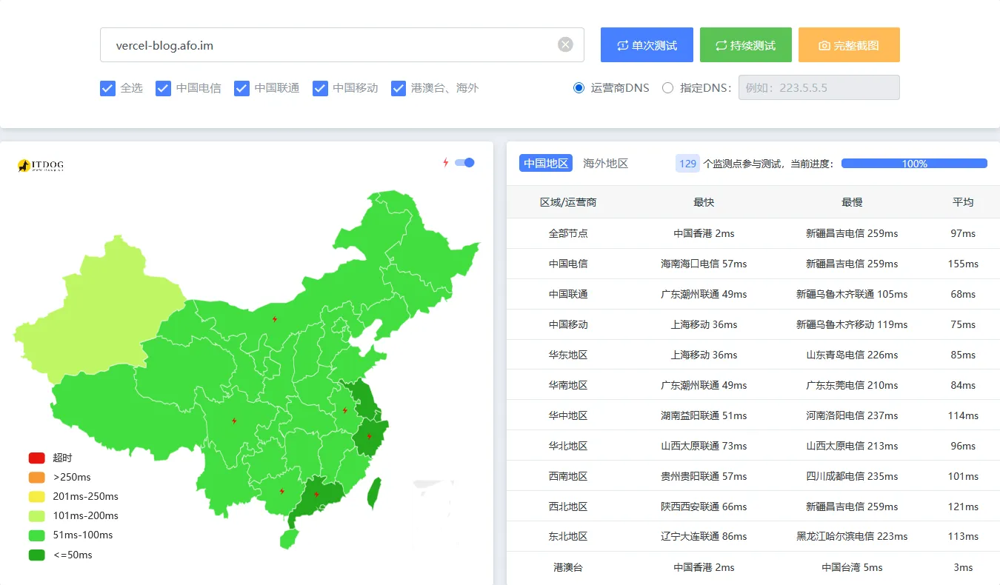

# [EdgeOne CDN](https://edgeone.ai)

目前处于内测，需要兑换码。获取方式前往 [腾讯云EdgeOne免费计划兑换码 - 立即体验](https://edgeone.ai/zh/redemption) 。无流量和请求数限制。

支持**高级回源设置**

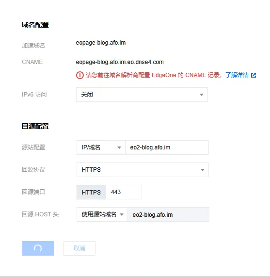

## 全球可用区（不含中国大陆）

> 本人博客目前使用的CDN

默认提供的CNAME延迟一般。下图是使用了本人的HK优选： eo.072103.xyz（注： EdgeOne Page不可用）

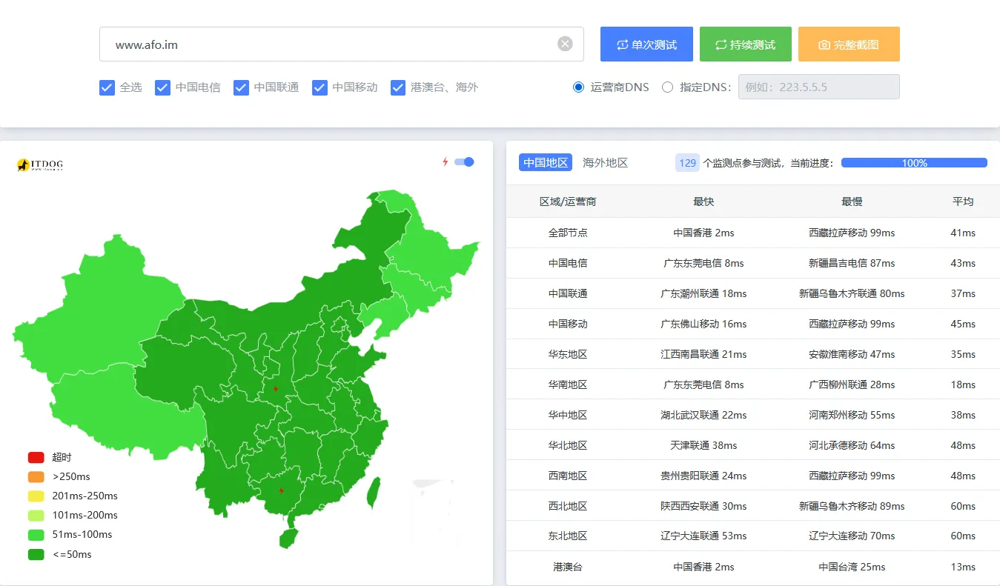

## EdgeOne CDN 中国大陆可用区

需要**实名认证**，需要**域名备案**

默认CNAME可用

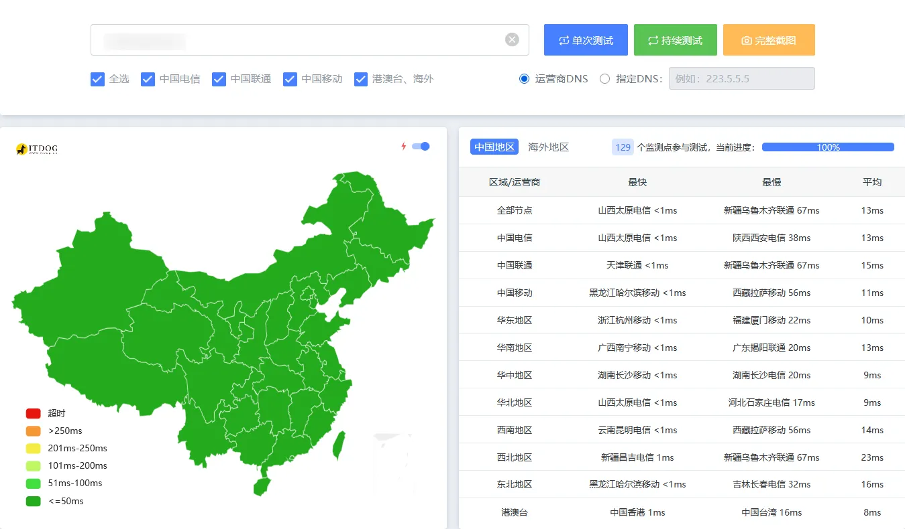

# [Cloudflare](https://www.cloudflare.com/)

无流量和请求数限制。**无法被打死**

[戳我查看优选域名](/posts/record/#cloudflare-%E4%BC%98%E9%80%89%E5%9F%9F%E5%90%8D)

下图使用本人的分流优选： fenliu.072103.xyz

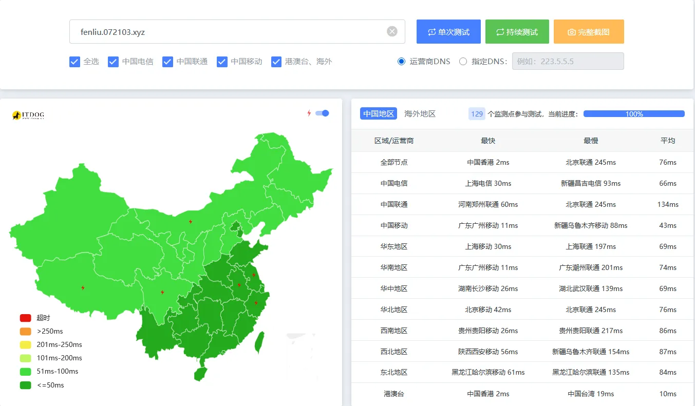

# [Render](https://render.com)

注册简单，具有严格的用量限制

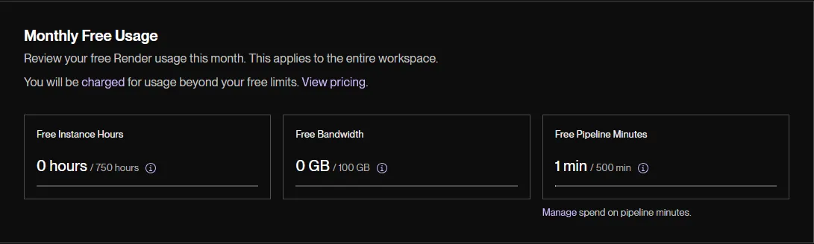

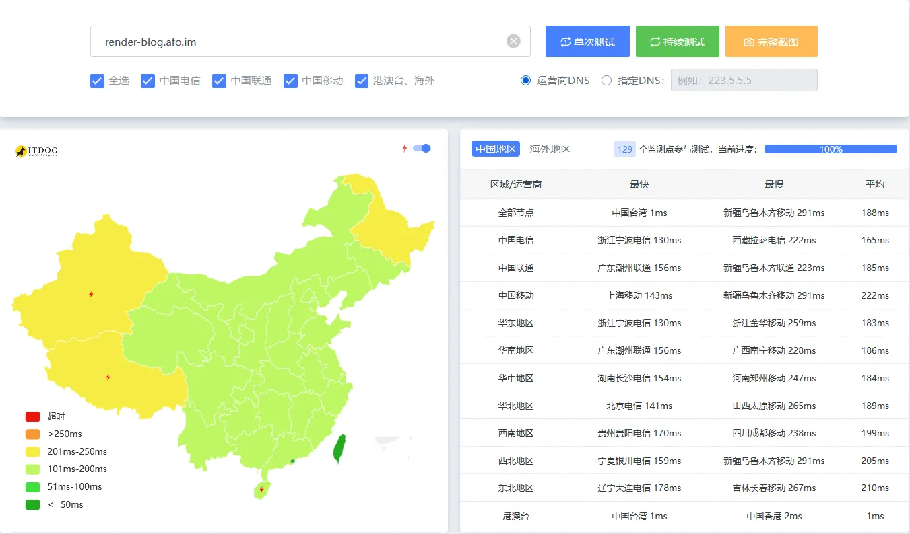

# [Github Page](https://pages.github.com/)

需要使用Github Action发布。**中国大陆大部分地区会间歇性阻断**，不推荐使用

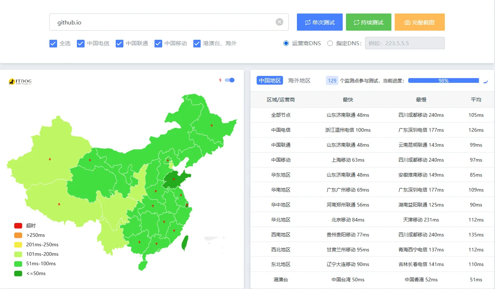
