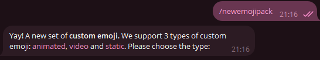
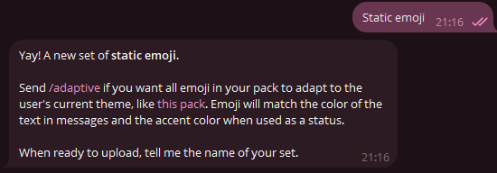
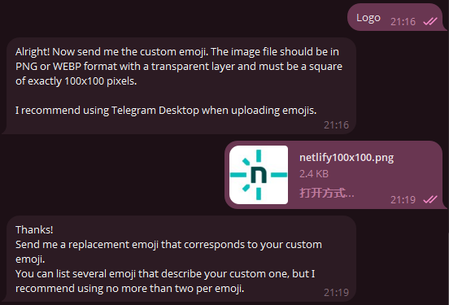
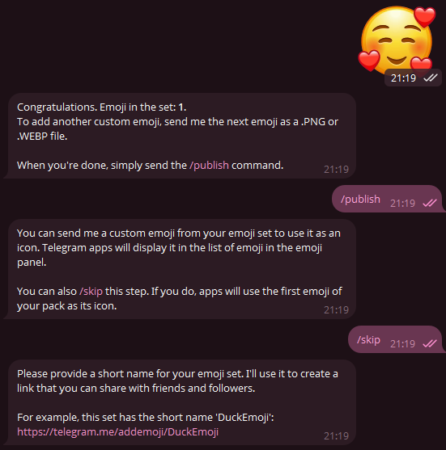
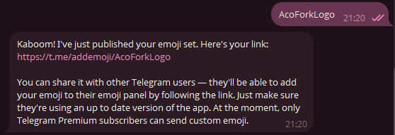
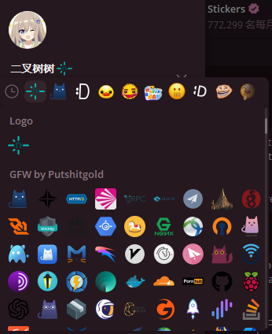

# 正式开始

> 本文讲述的是添加TG的Emoji，不是贴纸！！！

准备若干张 PNG或WEBP，100x100 px的图片

然后找到 @Stickers

发送 `/newemojipack` 

这里使用静态表情，即 `static` 

接下来随便起个名字，我这里就叫 `Logo` 

然后发送你的图片

接下来发送一个能代表你表情的Emoji，并且发布

然后设置一个 `pathname` 

点击上面的链接就可以添加咯~

如果你是Telegram Premium，还可以挂在昵称旁边哦~

