# 正式开始

> 本教程针对于Umami Cloud的上手使用，如果你需要自托管Umami请自行寻找相关文档

进入 https://umami.is/ （如果进不去请检查是否有广告拦截器拦截了Umami！！！）

点击右上角的 `Sign UP` 注册账号

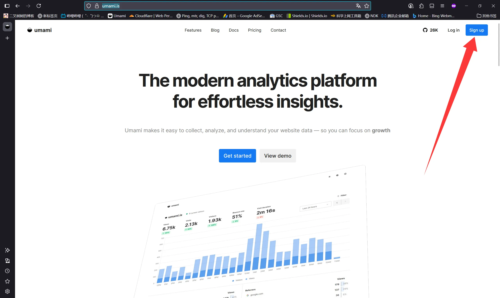

按需填写相关信息进行注册

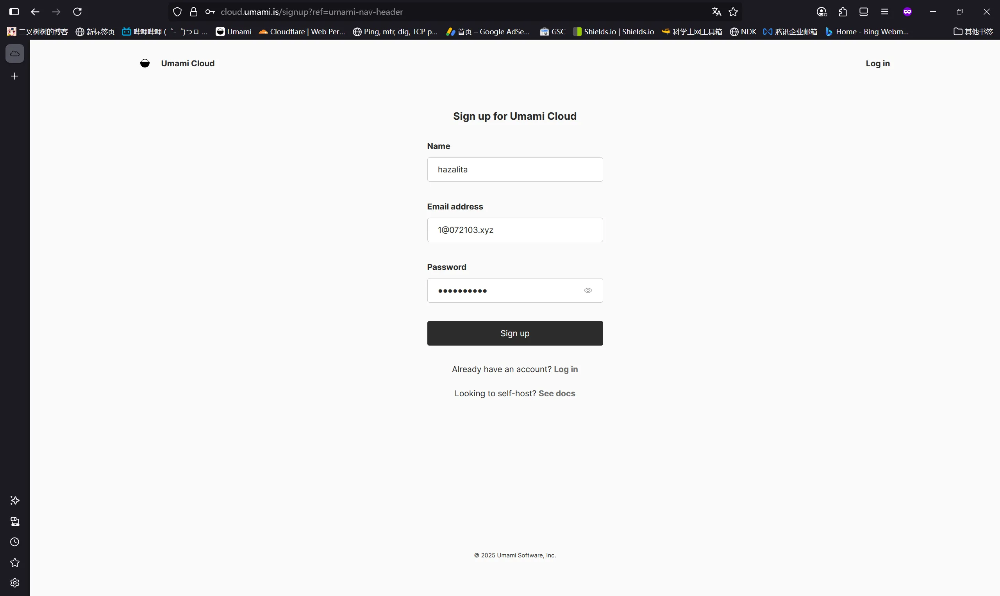

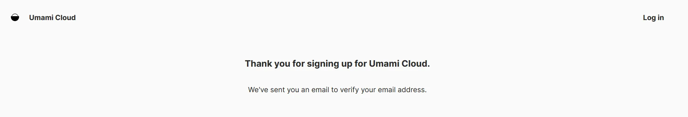

然后检查你的邮箱，是否收到了Umami的邮箱验证消息

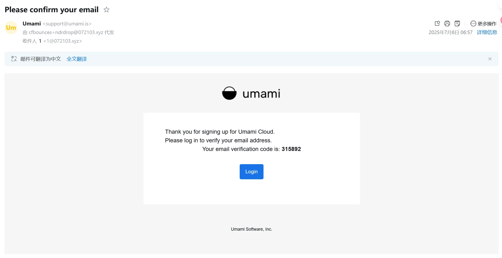

点击 `Login` 进行登录，填入验证码

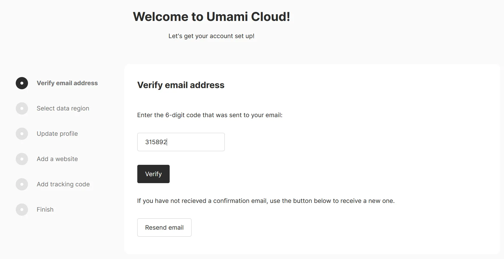

区域选择任意（选美国你的统计数据就记录在美国的服务器，选欧盟你的统计数据就记录在欧盟的服务器）

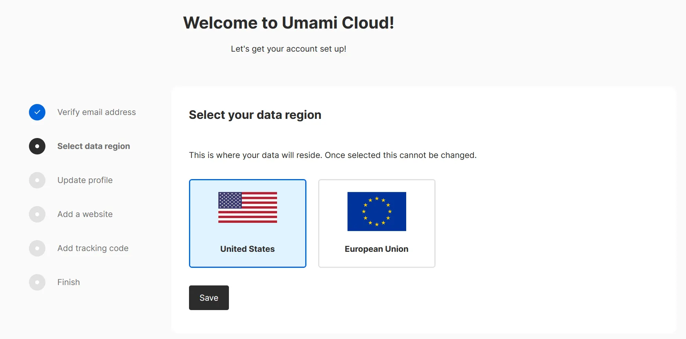

用户配置随便填写即可

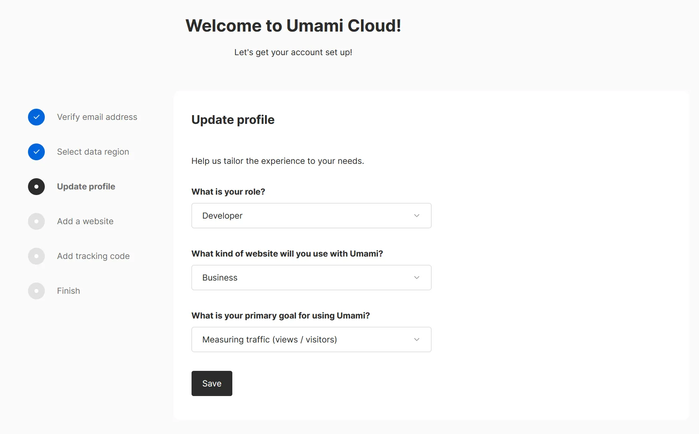

继续填写你要统计的网站

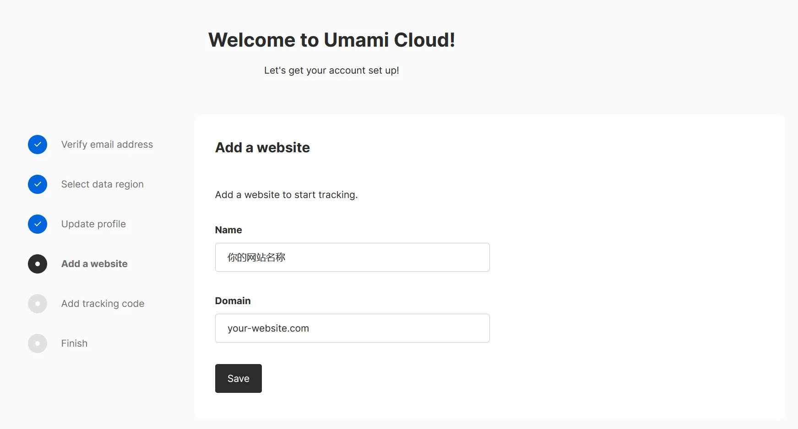

将跟踪代码插入到你的网站的 `<head>Umami跟踪代码</head>` 中

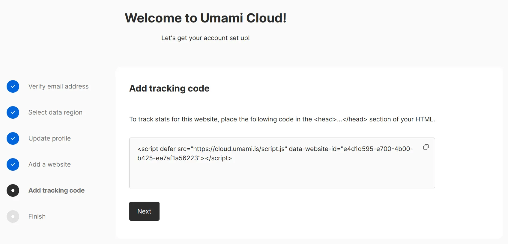

然后我们就进入Umami控制台了

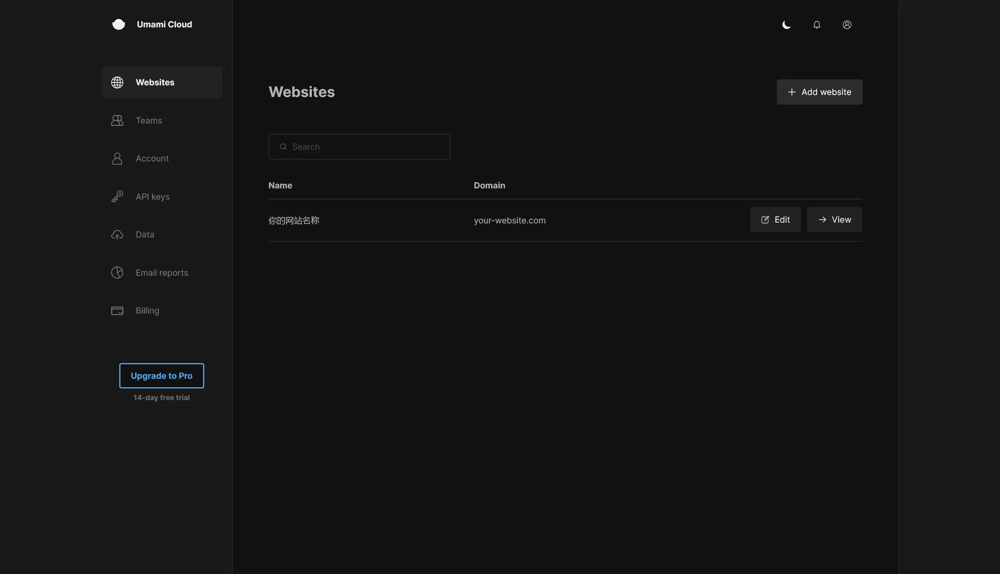

点击 `View` 就能看到你的网站统计啦

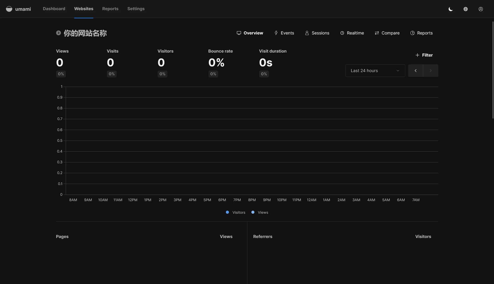

注：右上角可以改为中文

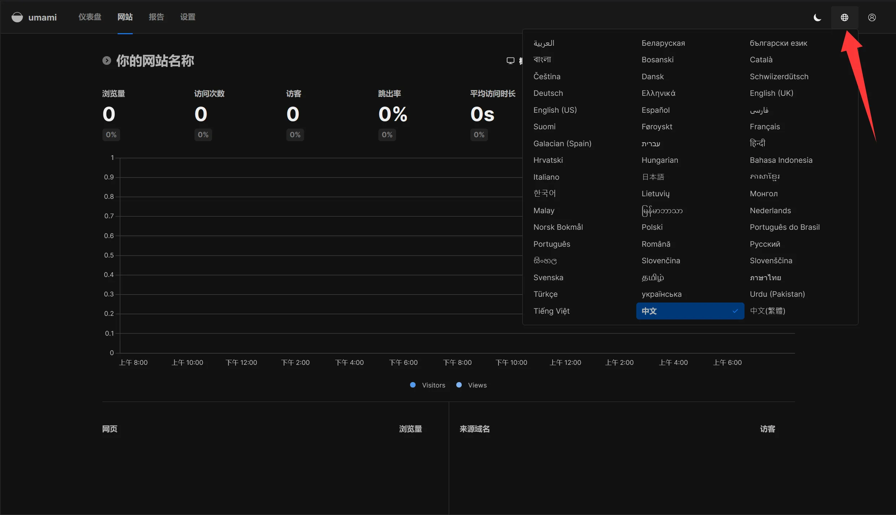

建议打开设置启用分享URL，这样你的用户就可以实时看到你的站点流量啦

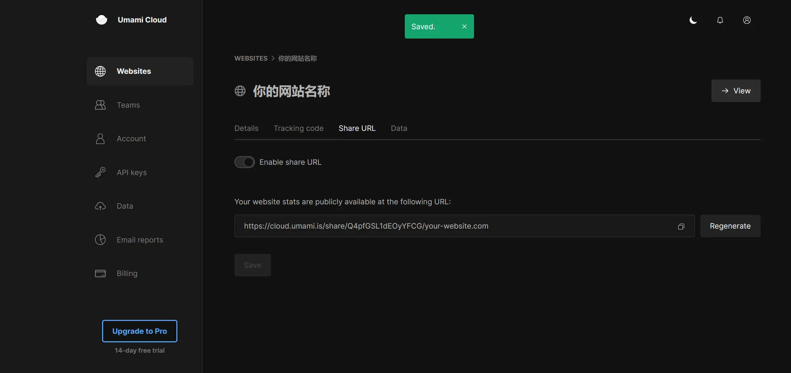

# 注意事项

Umami Cloud对于免费用户限制3个站点

免费版月事件数为10w，本人博客感觉不够用，已经自建了，教程可以看我b站，没有就是没发 ~~来拷打我~~

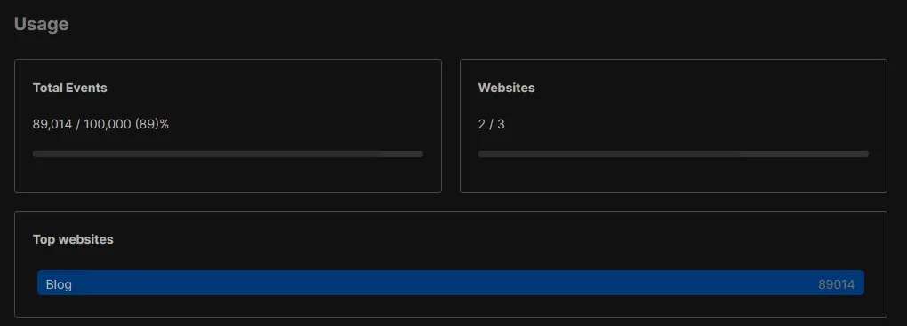
