# 前言

### Whois查询是什么？

如果了解域名，就知道域名一旦被注册就会在Whois服务器留下一些相关信息（比如：注册方，注册地，注册时间等等），可以被公开查询。

### 如何快速查询一个域名的Whois？

你是否用过某些Whois查询网站？如图为IP.SB的WHOIS查询服务，可以通过 [WHOIS - IP.SB](https://ip.sb/whois) 快速查询一个域名的Whois

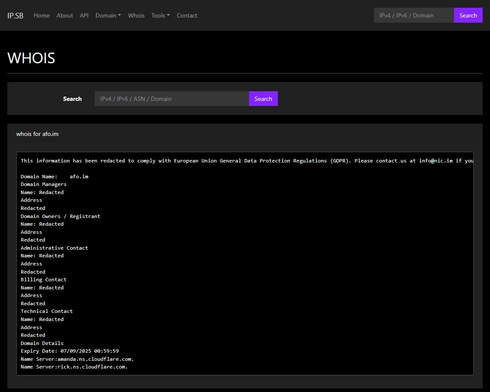

# 正片

那么如果我们想自建一个Whois查询服务放到我们的Bot或者网页上，我们要怎么做呢？

你也许已经知道在Linux系统上专门有一个包就叫做 `whois` 我们可以方便用它来查询Whois。我们现在就可以试试

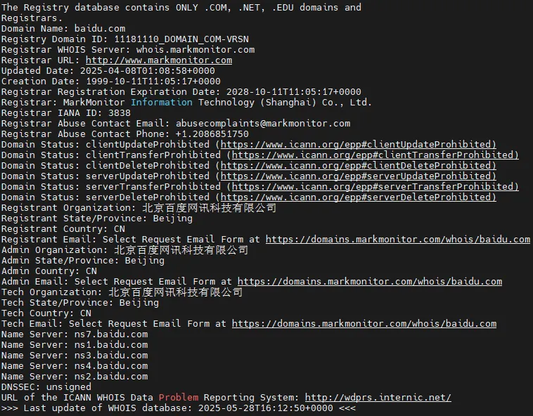

可以看到，成功查询到了 `baidu.com` 的Whois信息。但是实际上这个命令的输出有这么长

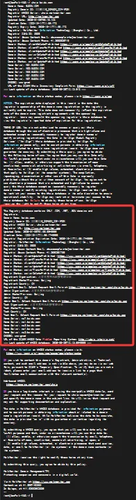

但是实际上，只有红色框内的信息对我们有效，其他的信息则是一些公告，警示，许可之类的无用信息

这对于偶尔查询一次然后用人眼筛选有效信息的现代人类不难，但是对现代计算机来说非常难

因为在**传统的Whois查询**中，Whois服务器返回的信息没有任何规范，它想给你什么就能给你什么，如下图

这是我的域名的Whois查询结果，可以看到，完全没有规范可言

更有甚者不仅改格式，甚至还改术语，比如Status写一个Connect

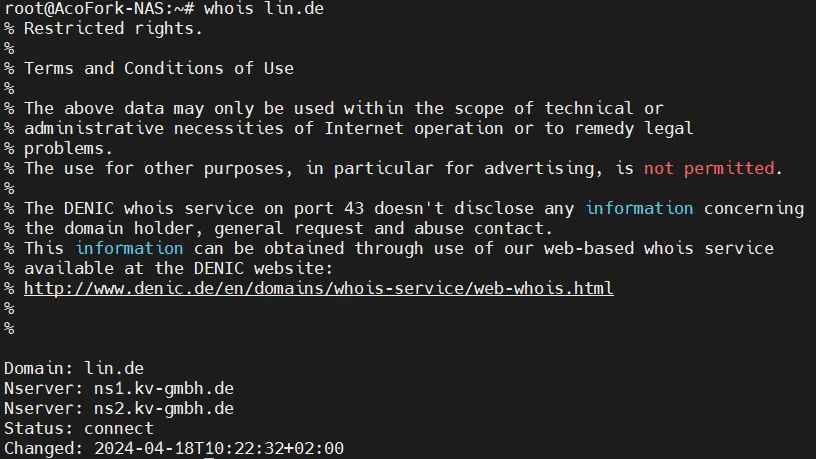

这就使得我们做三方API的时候想要针对性的汉化或者过滤就非常困难。如果你想要做到绝对的规范，需要针对每一个顶级域的Whois服务器做调查，然后针对性的配置过滤器，这样才能输出一个完整的，规范的Whois查询结果

前文我提到了**传统的Whois查询**，那么有没有一个API能直接提供一个规范了格式的查询结果，并且每个域名都遵循这个规范呢？

有的，兄弟有的，这就是RDAP（Registration Data Access Protocol），注册数据访问协议。使用了RDAP的域名查询Whois将会返回一个标准的JSON格式的输出，并且查询是通过标准的RESTAPI，也就是Web协议，如下图

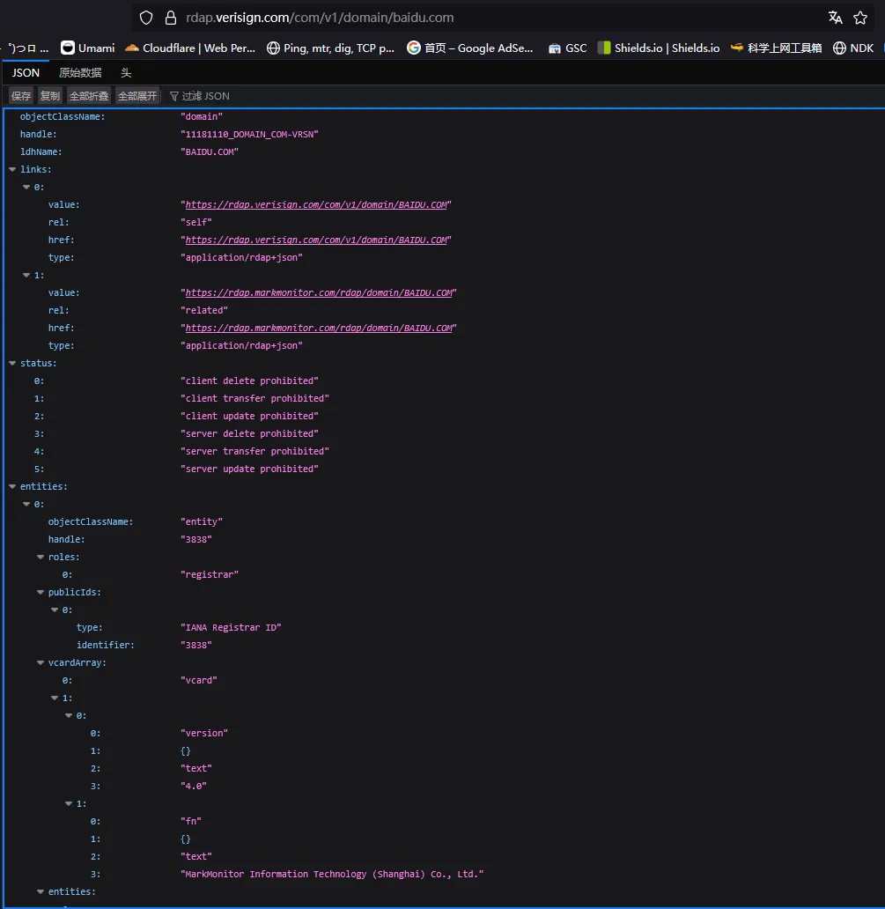

乍一看好多无用信息啊，但是你先别急，既然它返回的是JSON，而且所有域名都是一个规范，那么我们完全可以方便快捷的过滤

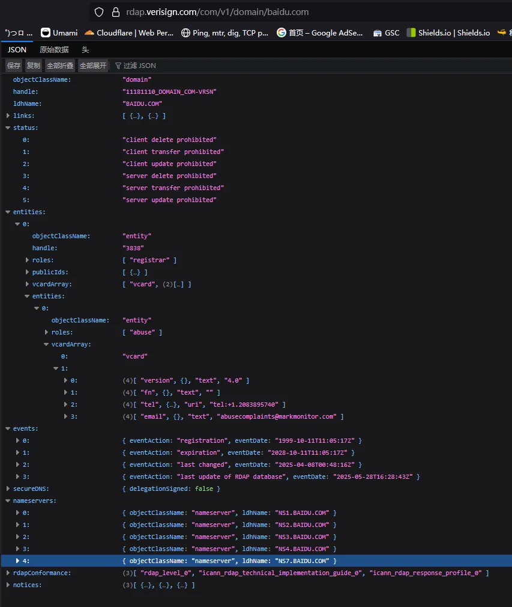

就像这样，只需要写一遍过滤规则，以后所有**支持RDAP查询Whois的顶级域**都可以通过这个规则快捷展示信息！

但是话又说回来，RDAP毕竟是一个新式协议，很多顶级域仍然不支持，比如 `.im`

[.im Domain Delegation Data](https://www.iana.org/domains/root/db/im.html)

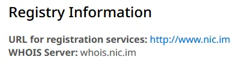

可以看到 `.im` 仅支持传统Whois查询

那么我们的三方API就要既支持传统Whois，又支持新式RDAP

# 正式开始构建三方Whois查询API

由于传统Whois查询是通过TCP请求43端口获取信息，需要专用客户端来查询，所以针对于**只支持传统Whois查询的顶级域**就需要我们的服务器先查询到信息，再返回用户纯文本。如下图

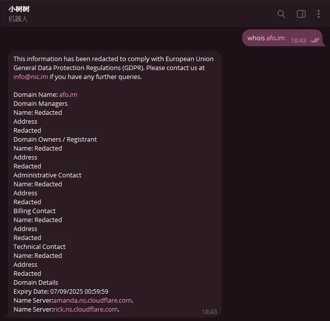

而对于**已经支持RDAP查询的顶级域**，直接返回Web URL，让用户自行阅览，如下图

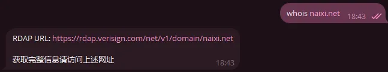

另外，针对于**仅支持RDAP查询的顶级域**，我们需要先通过IANA查询该顶级域的RDAP服务器（实际上传统Whois也需要，但是Linux的Whois包硬编码的Whois查询服务器目前够用 :）

比如我要查询 `freebird.day` ，就需要先前往[.day Domain Delegation Data](https://www.iana.org/domains/root/db/day.html)查找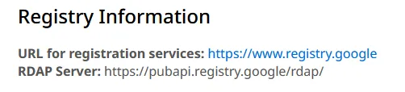

接下来通过给定的RDAP服务器查询即可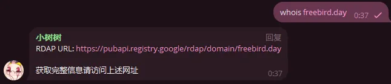

因为RDAP协议较新，且易读，所以针对于**传统Whois和RDAP查询都支持的顶级域**优先RDAP查询
