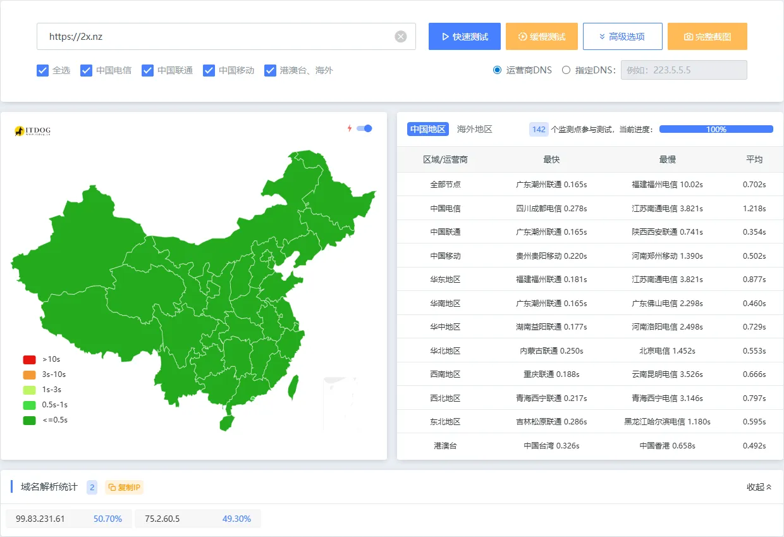

# 违规内容

早期本站发布过文章 [点此查看](/posts/bypass-gfw/)
该文章不符合备案规范。曾尝试过备案被打回

# 域名不支持备案

ICP备案是针对于域名的，本人名下的 2x.nz 并不在ICP备案支持的域名后缀内

所有支持备案的域名后缀请查看 https://domain.miit.gov.cn/

# 中国节点加速收效甚微

目前本站使用的CDN为Netlify CDN，Netlify采用AWS的IP，速度极快，在中国大陆可用性很高，延迟如下图

由于本站为静态站，若进行备案可以直接使用EdgeOne Page中的中国大陆节点，延迟固然会更低，但是对比目前的速度收效甚微

# 备案步骤繁琐

若进行备案，则需要填写实际运营人相关信息并且需要购买备案码（这是最低成本的备案方式）

# GFW未对本站进行SNI阻断

本站目前并未被GFW阻断。除部分省市防火墙进行非备案域阻断外皆可正常访问

# 泉州等地区用户仅支持访问备案域？

本站之前有一个IP站点，由于业务服务器1Panel V1升级至V2破坏了原有的CI/CD工作流，暂时停用

后续会进行修复并且重新恢复IP站点的运营

已恢复 参见[关于](/about/)界面

# 后续是否会备案

  可能。但是不会用做主要业务，更多是提高访问可达性，主站仍为未备案站。

且如果备案后我需要管理两个内容分支（即无违规内容分支和原分支）我可能会放弃这么做
